# Sequence Diagrams - Sinaloka Platform

> Dokumen komprehensif sequence diagrams untuk seluruh fitur Sinaloka Platform.
> Menunjukkan alur interaksi step-by-step antara Actor → Frontend → Backend → Database → External Services.
> Total: **78 sequence diagrams** across all domains.
> Dibuat berdasarkan deep analysis feature docs + codebase.
> Terakhir diperbarui: 2026-03-26

---

## Daftar Isi

### Part 1: Auth & Onboarding / Navigation & Layout (12 diagrams)
1. Login Flow (Platform)
2. Login Flow (Tutor Portal)
3. Login Flow (Parent Portal)
4. Token Refresh Flow
5. Forgot/Reset Password
6. Onboarding Wizard
7. Tutor Invitation Flow
8. Parent Invitation Flow
9. Public Registration Flow
10. Super Admin Impersonation
11. Protected Route Guard Chain
12. Subdomain Resolution

### Part 2: Students, Tutors & Registrations (15 diagrams)
13. Admin Creates Student
14. Import Students from CSV
15. Admin Views Student Detail
16. Invite Parent
17. Parent Registers via Invite
18. Parent Views Children Dashboard
19. Parent Views Child Detail Tabs
20. Admin Invites Tutor
21. Tutor Accepts Invite
22. Admin Creates Tutor (Direct)
23. Tutor Dashboard & Schedule
24. Tutor Submits Attendance & Finalizes
25. Tutor Requests Reschedule
26. Tutor Views Payouts
27. Admin Manages Tutor (Edit, Verify, Delete)

### Part 3: Classes, Academic Years, Schedules & Enrollments (14 diagrams)
28. Create Class
29. Update Class
30. Generate Sessions from Class
31. Create Enrollment (with Conflict Check)
32. Bulk Import Enrollments (CSV)
33. Enrollment Status Transitions
34. Create Academic Year + Semester
35. Archive Semester (Cascade)
36. Roll Over Semester
37. Manual Session Creation
38. Tutor Request Reschedule → Approve/Reject
39. Session Complete & Auto-Payout
40. Cancel Session
41. Navigate Schedules Calendar

### Part 4: Finance (17 diagrams)
42. Auto-Generate Monthly Payments (Cron)
43. Auto Per-Session Payment
44. Mid-Month Enrollment Payment
45. Record Payment (Manual)
46. Batch Record Payments
47. Midtrans Checkout → Webhook → PAID
48. Overdue Detection & Flag Propagation
49. Payment Reminder Flow
50. Generate Invoice PDF
51. Session Complete → Auto Payout
52. Reconcile Payout
53. Generate Salaries (Bulk)
54. Generate Payout Slip PDF
55. Create Expense (with Recurring)
56. Finance Overview Dashboard
57. Settlement Flow (Super Admin)
58. Export CSV/PDF

### Part 5: Settings, Plans, Dashboard, Notifications, WhatsApp & Audit Log (20 diagrams)
59. Update General Settings
60. Update Billing Settings
61. Manage Academic Settings
62. Toggle Registration Settings
63. Change Password
64. Request Plan Upgrade (Midtrans)
65. Request Plan Upgrade (Manual Transfer)
66. Subscription Lifecycle Cron
67. Plan Limit Enforcement
68. Super Admin Override Plan/Subscription
69. Dashboard Data Loading
70. Command Palette
71. SSE Notification Flow
72. Daily Payment Reminder Notifications
73. WhatsApp Manual Payment Reminder
74. WhatsApp Auto Reminders (Cron)
75. Fonnte Webhook Status Update
76. WhatsApp Template Management
77. Audit Log Capture (Global Interceptor)
78. View Audit Log with Diff

---

---

# Part 1: Auth & Onboarding / Navigation & Layout

## 1. Login Flow (Platform)

Subdomain detection, slug validation, API authentication, profile fetch, and post-login routing
including onboarding check, password change enforcement, and super admin redirect.

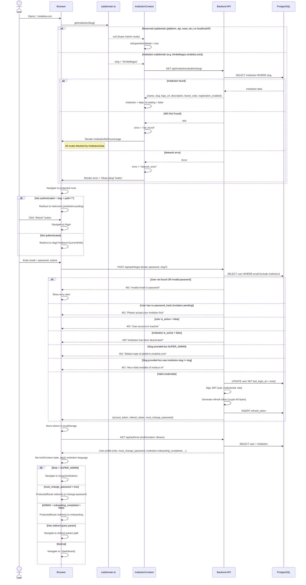
```mermaid
sequenceDiagram
    actor User
    participant Browser
    participant SubdomainUtil as subdomain.ts
    participant InstCtx as InstitutionContext
    participant API as Backend API
    participant DB as PostgreSQL

    User->>Browser: Opens *.sinaloka.com

    %% Phase 1: Subdomain Resolution
    Browser->>SubdomainUtil: getInstitutionSlug()
    alt Reserved subdomain (platform, api, www, etc.) or localhost/IP
        SubdomainUtil-->>InstCtx: null (Super Admin mode)
        InstCtx->>InstCtx: isSuperAdminMode = true
    else Institution subdomain (e.g. bimbelbagus.sinaloka.com)
        SubdomainUtil-->>InstCtx: slug = "bimbelbagus"
        InstCtx->>API: GET /api/institutions/public/{slug}
        API->>DB: SELECT institution WHERE slug
        alt Institution found
            DB-->>API: Institution data
            API-->>InstCtx: {name, slug, logo_url, description, brand_color, registration_enabled}
            InstCtx->>InstCtx: institution = data, isLoading = false
        else 404 Not Found
            API-->>InstCtx: 404
            InstCtx->>InstCtx: error = "not_found"
            InstCtx->>Browser: Render InstitutionNotFound page
            Note right of Browser: All routes blocked by InstitutionGate
        else Network error
            API-->>InstCtx: Error
            InstCtx->>InstCtx: error = "network_error"
            InstCtx->>Browser: Render error + "Muat ulang" button
        end
    end

    %% Phase 2: Route Guard (ProtectedRoute)
    Browser->>Browser: Navigate to protected route
    alt Not authenticated + slug + path="/"
        Browser->>Browser: Redirect to /welcome (InstitutionLanding)
        User->>Browser: Click "Masuk" button
        Browser->>Browser: Navigate to /login
    else Not authenticated
        Browser->>Browser: Redirect to /login?redirect={currentPath}
    end

    %% Phase 3: Login
    User->>Browser: Enter email + password, submit
    Browser->>API: POST /api/auth/login {email, password, slug?}
    API->>DB: SELECT user WHERE email (include institution)

    alt User not found OR invalid password
        API-->>Browser: 401 "Invalid email or password"
        Browser->>Browser: Show error alert
    else User has no password_hash (invitation pending)
        API-->>Browser: 401 "Please accept your invitation first"
    else User is_active = false
        API-->>Browser: 401 "User account is inactive"
    else Institution is_active = false
        API-->>Browser: 403 "Institution has been deactivated"
    else Slug provided but SUPER_ADMIN
        API-->>Browser: 401 "Silakan login di platform.sinaloka.com"
    else Slug provided but user.institution.slug != slug
        API-->>Browser: 401 "Akun tidak terdaftar di institusi ini"
    else Valid credentials
        API->>DB: UPDATE user SET last_login_at = now()
        API->>API: Sign JWT {sub, institutionId, role}
        API->>API: Generate refresh token (crypto 64 bytes)
        API->>DB: INSERT refresh_token
        API-->>Browser: {access_token, refresh_token, must_change_password}
    end

    %% Phase 4: Profile Fetch & Routing
    Browser->>Browser: Store tokens in localStorage
    Browser->>API: GET /api/auth/me (Authorization: Bearer)
    API->>DB: SELECT user + institution
    API-->>Browser: User profile {role, must_change_password, institution.onboarding_completed, ...}

    Browser->>Browser: Set AuthContext state, apply institution language

    alt Role = SUPER_ADMIN
        Browser->>Browser: Navigate to /super/institutions
    else must_change_password = true
        Browser->>Browser: ProtectedRoute redirects to /change-password
    else ADMIN + onboarding_completed = false
        Browser->>Browser: ProtectedRoute redirects to /onboarding
    else Has redirect query param
        Browser->>Browser: Navigate to redirect param path
    else Normal
        Browser->>Browser: Navigate to / (dashboard)
    end
```

> **Business Rules:**
> - SUPER_ADMIN must login at `platform.sinaloka.com` (no slug). Attempting to login via institution subdomain returns 401.
> - Rate limit: 5 login attempts per 15 minutes per IP.
> - `must_change_password` takes priority over onboarding redirect.
> - Language auto-detection: if user has no `sinaloka-lang` in localStorage, institution's `default_language` is applied via i18n.

---

## 2. Login Flow (Tutor Portal)

Tutor opens tutors.sinaloka.com, authenticates, fetches tutor profile, and enters the dashboard.

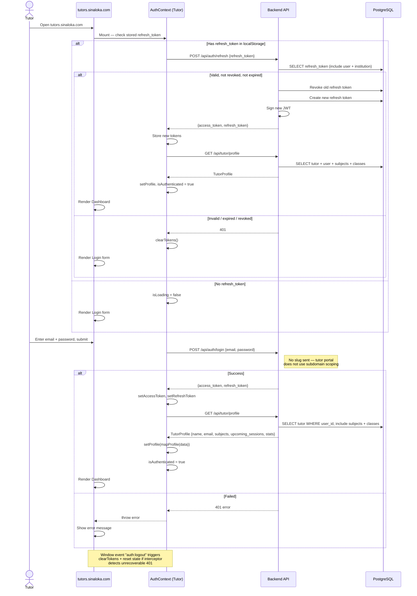
```mermaid
sequenceDiagram
    actor Tutor
    participant TutorApp as tutors.sinaloka.com
    participant AuthCtx as AuthContext (Tutor)
    participant API as Backend API
    participant DB as PostgreSQL

    Tutor->>TutorApp: Open tutors.sinaloka.com

    %% Session Restore Attempt
    TutorApp->>AuthCtx: Mount — check stored refresh_token
    alt Has refresh_token in localStorage
        AuthCtx->>API: POST /api/auth/refresh {refresh_token}
        API->>DB: SELECT refresh_token (include user + institution)
        alt Valid, not revoked, not expired
            API->>DB: Revoke old refresh token
            API->>DB: Create new refresh token
            API->>API: Sign new JWT
            API-->>AuthCtx: {access_token, refresh_token}
            AuthCtx->>AuthCtx: Store new tokens
            AuthCtx->>API: GET /api/tutor/profile
            API->>DB: SELECT tutor + user + subjects + classes
            API-->>AuthCtx: TutorProfile
            AuthCtx->>AuthCtx: setProfile, isAuthenticated = true
            TutorApp->>TutorApp: Render Dashboard
        else Invalid / expired / revoked
            API-->>AuthCtx: 401
            AuthCtx->>AuthCtx: clearTokens()
            TutorApp->>TutorApp: Render Login form
        end
    else No refresh_token
        AuthCtx->>AuthCtx: isLoading = false
        TutorApp->>TutorApp: Render Login form
    end

    %% Fresh Login
    Tutor->>TutorApp: Enter email + password, submit
    AuthCtx->>API: POST /api/auth/login {email, password}
    Note right of API: No slug sent — tutor portal<br/>does not use subdomain scoping

    alt Success
        API-->>AuthCtx: {access_token, refresh_token}
        AuthCtx->>AuthCtx: setAccessToken, setRefreshToken
        AuthCtx->>API: GET /api/tutor/profile
        API->>DB: SELECT tutor WHERE user_id, include subjects + classes
        API-->>AuthCtx: TutorProfile {name, email, subjects, upcoming_sessions, stats}
        AuthCtx->>AuthCtx: setProfile(mapProfile(data))
        AuthCtx->>AuthCtx: isAuthenticated = true
        TutorApp->>TutorApp: Render Dashboard
    else Failed
        API-->>AuthCtx: 401 error
        AuthCtx-->>TutorApp: throw error
        TutorApp->>TutorApp: Show error message
    end

    %% Forced logout listener
    Note over TutorApp,AuthCtx: Window event "auth:logout" triggers<br/>clearTokens + reset state if interceptor<br/>detects unrecoverable 401
```

> **Business Rules:**
> - Tutor portal does not send `slug` with login -- backend does not enforce subdomain restriction for tutors unless `ENFORCE_SUBDOMAIN_LOGIN=true`.
> - Session restore uses refresh token rotation on every mount (old token is revoked, new one issued).
> - Profile is fetched from the tutor-specific endpoint `/api/tutor/profile`, not `/api/auth/me`.

---

## 3. Login Flow (Parent Portal)

Parent opens parent.sinaloka.com, authenticates, fetches profile and children list.

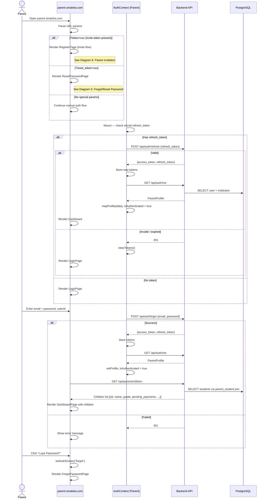
```mermaid
sequenceDiagram
    actor Parent
    participant ParentApp as parent.sinaloka.com
    participant AuthCtx as AuthContext (Parent)
    participant API as Backend API
    participant DB as PostgreSQL

    Parent->>ParentApp: Open parent.sinaloka.com

    %% Check URL params first
    ParentApp->>ParentApp: Parse URL params
    alt ?token=xxx (invite token present)
        ParentApp->>ParentApp: Render RegisterPage (invite flow)
        Note right of ParentApp: See Diagram 8: Parent Invitation
    else ?reset_token=xxx
        ParentApp->>ParentApp: Render ResetPasswordPage
        Note right of ParentApp: See Diagram 5: Forgot/Reset Password
    else No special params
        ParentApp->>ParentApp: Continue normal auth flow
    end

    %% Session Restore
    AuthCtx->>AuthCtx: Mount — check stored refresh_token
    alt Has refresh_token
        AuthCtx->>API: POST /api/auth/refresh {refresh_token}
        alt Valid
            API-->>AuthCtx: {access_token, refresh_token}
            AuthCtx->>AuthCtx: Store new tokens
            AuthCtx->>API: GET /api/auth/me
            API->>DB: SELECT user + institution
            API-->>AuthCtx: ParentProfile
            AuthCtx->>AuthCtx: mapProfile(data), isAuthenticated = true
            ParentApp->>ParentApp: Render Dashboard
        else Invalid / expired
            API-->>AuthCtx: 401
            AuthCtx->>AuthCtx: clearTokens()
            ParentApp->>ParentApp: Render LoginPage
        end
    else No token
        ParentApp->>ParentApp: Render LoginPage
    end

    %% Fresh Login
    Parent->>ParentApp: Enter email + password, submit
    AuthCtx->>API: POST /api/auth/login {email, password}
    alt Success
        API-->>AuthCtx: {access_token, refresh_token}
        AuthCtx->>AuthCtx: Store tokens
        AuthCtx->>API: GET /api/auth/me
        API-->>AuthCtx: ParentProfile
        AuthCtx->>AuthCtx: setProfile, isAuthenticated = true

        %% Auto-load children
        ParentApp->>API: GET /api/parent/children
        API->>DB: SELECT students via parent_student join
        API-->>ParentApp: Children list [{id, name, grade, pending_payments, ...}]
        ParentApp->>ParentApp: Render DashboardPage with children
    else Failed
        API-->>AuthCtx: 401
        ParentApp->>ParentApp: Show error message
    end

    %% Auth screen switching
    Parent->>ParentApp: Click "Lupa Password?"
    ParentApp->>ParentApp: setAuthScreen("forgot")
    ParentApp->>ParentApp: Render ForgotPasswordPage
```

> **Business Rules:**
> - Parent portal uses a state-based router (no React Router), with `authScreen` state to switch between login/forgot password.
> - URL params (`?token=` for invite, `?reset_token=` for password reset) take priority over normal login flow.
> - Children list is fetched automatically after authentication via `useChildren()` hook.
> - Forced logout shows a toast: "Sesi habis, silakan login kembali".

---

## 4. Token Refresh Flow

Automatic 401 interception, refresh token rotation, request retry queue, and forced logout.

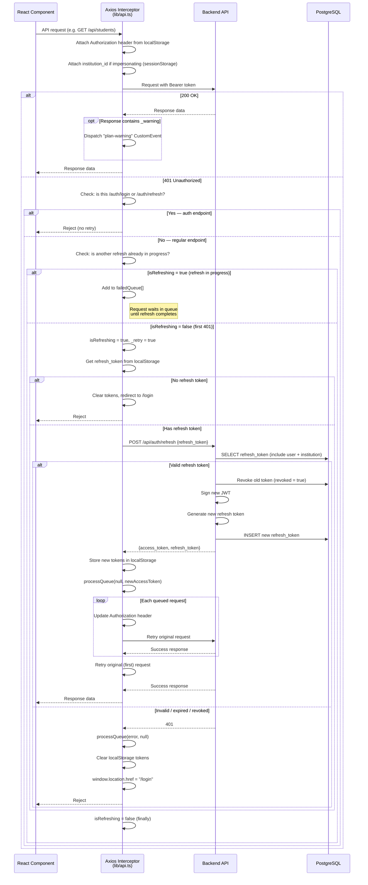
```mermaid
sequenceDiagram
    participant Page as React Component
    participant Axios as Axios Interceptor<br/>(lib/api.ts)
    participant API as Backend API
    participant DB as PostgreSQL

    Page->>Axios: API request (e.g. GET /api/students)
    Axios->>Axios: Attach Authorization header from localStorage
    Axios->>Axios: Attach institution_id if impersonating (sessionStorage)
    Axios->>API: Request with Bearer token

    alt 200 OK
        API-->>Axios: Response data
        opt Response contains _warning
            Axios->>Axios: Dispatch "plan-warning" CustomEvent
        end
        Axios-->>Page: Response data
    else 401 Unauthorized
        Axios->>Axios: Check: is this /auth/login or /auth/refresh?
        alt Yes — auth endpoint
            Axios-->>Page: Reject (no retry)
        else No — regular endpoint
            Axios->>Axios: Check: is another refresh already in progress?
            alt isRefreshing = true (refresh in progress)
                Axios->>Axios: Add to failedQueue[]
                Note right of Axios: Request waits in queue<br/>until refresh completes
            else isRefreshing = false (first 401)
                Axios->>Axios: isRefreshing = true, _retry = true

                Axios->>Axios: Get refresh_token from localStorage
                alt No refresh token
                    Axios->>Axios: Clear tokens, redirect to /login
                    Axios-->>Page: Reject
                else Has refresh token
                    Axios->>API: POST /api/auth/refresh {refresh_token}
                    API->>DB: SELECT refresh_token (include user + institution)

                    alt Valid refresh token
                        API->>DB: Revoke old token (revoked = true)
                        API->>API: Sign new JWT
                        API->>API: Generate new refresh token
                        API->>DB: INSERT new refresh_token
                        API-->>Axios: {access_token, refresh_token}

                        Axios->>Axios: Store new tokens in localStorage
                        Axios->>Axios: processQueue(null, newAccessToken)

                        loop Each queued request
                            Axios->>Axios: Update Authorization header
                            Axios->>API: Retry original request
                            API-->>Axios: Success response
                        end

                        Axios->>Axios: Retry original (first) request
                        API-->>Axios: Success response
                        Axios-->>Page: Response data
                    else Invalid / expired / revoked
                        API-->>Axios: 401
                        Axios->>Axios: processQueue(error, null)
                        Axios->>Axios: Clear localStorage tokens
                        Axios->>Axios: window.location.href = "/login"
                        Axios-->>Page: Reject
                    end
                end
                Axios->>Axios: isRefreshing = false (finally)
            end
        end
    end
```

> **Business Rules:**
> - Refresh token rotation: every refresh revokes the old token and issues a new one. This prevents replay attacks.
> - Queue pattern: if multiple API calls fail with 401 simultaneously, only one refresh request is made. All others wait in `failedQueue` and are retried with the new token.
> - The interceptor never retries `/auth/login` or `/auth/refresh` endpoints to avoid infinite loops.
> - On refresh failure: all tokens are cleared and user is force-redirected to `/login`.

---

## 5. Forgot / Reset Password Flow

Request reset via email, validate token from link, set new password, and re-login.
Implemented in the **Parent Portal** (full flow) and partially in **Platform** (info-only in platform login).

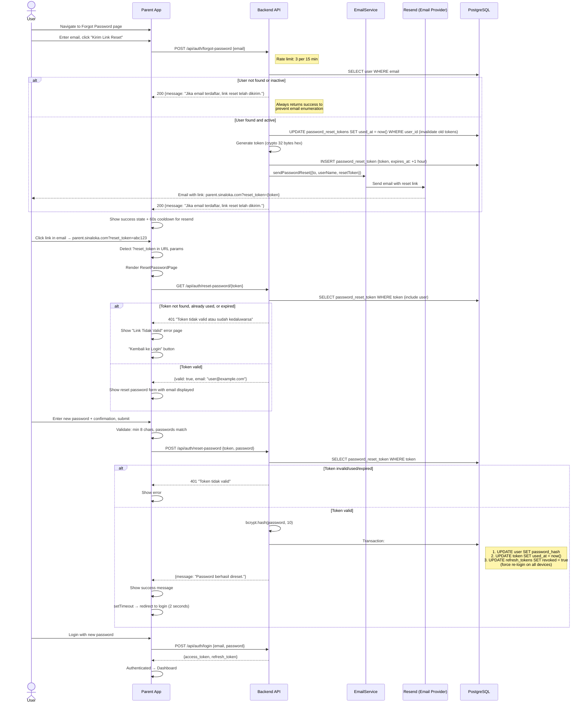
```mermaid
sequenceDiagram
    actor User
    participant App as Parent App
    participant API as Backend API
    participant EmailSvc as EmailService
    participant Resend as Resend (Email Provider)
    participant DB as PostgreSQL

    %% Step 1: Request reset
    User->>App: Navigate to Forgot Password page
    User->>App: Enter email, click "Kirim Link Reset"
    App->>API: POST /api/auth/forgot-password {email}
    Note right of API: Rate limit: 3 per 15 min

    API->>DB: SELECT user WHERE email
    alt User not found or inactive
        API-->>App: 200 {message: "Jika email terdaftar, link reset telah dikirim."}
        Note right of API: Always returns success to<br/>prevent email enumeration
    else User found and active
        API->>DB: UPDATE password_reset_tokens SET used_at = now() WHERE user_id (invalidate old tokens)
        API->>API: Generate token (crypto 32 bytes hex)
        API->>DB: INSERT password_reset_token {token, expires_at: +1 hour}
        API->>EmailSvc: sendPasswordReset({to, userName, resetToken})
        EmailSvc->>Resend: Send email with reset link
        Resend-->>User: Email with link: parent.sinaloka.com?reset_token={token}
        API-->>App: 200 {message: "Jika email terdaftar, link reset telah dikirim."}
    end

    App->>App: Show success state + 60s cooldown for resend

    %% Step 2: Click reset link
    User->>App: Click link in email → parent.sinaloka.com?reset_token=abc123
    App->>App: Detect ?reset_token in URL params
    App->>App: Render ResetPasswordPage

    %% Step 3: Validate token
    App->>API: GET /api/auth/reset-password/{token}
    API->>DB: SELECT password_reset_token WHERE token (include user)
    alt Token not found, already used, or expired
        API-->>App: 401 "Token tidak valid atau sudah kedaluwarsa"
        App->>App: Show "Link Tidak Valid" error page
        App->>App: "Kembali ke Login" button
    else Token valid
        API-->>App: {valid: true, email: "user@example.com"}
        App->>App: Show reset password form with email displayed
    end

    %% Step 4: Set new password
    User->>App: Enter new password + confirmation, submit
    App->>App: Validate: min 8 chars, passwords match
    App->>API: POST /api/auth/reset-password {token, password}

    API->>DB: SELECT password_reset_token WHERE token
    alt Token invalid/used/expired
        API-->>App: 401 "Token tidak valid"
        App->>App: Show error
    else Token valid
        API->>API: bcrypt.hash(password, 10)
        API->>DB: Transaction:
        Note right of DB: 1. UPDATE user SET password_hash<br/>2. UPDATE token SET used_at = now()<br/>3. UPDATE refresh_tokens SET revoked = true<br/>(force re-login on all devices)
        API-->>App: {message: "Password berhasil direset."}
        App->>App: Show success message
        App->>App: setTimeout → redirect to login (2 seconds)
    end

    %% Step 5: Re-login
    User->>App: Login with new password
    App->>API: POST /api/auth/login {email, password}
    API-->>App: {access_token, refresh_token}
    App->>App: Authenticated → Dashboard
```

> **Business Rules:**
> - Reset token expires in 1 hour. Creating a new token invalidates all previous unused tokens for that user.
> - After successful password reset, ALL refresh tokens are revoked (forces re-login on all devices/sessions).
> - Anti-enumeration: `/forgot-password` always returns the same success message regardless of whether the email exists.
> - Platform login page does NOT have a reset password feature — it shows an info box telling users to contact their admin.

---

## 6. Onboarding Wizard

Admin first login flow: redirect to /onboarding, complete 3 steps (Profile, Academic, Billing), then full page reload.

```mermaid
sequenceDiagram
    actor Admin
    participant Browser
    participant ProtRoute as ProtectedRoute
    participant Wizard as Onboarding Wizard
    participant ProfileStep as Step 1: Profile
    participant AcademicStep as Step 2: Academic
    participant BillingStep as Step 3: Billing
    participant API as Backend API
    participant DB as PostgreSQL

    %% Trigger: Admin login with onboarding incomplete
    Admin->>Browser: Login successful
    Browser->>ProtRoute: Navigate to / (dashboard)
    ProtRoute->>ProtRoute: Check: role=ADMIN, institution.onboarding_completed=false
    ProtRoute->>Browser: Redirect to /onboarding

    %% Step 1: Profile
    Wizard->>Wizard: currentStep = 1
    Wizard->>ProfileStep: Render
    ProfileStep->>ProfileStep: Show institution name (read-only), phone, email fields

    alt Admin fills phone and/or email
        Admin->>ProfileStep: Enter phone, email
        Admin->>ProfileStep: Click "Lanjut"
        ProfileStep->>API: PATCH /api/settings/general {phone, email}
        API->>DB: UPDATE institution SET phone, email
        API-->>ProfileStep: Success
        ProfileStep->>Wizard: onNext()
    else Admin skips
        Admin->>ProfileStep: Click "Lewati"
        ProfileStep->>Wizard: onNext() (no API call)
    end

    %% Step 2: Academic
    Wizard->>Wizard: currentStep = 2
    Wizard->>AcademicStep: Render
    AcademicStep->>AcademicStep: Default working days: Mon-Sat

    Admin->>AcademicStep: Toggle working days (e.g. disable Sunday)
    Admin->>AcademicStep: Add rooms (input + Enter/Plus, remove with X)
    Admin->>AcademicStep: Add subjects (input + Enter/Plus, remove with X)

    alt Admin saves academic data
        Admin->>AcademicStep: Click "Lanjut"
        AcademicStep->>API: PATCH /api/settings/academic {working_days, rooms}
        API->>DB: UPDATE institution SET working_days; UPSERT rooms
        API-->>AcademicStep: Success

        loop For each subject
            AcademicStep->>API: POST /api/admin/subjects {name}
            API->>DB: INSERT subject
            API-->>AcademicStep: Created
        end

        AcademicStep->>Wizard: onNext()
    else Admin skips
        Admin->>AcademicStep: Click "Lewati"
        AcademicStep->>Wizard: onNext()
    end

    %% Step 3: Billing (PERMANENT choice)
    Wizard->>Wizard: currentStep = 3
    Wizard->>BillingStep: Render

    BillingStep->>BillingStep: Show two cards: PER_SESSION / MONTHLY_FIXED
    BillingStep->>BillingStep: Show amber warning: "Mode tidak dapat diubah"

    Admin->>BillingStep: Select billing mode (click card)
    Admin->>BillingStep: Click "Selesai"

    BillingStep->>API: POST /api/onboarding/billing-mode {billing_mode}
    API->>DB: SELECT institution (check billing_mode is null)
    alt billing_mode already set
        API-->>BillingStep: 400 "Billing mode already set"
    else
        API->>DB: UPDATE institution SET billing_mode
        API-->>BillingStep: {billing_mode, onboarding_completed}
    end

    BillingStep->>API: POST /api/onboarding/complete
    API->>DB: SELECT institution (check billing_mode is set)
    API->>DB: Transaction:
    Note right of DB: 1. UPDATE institution SET onboarding_completed = true<br/>2. UPDATE user SET must_change_password = false
    API-->>BillingStep: {onboarding_completed: true}

    BillingStep->>BillingStep: Toast "Setup selesai! Selamat datang."
    BillingStep->>Browser: window.location.href = "/" (FULL RELOAD)
    Note right of Browser: Full reload ensures all contexts<br/>get fresh data (onboarding_completed = true)

    Browser->>API: GET /api/auth/me
    API-->>Browser: Profile with onboarding_completed = true
    Browser->>ProtRoute: ProtectedRoute check passes
    Browser->>Browser: Render Dashboard
```

> **Business Rules:**
> - Billing mode is a **permanent, irreversible** decision. Once set, it cannot be changed (backend rejects if `billing_mode !== null`).
> - `PER_SESSION`: fees calculated per attendance session. `MONTHLY_FIXED`: flat monthly fee regardless of sessions attended.
> - Steps 1 (Profile) and 2 (Academic) are skippable. Step 3 (Billing) is mandatory.
> - The `complete` endpoint also clears `must_change_password` for the admin user.
> - Uses `window.location.href` (full reload) instead of React Router `navigate()` to ensure all contexts re-fetch fresh state.
> - Only ADMINs are redirected to onboarding (not TUTORs, even if institution is incomplete).

---

## 7. Tutor Invitation Flow

Admin invites a tutor, email sent, tutor clicks link, validates token, accepts with password and bank details.

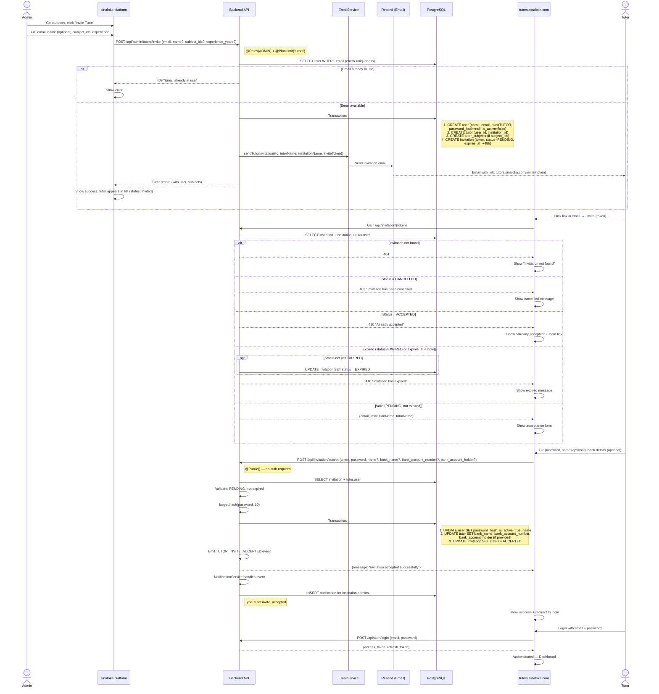
```mermaid
sequenceDiagram
    actor Admin
    participant Platform as sinaloka-platform
    participant API as Backend API
    participant EmailSvc as EmailService
    participant Resend as Resend (Email)
    participant DB as PostgreSQL
    participant TutorApp as tutors.sinaloka.com
    actor Tutor

    %% Step 1: Admin creates invitation
    Admin->>Platform: Go to /tutors, click "Invite Tutor"
    Admin->>Platform: Fill: email, name (optional), subject_ids, experience
    Platform->>API: POST /api/admin/tutors/invite {email, name?, subject_ids?, experience_years?}
    Note right of API: @Roles(ADMIN) + @PlanLimit('tutors')

    API->>DB: SELECT user WHERE email (check uniqueness)
    alt Email already in use
        API-->>Platform: 409 "Email already in use"
        Platform->>Platform: Show error
    else Email available
        API->>DB: Transaction:
        Note right of DB: 1. CREATE user (name, email, role=TUTOR,<br/>    password_hash=null, is_active=false)<br/>2. CREATE tutor (user_id, institution_id)<br/>3. CREATE tutor_subjects (if subject_ids)<br/>4. CREATE invitation (token, status=PENDING,<br/>    expires_at=+48h)

        API->>EmailSvc: sendTutorInvitation({to, tutorName, institutionName, inviteToken})
        EmailSvc->>Resend: Send invitation email
        Resend-->>Tutor: Email with link: tutors.sinaloka.com/invite/{token}
        API-->>Platform: Tutor record (with user, subjects)
        Platform->>Platform: Show success, tutor appears in list (status: Invited)
    end

    %% Step 2: Tutor opens invitation link
    Tutor->>TutorApp: Click link in email → /invite/{token}
    TutorApp->>API: GET /api/invitation/{token}
    API->>DB: SELECT invitation + institution + tutor.user

    alt Invitation not found
        API-->>TutorApp: 404
        TutorApp->>TutorApp: Show "Invitation not found"
    else Status = CANCELLED
        API-->>TutorApp: 403 "Invitation has been cancelled"
        TutorApp->>TutorApp: Show cancelled message
    else Status = ACCEPTED
        API-->>TutorApp: 410 "Already accepted"
        TutorApp->>TutorApp: Show "Already accepted" + login link
    else Expired (status=EXPIRED or expires_at < now)
        opt Status not yet EXPIRED
            API->>DB: UPDATE invitation SET status = EXPIRED
        end
        API-->>TutorApp: 410 "Invitation has expired"
        TutorApp->>TutorApp: Show expired message
    else Valid (PENDING, not expired)
        API-->>TutorApp: {email, institutionName, tutorName}
        TutorApp->>TutorApp: Show acceptance form
    end

    %% Step 3: Accept invitation
    Tutor->>TutorApp: Fill: password, name (optional), bank details (optional)
    TutorApp->>API: POST /api/invitation/accept {token, password, name?, bank_name?, bank_account_number?, bank_account_holder?}
    Note right of API: @Public() — no auth required

    API->>DB: SELECT invitation + tutor.user
    API->>API: Validate: PENDING, not expired
    API->>API: bcrypt.hash(password, 10)
    API->>DB: Transaction:
    Note right of DB: 1. UPDATE user SET password_hash, is_active=true, name<br/>2. UPDATE tutor SET bank_name, bank_account_number,<br/>    bank_account_holder (if provided)<br/>3. UPDATE invitation SET status = ACCEPTED

    API->>API: Emit TUTOR_INVITE_ACCEPTED event
    API-->>TutorApp: {message: "Invitation accepted successfully"}

    %% Step 4: Notification to Admin
    API->>API: NotificationService handles event
    API->>DB: INSERT notification for institution admins
    Note right of API: Type: tutor.invite_accepted

    %% Step 5: Tutor can now login
    TutorApp->>TutorApp: Show success + redirect to login
    Tutor->>TutorApp: Login with email + password
    TutorApp->>API: POST /api/auth/login {email, password}
    API-->>TutorApp: {access_token, refresh_token}
    TutorApp->>TutorApp: Authenticated → Dashboard
```

> **Business Rules:**
> - Invitation tokens expire after 48 hours. Admin can resend (generates new token) or cancel (deletes tutor + user record entirely).
> - The user record is created immediately on invite (with `is_active=false`, `password_hash=null`), allowing the admin to pre-assign the tutor to classes before acceptance.
> - Bank details are optional during acceptance but needed for payout processing.
> - Admin is notified in real-time via the notification system when a tutor accepts.
> - Cancel invite performs a cascading delete: classes, sessions, attendance, payments, enrollments, invitation, payout, tutor, user.

---

## 8. Parent Invitation Flow

Admin invites parent for specific students, email sent, parent registers (name + password),
students auto-linked, auto-login, dashboard with children list.

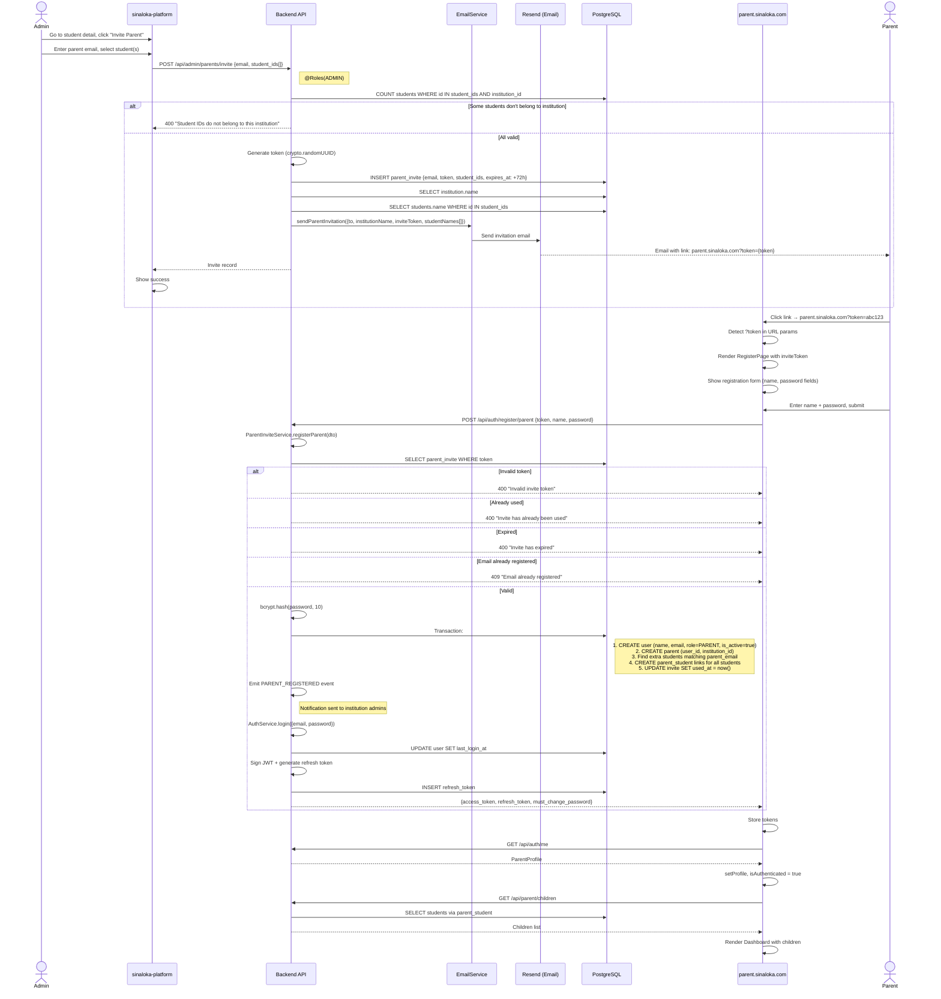
```mermaid
sequenceDiagram
    actor Admin
    participant Platform as sinaloka-platform
    participant API as Backend API
    participant EmailSvc as EmailService
    participant Resend as Resend (Email)
    participant DB as PostgreSQL
    participant ParentApp as parent.sinaloka.com
    actor Parent

    %% Step 1: Admin creates parent invite
    Admin->>Platform: Go to student detail, click "Invite Parent"
    Admin->>Platform: Enter parent email, select student(s)
    Platform->>API: POST /api/admin/parents/invite {email, student_ids[]}
    Note right of API: @Roles(ADMIN)

    API->>DB: COUNT students WHERE id IN student_ids AND institution_id
    alt Some students don't belong to institution
        API-->>Platform: 400 "Student IDs do not belong to this institution"
    else All valid
        API->>API: Generate token (crypto.randomUUID)
        API->>DB: INSERT parent_invite {email, token, student_ids, expires_at: +72h}

        API->>DB: SELECT institution.name
        API->>DB: SELECT students.name WHERE id IN student_ids
        API->>EmailSvc: sendParentInvitation({to, institutionName, inviteToken, studentNames[]})
        EmailSvc->>Resend: Send invitation email
        Resend-->>Parent: Email with link: parent.sinaloka.com?token={token}
        API-->>Platform: Invite record
        Platform->>Platform: Show success
    end

    %% Step 2: Parent opens link
    Parent->>ParentApp: Click link → parent.sinaloka.com?token=abc123
    ParentApp->>ParentApp: Detect ?token in URL params
    ParentApp->>ParentApp: Render RegisterPage with inviteToken

    %% RegisterPage validates the invite token first (from UI)
    ParentApp->>ParentApp: Show registration form (name, password fields)

    %% Step 3: Parent registers
    Parent->>ParentApp: Enter name + password, submit
    ParentApp->>API: POST /api/auth/register/parent {token, name, password}

    API->>API: ParentInviteService.registerParent(dto)
    API->>DB: SELECT parent_invite WHERE token
    alt Invalid token
        API-->>ParentApp: 400 "Invalid invite token"
    else Already used
        API-->>ParentApp: 400 "Invite has already been used"
    else Expired
        API-->>ParentApp: 400 "Invite has expired"
    else Email already registered
        API-->>ParentApp: 409 "Email already registered"
    else Valid
        API->>API: bcrypt.hash(password, 10)
        API->>DB: Transaction:
        Note right of DB: 1. CREATE user (name, email, role=PARENT, is_active=true)<br/>2. CREATE parent (user_id, institution_id)<br/>3. Find extra students matching parent_email<br/>4. CREATE parent_student links for all students<br/>5. UPDATE invite SET used_at = now()

        API->>API: Emit PARENT_REGISTERED event
        Note right of API: Notification sent to institution admins

        %% Auto-login: controller calls authService.login after registration
        API->>API: AuthService.login({email, password})
        API->>DB: UPDATE user SET last_login_at
        API->>API: Sign JWT + generate refresh token
        API->>DB: INSERT refresh_token
        API-->>ParentApp: {access_token, refresh_token, must_change_password}
    end

    %% Step 4: Auto-authenticated
    ParentApp->>ParentApp: Store tokens
    ParentApp->>API: GET /api/auth/me
    API-->>ParentApp: ParentProfile
    ParentApp->>ParentApp: setProfile, isAuthenticated = true

    ParentApp->>API: GET /api/parent/children
    API->>DB: SELECT students via parent_student
    API-->>ParentApp: Children list
    ParentApp->>ParentApp: Render Dashboard with children
```

> **Business Rules:**
> - Parent invite expires in 72 hours (vs. 48h for tutor invites).
> - Auto-linking: besides the explicitly invited student_ids, the system also finds other students where `parent_email` matches the invite email and links them automatically.
> - Registration is auto-login: the `POST /api/auth/register/parent` endpoint creates the user AND returns authentication tokens in one call.
> - Parent invite tokens are single-use. Once `used_at` is set, the invite cannot be re-used.
> - `ParentStudentGuard` in the backend ensures parents can only access data of their own linked children.

---

## 9. Public Registration Flow

Visitor opens /register/:slug, fetches institution info, selects role, fills form, submits.
Registration goes into PENDING status for admin review.

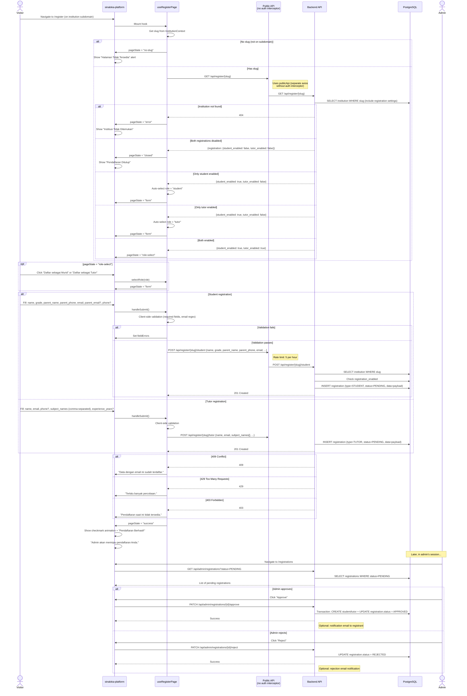
```mermaid
sequenceDiagram
    actor Visitor
    participant Platform as sinaloka-platform
    participant RegHook as useRegisterPage
    participant PublicAPI as Public API<br/>(no auth interceptor)
    participant API as Backend API
    participant DB as PostgreSQL
    actor Admin

    %% Step 1: Load registration page
    Visitor->>Platform: Navigate to /register (on institution subdomain)
    Platform->>RegHook: Mount hook

    RegHook->>RegHook: Get slug from InstitutionContext
    alt No slug (not on subdomain)
        RegHook->>Platform: pageState = "no-slug"
        Platform->>Platform: Show "Halaman Tidak Tersedia" alert
    else Has slug
        RegHook->>PublicAPI: GET /api/register/{slug}
        Note right of PublicAPI: Uses publicApi (separate axios<br/>without auth interceptor)
        PublicAPI->>API: GET /api/register/{slug}
        API->>DB: SELECT institution WHERE slug (include registration settings)

        alt Institution not found
            API-->>RegHook: 404
            RegHook->>Platform: pageState = "error"
            Platform->>Platform: Show "Institusi Tidak Ditemukan"
        else Both registrations disabled
            API-->>RegHook: {registration: {student_enabled: false, tutor_enabled: false}}
            RegHook->>Platform: pageState = "closed"
            Platform->>Platform: Show "Pendaftaran Ditutup"
        else Only student enabled
            API-->>RegHook: {student_enabled: true, tutor_enabled: false}
            RegHook->>RegHook: Auto-select role = "student"
            RegHook->>Platform: pageState = "form"
        else Only tutor enabled
            API-->>RegHook: {student_enabled: true, tutor_enabled: false}
            RegHook->>RegHook: Auto-select role = "tutor"
            RegHook->>Platform: pageState = "form"
        else Both enabled
            API-->>RegHook: {student_enabled: true, tutor_enabled: true}
            RegHook->>Platform: pageState = "role-select"
        end
    end

    %% Step 2: Role selection (if both enabled)
    opt pageState = "role-select"
        Visitor->>Platform: Click "Daftar sebagai Murid" or "Daftar sebagai Tutor"
        Platform->>RegHook: selectRole(role)
        RegHook->>Platform: pageState = "form"
    end

    %% Step 3: Fill and submit form
    alt Student registration
        Visitor->>Platform: Fill: name, grade, parent_name, parent_phone, email, parent_email?, phone?
        Platform->>RegHook: handleSubmit()
        RegHook->>RegHook: Client-side validation (required fields, email regex)
        alt Validation fails
            RegHook->>Platform: Set fieldErrors
        else Validation passes
            RegHook->>PublicAPI: POST /api/register/{slug}/student {name, grade, parent_name, parent_phone, email, ...}
            Note right of PublicAPI: Rate limit: 5 per hour
            PublicAPI->>API: POST /api/register/{slug}/student
            API->>DB: SELECT institution WHERE slug
            API->>DB: Check registration_enabled
            API->>DB: INSERT registration (type=STUDENT, status=PENDING, data=payload)
            API-->>RegHook: 201 Created
        end
    else Tutor registration
        Visitor->>Platform: Fill: name, email, phone?, subject_names (comma-separated), experience_years?
        Platform->>RegHook: handleSubmit()
        RegHook->>RegHook: Client-side validation
        RegHook->>PublicAPI: POST /api/register/{slug}/tutor {name, email, subject_names[], ...}
        API->>DB: INSERT registration (type=TUTOR, status=PENDING, data=payload)
        API-->>RegHook: 201 Created
    end

    %% Error handling
    alt 409 Conflict
        API-->>RegHook: 409
        RegHook->>Platform: "Data dengan email ini sudah terdaftar."
    else 429 Too Many Requests
        API-->>RegHook: 429
        RegHook->>Platform: "Terlalu banyak percobaan."
    else 403 Forbidden
        API-->>RegHook: 403
        RegHook->>Platform: "Pendaftaran saat ini tidak tersedia."
    end

    %% Step 4: Success
    RegHook->>Platform: pageState = "success"
    Platform->>Platform: Show checkmark animation + "Pendaftaran Berhasil!"
    Platform->>Platform: "Admin akan meninjau pendaftaran Anda."

    %% Step 5: Admin review (async, different session)
    Note over Admin,DB: Later, in admin's session...
    Admin->>Platform: Navigate to /registrations
    Platform->>API: GET /api/admin/registrations?status=PENDING
    API->>DB: SELECT registrations WHERE status=PENDING
    API-->>Platform: List of pending registrations

    alt Admin approves
        Admin->>Platform: Click "Approve"
        Platform->>API: PATCH /api/admin/registrations/{id}/approve
        API->>DB: Transaction: CREATE student/tutor + UPDATE registration.status = APPROVED
        API-->>Platform: Success
        Note right of API: Optional: notification email to registrant
    else Admin rejects
        Admin->>Platform: Click "Reject"
        Platform->>API: PATCH /api/admin/registrations/{id}/reject
        API->>DB: UPDATE registration.status = REJECTED
        API-->>Platform: Success
        Note right of API: Optional: rejection email notification
    end
```

> **Business Rules:**
> - Public registration uses a separate Axios instance (`publicApi`) without the auth interceptor, to avoid 401 redirect loops.
> - Rate limit: 5 registration submissions per hour per IP address.
> - Registration does NOT create a user account. It creates a `registration` record with `status=PENDING`. Admin must approve to create the actual student/tutor entity.
> - `student_enabled` and `tutor_enabled` are configured per-institution in Settings > Registration.
> - If only one role is enabled, the role selection step is skipped and the form auto-selects that role.

---

## 10. Super Admin Impersonation

Super Admin navigates to institution detail, clicks impersonate, all API calls scoped to that institution.

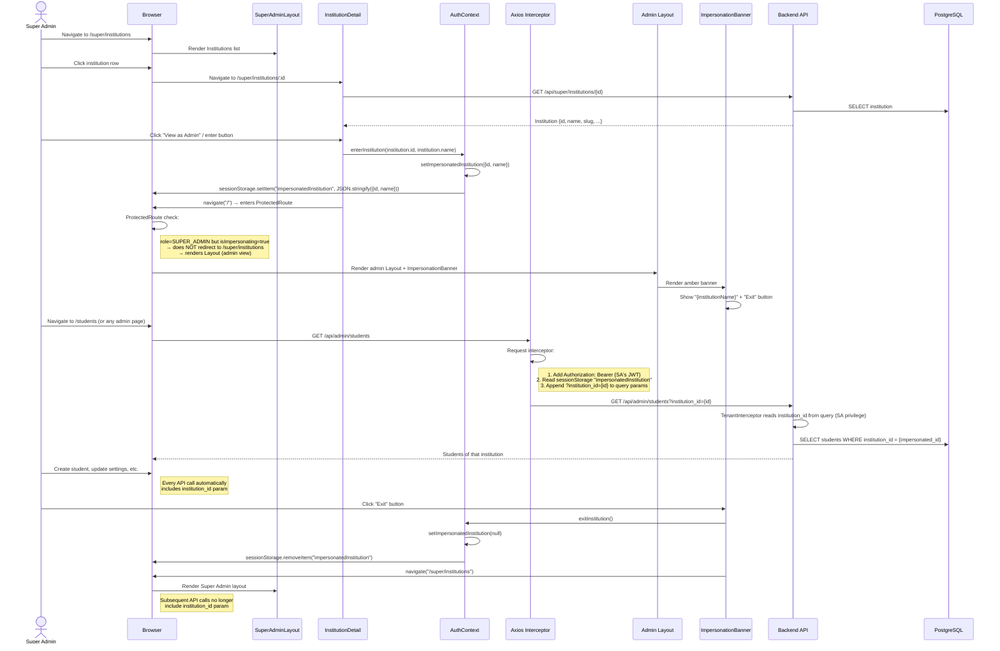
```mermaid
sequenceDiagram
    actor SA as Super Admin
    participant Browser
    participant SALayout as SuperAdminLayout
    participant InstDetail as InstitutionDetail
    participant AuthCtx as AuthContext
    participant Axios as Axios Interceptor
    participant Layout as Admin Layout
    participant Banner as ImpersonationBanner
    participant API as Backend API
    participant DB as PostgreSQL

    %% Step 1: Navigate to institution detail
    SA->>Browser: Navigate to /super/institutions
    Browser->>SALayout: Render Institutions list
    SA->>Browser: Click institution row
    Browser->>InstDetail: Navigate to /super/institutions/:id

    InstDetail->>API: GET /api/super/institutions/{id}
    API->>DB: SELECT institution
    API-->>InstDetail: Institution {id, name, slug, ...}

    %% Step 2: Enter impersonation
    SA->>InstDetail: Click "View as Admin" / enter button
    InstDetail->>AuthCtx: enterInstitution(institution.id, institution.name)
    AuthCtx->>AuthCtx: setImpersonatedInstitution({id, name})
    AuthCtx->>Browser: sessionStorage.setItem("impersonatedInstitution", JSON.stringify({id, name}))

    InstDetail->>Browser: navigate("/") → enters ProtectedRoute

    %% Step 3: ProtectedRoute allows impersonating SA
    Browser->>Browser: ProtectedRoute check:
    Note right of Browser: role=SUPER_ADMIN but isImpersonating=true<br/>→ does NOT redirect to /super/institutions<br/>→ renders Layout (admin view)

    %% Step 4: All API calls now scoped
    Browser->>Layout: Render admin Layout + ImpersonationBanner

    Layout->>Banner: Render amber banner
    Banner->>Banner: Show "{institutionName}" + "Exit" button

    SA->>Browser: Navigate to /students (or any admin page)
    Browser->>Axios: GET /api/admin/students
    Axios->>Axios: Request interceptor:
    Note right of Axios: 1. Add Authorization: Bearer {SA's JWT}<br/>2. Read sessionStorage "impersonatedInstitution"<br/>3. Append ?institution_id={id} to query params

    Axios->>API: GET /api/admin/students?institution_id={id}
    API->>API: TenantInterceptor reads institution_id from query (SA privilege)
    API->>DB: SELECT students WHERE institution_id = {impersonated_id}
    API-->>Browser: Students of that institution

    %% Step 5: All CRUD operations are scoped
    SA->>Browser: Create student, update settings, etc.
    Note right of Browser: Every API call automatically<br/>includes institution_id param

    %% Step 6: Exit impersonation
    SA->>Banner: Click "Exit" button
    Banner->>AuthCtx: exitInstitution()
    AuthCtx->>AuthCtx: setImpersonatedInstitution(null)
    AuthCtx->>Browser: sessionStorage.removeItem("impersonatedInstitution")
    Banner->>Browser: navigate("/super/institutions")

    Browser->>SALayout: Render Super Admin layout
    Note right of Browser: Subsequent API calls no longer<br/>include institution_id param
```

> **Business Rules:**
> - Impersonation state is stored in `sessionStorage`, not `localStorage`. This means it is cleared when the browser tab is closed (security measure).
> - The amber banner is always visible during impersonation to prevent confusion about which institution the SA is operating on.
> - `TenantInterceptor` on the backend only allows the `institution_id` query parameter override for `SUPER_ADMIN` role. Regular users cannot scope to other institutions.
> - The SA's own JWT is used for all requests -- no separate token is minted. The backend trusts the `institution_id` override because the JWT role is `SUPER_ADMIN`.
> - During impersonation, `ProtectedRoute` recognizes `isImpersonating=true` and does NOT redirect the SA to `/super/institutions`, allowing them to use the regular admin layout.

---

## 11. Protected Route Guard Chain

Complete request-to-render chain for any protected page in the platform.

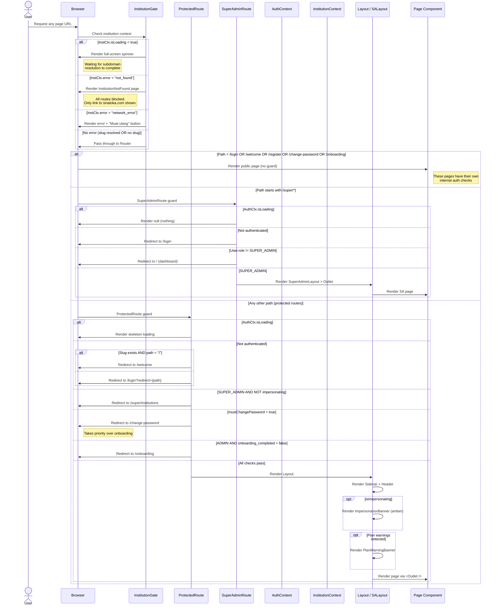
```mermaid
sequenceDiagram
    actor User
    participant Browser
    participant InstGate as InstitutionGate
    participant ProtRoute as ProtectedRoute
    participant SARoute as SuperAdminRoute
    participant AuthCtx as AuthContext
    participant InstCtx as InstitutionContext
    participant Layout as Layout / SALayout
    participant Page as Page Component

    User->>Browser: Request any page URL

    %% Gate 1: Institution Gate (outermost wrapper)
    Browser->>InstGate: Check institution context
    alt InstCtx.isLoading = true
        InstGate->>Browser: Render full-screen spinner
        Note right of Browser: Waiting for subdomain<br/>resolution to complete
    else InstCtx.error = "not_found"
        InstGate->>Browser: Render InstitutionNotFound page
        Note right of Browser: All routes blocked.<br/>Only link to sinaloka.com shown.
    else InstCtx.error = "network_error"
        InstGate->>Browser: Render error + "Muat ulang" button
    else No error (slug resolved OR no slug)
        InstGate->>Browser: Pass through to Router
    end

    %% Router dispatches based on path
    alt Path = /login OR /welcome OR /register OR /change-password OR /onboarding
        Browser->>Page: Render public page (no guard)
        Note right of Page: These pages have their own<br/>internal auth checks
    else Path starts with /super/*
        Browser->>SARoute: SuperAdminRoute guard

        %% Gate 2: SuperAdminRoute
        alt AuthCtx.isLoading
            SARoute->>Browser: Render null (nothing)
        else Not authenticated
            SARoute->>Browser: Redirect to /login
        else User.role != SUPER_ADMIN
            SARoute->>Browser: Redirect to / (dashboard)
        else SUPER_ADMIN
            SARoute->>Layout: Render SuperAdminLayout > Outlet
            Layout->>Page: Render SA page
        end
    else Any other path (protected routes)
        Browser->>ProtRoute: ProtectedRoute guard

        %% Gate 3: ProtectedRoute (cascading checks)
        alt AuthCtx.isLoading
            ProtRoute->>Browser: Render skeleton loading
        else Not authenticated
            alt Slug exists AND path = "/"
                ProtRoute->>Browser: Redirect to /welcome
            else
                ProtRoute->>Browser: Redirect to /login?redirect={path}
            end
        else SUPER_ADMIN AND NOT impersonating
            ProtRoute->>Browser: Redirect to /super/institutions
        else mustChangePassword = true
            ProtRoute->>Browser: Redirect to /change-password
            Note right of Browser: Takes priority over onboarding
        else ADMIN AND onboarding_completed = false
            ProtRoute->>Browser: Redirect to /onboarding
        else All checks pass
            ProtRoute->>Layout: Render Layout
            Layout->>Layout: Render Sidebar + Header
            opt isImpersonating
                Layout->>Layout: Render ImpersonationBanner (amber)
            end
            opt Plan warnings detected
                Layout->>Layout: Render PlanWarningBanner
            end
            Layout->>Page: Render page via <Outlet />
        end
    end
```

> **Business Rules:**
> - Guard evaluation order matters: InstitutionGate > Router > ProtectedRoute/SuperAdminRoute.
> - `mustChangePassword` is checked BEFORE onboarding. A user forced to change password must do so before they can proceed to onboarding or any other page.
> - SuperAdminRoute is simpler than ProtectedRoute -- no password change check, no onboarding check, no impersonation handling.
> - Unauthenticated users on an institution subdomain hitting the root path `/` are sent to `/welcome` (branded landing) rather than `/login` directly.
> - The `redirect` query parameter preserves the user's intended destination through the login flow.

---

## 12. Subdomain Resolution

Browser loads *.sinaloka.com, extract slug from hostname, fetch institution data or enter super admin mode.

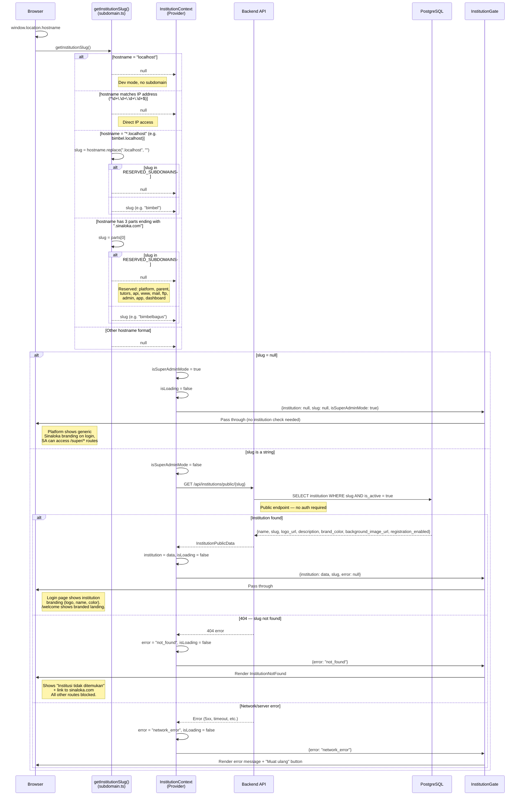
```mermaid
sequenceDiagram
    participant Browser
    participant SubUtil as getInstitutionSlug()<br/>(subdomain.ts)
    participant InstCtx as InstitutionContext<br/>(Provider)
    participant API as Backend API
    participant DB as PostgreSQL
    participant InstGate as InstitutionGate

    Browser->>Browser: window.location.hostname

    Browser->>SubUtil: getInstitutionSlug()

    alt hostname = "localhost"
        SubUtil-->>InstCtx: null
        Note right of SubUtil: Dev mode, no subdomain
    else hostname matches IP address (^\d+\.\d+\.\d+\.\d+$)
        SubUtil-->>InstCtx: null
        Note right of SubUtil: Direct IP access
    else hostname = "*.localhost" (e.g. bimbel.localhost)
        SubUtil->>SubUtil: slug = hostname.replace(".localhost", "")
        alt slug in RESERVED_SUBDOMAINS
            SubUtil-->>InstCtx: null
        else
            SubUtil-->>InstCtx: slug (e.g. "bimbel")
        end
    else hostname has 3 parts ending with ".sinaloka.com"
        SubUtil->>SubUtil: slug = parts[0]
        alt slug in RESERVED_SUBDOMAINS
            SubUtil-->>InstCtx: null
            Note right of SubUtil: Reserved: platform, parent,<br/>tutors, api, www, mail, ftp,<br/>admin, app, dashboard
        else
            SubUtil-->>InstCtx: slug (e.g. "bimbelbagus")
        end
    else Other hostname format
        SubUtil-->>InstCtx: null
    end

    %% InstitutionContext processes the slug
    alt slug = null
        InstCtx->>InstCtx: isSuperAdminMode = true
        InstCtx->>InstCtx: isLoading = false
        InstCtx->>InstGate: {institution: null, slug: null, isSuperAdminMode: true}
        InstGate->>Browser: Pass through (no institution check needed)
        Note right of Browser: Platform shows generic<br/>Sinaloka branding on login,<br/>SA can access /super/* routes
    else slug is a string
        InstCtx->>InstCtx: isSuperAdminMode = false
        InstCtx->>API: GET /api/institutions/public/{slug}
        API->>DB: SELECT institution WHERE slug AND is_active = true
        Note right of API: Public endpoint — no auth required

        alt Institution found
            DB-->>API: {name, slug, logo_url, description, brand_color, background_image_url, registration_enabled}
            API-->>InstCtx: InstitutionPublicData
            InstCtx->>InstCtx: institution = data, isLoading = false
            InstCtx->>InstGate: {institution: data, slug, error: null}
            InstGate->>Browser: Pass through
            Note right of Browser: Login page shows institution<br/>branding (logo, name, color).<br/>/welcome shows branded landing.
        else 404 — slug not found
            API-->>InstCtx: 404 error
            InstCtx->>InstCtx: error = "not_found", isLoading = false
            InstCtx->>InstGate: {error: "not_found"}
            InstGate->>Browser: Render InstitutionNotFound
            Note right of Browser: Shows "Institusi tidak ditemukan"<br/>+ link to sinaloka.com<br/>All other routes blocked.
        else Network/server error
            API-->>InstCtx: Error (5xx, timeout, etc.)
            InstCtx->>InstCtx: error = "network_error", isLoading = false
            InstCtx->>InstGate: {error: "network_error"}
            InstGate->>Browser: Render error message + "Muat ulang" button
        end
    end
```

> **Business Rules:**
> - Subdomain resolution happens synchronously for hostname parsing (no async), but the institution data fetch is async.
> - Reserved subdomains are hardcoded: `platform`, `parent`, `tutors`, `api`, `www`, `mail`, `ftp`, `admin`, `app`, `dashboard`. These always resolve to `null` (super admin / generic mode).
> - This is NOT a security mechanism. All auth is server-side via JWT. Subdomain resolution only affects UI branding and routing decisions.
> - `InstitutionPublicData` is fetched from a public endpoint (no auth required), so even unauthenticated visitors see institution branding.
> - The `isSuperAdminMode` flag is derived from `slug === null`. It does NOT check the user's role -- it only indicates the hostname context.
> - Institution `is_active` is checked server-side. Deactivated institutions return 404 on the public endpoint.

---

# Part 2: Students, Tutors & Registrations

---

## Table of Contents

1. [Admin Creates Student](#1-admin-creates-student)
2. [Import Students from CSV](#2-import-students-from-csv)
3. [Admin Views Student Detail](#3-admin-views-student-detail)
4. [Invite Parent](#4-invite-parent)
5. [Parent Registers via Invite](#5-parent-registers-via-invite)
6. [Parent Views Children Dashboard](#6-parent-views-children-dashboard)
7. [Parent Views Child Detail Tabs](#7-parent-views-child-detail-tabs)
8. [Admin Invites Tutor](#8-admin-invites-tutor)
9. [Tutor Accepts Invite](#9-tutor-accepts-invite)
10. [Admin Creates Tutor (Direct)](#10-admin-creates-tutor-direct)
11. [Tutor Self-Service: Dashboard and Schedule](#11-tutor-self-service-dashboard-and-schedule)
12. [Tutor Submits Attendance and Finalizes](#12-tutor-submits-attendance-and-finalizes)
13. [Tutor Requests Reschedule](#13-tutor-requests-reschedule)
14. [Tutor Views Payouts](#14-tutor-views-payouts)
15. [Admin Manages Tutor (Edit, Verify, Delete)](#15-admin-manages-tutor-edit-verify-delete)

---

## 1. Admin Creates Student

Admin opens the student form, fills in student data including parent info, and creates a new student record. The backend enforces plan limits and emits a notification event.

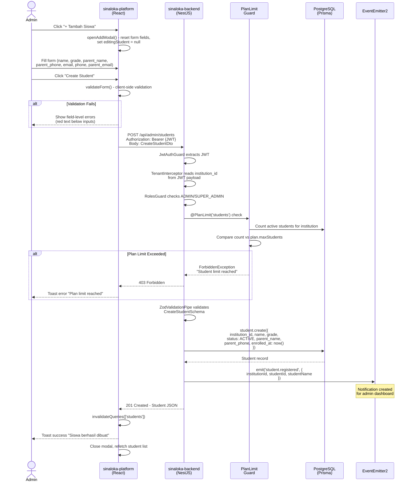
```mermaid
sequenceDiagram
    actor Admin
    participant Platform as sinaloka-platform<br/>(React)
    participant Backend as sinaloka-backend<br/>(NestJS)
    participant PlanGuard as PlanLimit<br/>Guard
    participant DB as PostgreSQL<br/>(Prisma)
    participant Events as EventEmitter2

    Admin->>Platform: Click "+ Tambah Siswa"
    Platform->>Platform: openAddModal() - reset form fields,<br/>set editingStudent = null

    Admin->>Platform: Fill form (name, grade, parent_name,<br/>parent_phone, email, phone, parent_email)
    Admin->>Platform: Click "Create Student"
    Platform->>Platform: validateForm() - client-side validation

    alt Validation Fails
        Platform-->>Admin: Show field-level errors<br/>(red text below inputs)
    end

    Platform->>Backend: POST /api/admin/students<br/>Authorization: Bearer {JWT}<br/>Body: CreateStudentDto

    Backend->>Backend: JwtAuthGuard extracts JWT
    Backend->>Backend: TenantInterceptor reads institution_id<br/>from JWT payload
    Backend->>Backend: RolesGuard checks ADMIN/SUPER_ADMIN

    Backend->>PlanGuard: @PlanLimit('students') check
    PlanGuard->>DB: Count active students for institution
    PlanGuard->>PlanGuard: Compare count vs plan.maxStudents

    alt Plan Limit Exceeded
        PlanGuard-->>Backend: ForbiddenException<br/>"Student limit reached"
        Backend-->>Platform: 403 Forbidden
        Platform-->>Admin: Toast error "Plan limit reached"
    end

    Backend->>Backend: ZodValidationPipe validates<br/>CreateStudentSchema

    Backend->>DB: student.create({<br/>  institution_id, name, grade,<br/>  status: ACTIVE, parent_name,<br/>  parent_phone, enrolled_at: now()<br/>})
    DB-->>Backend: Student record

    Backend->>Events: emit('student.registered', {<br/>  institutionId, studentId, studentName<br/>})
    Note over Events: Notification created<br/>for admin dashboard

    Backend-->>Platform: 201 Created - Student JSON

    Platform->>Platform: invalidateQueries(['students'])
    Platform-->>Admin: Toast success "Siswa berhasil dibuat"
    Platform->>Platform: Close modal, refetch student list
```

> **Business Rules:**
> - `@PlanLimit('students')` decorator checks active student count against the institution's plan (Starter: 30, Growth: 100, Business: unlimited).
> - If the plan limit is reached but within a 7-day grace period, creation is still allowed. After grace period expires, creation is blocked.
> - `parent_name` and `parent_phone` are required by the Zod schema. `email`, `phone`, and `parent_email` are optional.
> - `enrolled_at` defaults to the current timestamp if not provided.

---

## 2. Import Students from CSV

Admin uploads a CSV file to bulk-create students. Each row is validated against the CreateStudentSchema, and duplicates are skipped.

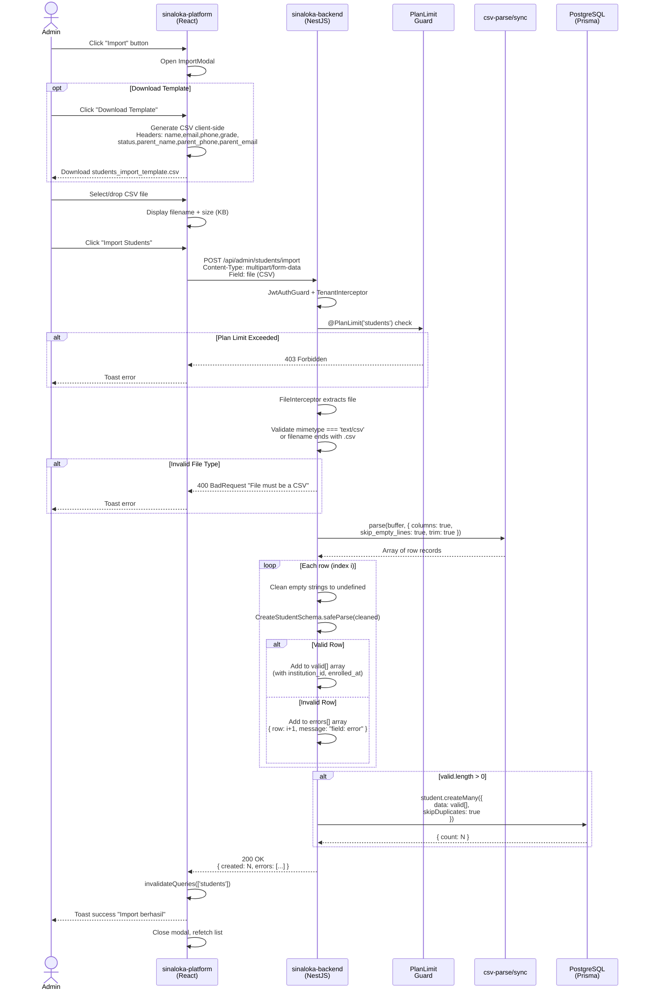
```mermaid
sequenceDiagram
    actor Admin
    participant Platform as sinaloka-platform<br/>(React)
    participant Backend as sinaloka-backend<br/>(NestJS)
    participant PlanGuard as PlanLimit<br/>Guard
    participant CSVParser as csv-parse/sync
    participant DB as PostgreSQL<br/>(Prisma)

    Admin->>Platform: Click "Import" button
    Platform->>Platform: Open ImportModal

    opt Download Template
        Admin->>Platform: Click "Download Template"
        Platform->>Platform: Generate CSV client-side<br/>Headers: name,email,phone,grade,<br/>status,parent_name,parent_phone,parent_email
        Platform-->>Admin: Download students_import_template.csv
    end

    Admin->>Platform: Select/drop CSV file
    Platform->>Platform: Display filename + size (KB)
    Admin->>Platform: Click "Import Students"

    Platform->>Backend: POST /api/admin/students/import<br/>Content-Type: multipart/form-data<br/>Field: file (CSV)

    Backend->>Backend: JwtAuthGuard + TenantInterceptor
    Backend->>PlanGuard: @PlanLimit('students') check

    alt Plan Limit Exceeded
        PlanGuard-->>Platform: 403 Forbidden
        Platform-->>Admin: Toast error
    end

    Backend->>Backend: FileInterceptor extracts file
    Backend->>Backend: Validate mimetype === 'text/csv'<br/>or filename ends with .csv

    alt Invalid File Type
        Backend-->>Platform: 400 BadRequest "File must be a CSV"
        Platform-->>Admin: Toast error
    end

    Backend->>CSVParser: parse(buffer, { columns: true,<br/>skip_empty_lines: true, trim: true })
    CSVParser-->>Backend: Array of row records

    loop Each row (index i)
        Backend->>Backend: Clean empty strings to undefined
        Backend->>Backend: CreateStudentSchema.safeParse(cleaned)
        alt Valid Row
            Backend->>Backend: Add to valid[] array<br/>(with institution_id, enrolled_at)
        else Invalid Row
            Backend->>Backend: Add to errors[] array<br/>{ row: i+1, message: "field: error" }
        end
    end

    alt valid.length > 0
        Backend->>DB: student.createMany({<br/>  data: valid[],<br/>  skipDuplicates: true<br/>})
        DB-->>Backend: { count: N }
    end

    Backend-->>Platform: 200 OK<br/>{ created: N, errors: [...] }

    Platform->>Platform: invalidateQueries(['students'])
    Platform-->>Admin: Toast success "Import berhasil"
    Platform->>Platform: Close modal, refetch list
```

> **Business Rules:**
> - `skipDuplicates: true` ensures rows with duplicate unique fields (e.g., email) are silently skipped rather than causing the entire import to fail.
> - Each row is individually validated against the full `CreateStudentSchema`, so partial imports are possible (some rows succeed, some fail).
> - The response includes both `created` count and an `errors` array with row numbers and error messages for admin review.

---

## 3. Admin Views Student Detail

Admin navigates to a specific student's detail page, which loads the profile and attendance data in separate tabs with a date range picker.

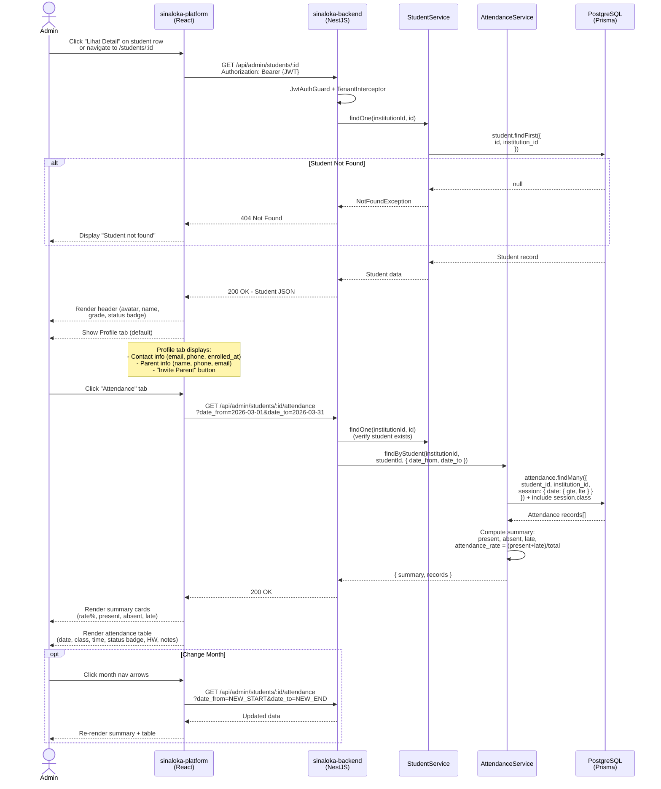
```mermaid
sequenceDiagram
    actor Admin
    participant Platform as sinaloka-platform<br/>(React)
    participant Backend as sinaloka-backend<br/>(NestJS)
    participant StudentSvc as StudentService
    participant AttendanceSvc as AttendanceService
    participant DB as PostgreSQL<br/>(Prisma)

    Admin->>Platform: Click "Lihat Detail" on student row<br/>or navigate to /students/:id

    Platform->>Backend: GET /api/admin/students/:id<br/>Authorization: Bearer {JWT}
    Backend->>Backend: JwtAuthGuard + TenantInterceptor
    Backend->>StudentSvc: findOne(institutionId, id)
    StudentSvc->>DB: student.findFirst({<br/>  id, institution_id<br/>})

    alt Student Not Found
        DB-->>StudentSvc: null
        StudentSvc-->>Backend: NotFoundException
        Backend-->>Platform: 404 Not Found
        Platform-->>Admin: Display "Student not found"
    end

    DB-->>StudentSvc: Student record
    StudentSvc-->>Backend: Student data
    Backend-->>Platform: 200 OK - Student JSON

    Platform-->>Admin: Render header (avatar, name,<br/>grade, status badge)
    Platform-->>Admin: Show Profile tab (default)

    Note over Platform: Profile tab displays:<br/>- Contact info (email, phone, enrolled_at)<br/>- Parent info (name, phone, email)<br/>- "Invite Parent" button

    Admin->>Platform: Click "Attendance" tab

    Platform->>Backend: GET /api/admin/students/:id/attendance<br/>?date_from=2026-03-01&date_to=2026-03-31
    Backend->>StudentSvc: findOne(institutionId, id)<br/>(verify student exists)
    Backend->>AttendanceSvc: findByStudent(institutionId,<br/>studentId, { date_from, date_to })

    AttendanceSvc->>DB: attendance.findMany({<br/>  student_id, institution_id,<br/>  session: { date: { gte, lte } }<br/>}) + include session.class

    DB-->>AttendanceSvc: Attendance records[]

    AttendanceSvc->>AttendanceSvc: Compute summary:<br/>present, absent, late,<br/>attendance_rate = (present+late)/total

    AttendanceSvc-->>Backend: { summary, records }
    Backend-->>Platform: 200 OK

    Platform-->>Admin: Render summary cards<br/>(rate%, present, absent, late)
    Platform-->>Admin: Render attendance table<br/>(date, class, time, status badge, HW, notes)

    opt Change Month
        Admin->>Platform: Click month nav arrows
        Platform->>Backend: GET /api/admin/students/:id/attendance<br/>?date_from=NEW_START&date_to=NEW_END
        Backend-->>Platform: Updated data
        Platform-->>Admin: Re-render summary + table
    end
```

> **Business Rules:**
> - The attendance tab uses month-based navigation (first day to last day of month).
> - Summary stats are computed server-side from ALL matching records, not just the paginated page.
> - Attendance status badges: PRESENT (emerald/green), ABSENT (rose/red), LATE (amber/yellow).
> - Homework completion shows a green checkmark if `homework_done` is true, otherwise a dash.

---

## 4. Invite Parent

Admin sends a parent invitation email from a student's record. The system creates a time-limited invite token and emails it to the parent.

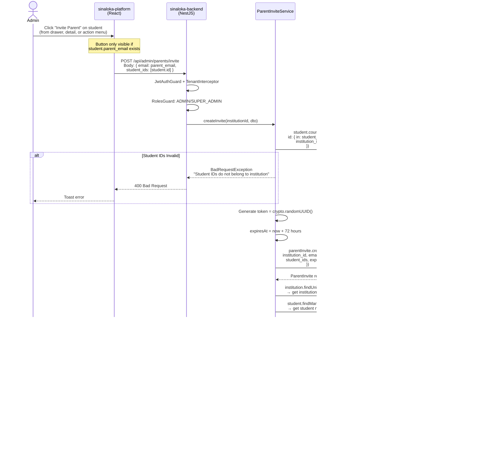
```mermaid
sequenceDiagram
    actor Admin
    participant Platform as sinaloka-platform<br/>(React)
    participant Backend as sinaloka-backend<br/>(NestJS)
    participant InviteSvc as ParentInviteService
    participant DB as PostgreSQL<br/>(Prisma)
    participant Email as EmailService<br/>(Resend)
    actor Parent

    Admin->>Platform: Click "Invite Parent" on student<br/>(from drawer, detail, or action menu)

    Note over Platform: Button only visible if<br/>student.parent_email exists

    Platform->>Backend: POST /api/admin/parents/invite<br/>Body: { email: parent_email,<br/>student_ids: [student.id] }

    Backend->>Backend: JwtAuthGuard + TenantInterceptor
    Backend->>Backend: RolesGuard: ADMIN/SUPER_ADMIN

    Backend->>InviteSvc: createInvite(institutionId, dto)

    InviteSvc->>DB: student.count({<br/>  id: { in: student_ids },<br/>  institution_id<br/>})

    alt Student IDs Invalid
        InviteSvc-->>Backend: BadRequestException<br/>"Student IDs do not belong to institution"
        Backend-->>Platform: 400 Bad Request
        Platform-->>Admin: Toast error
    end

    InviteSvc->>InviteSvc: Generate token = crypto.randomUUID()
    InviteSvc->>InviteSvc: expiresAt = now + 72 hours

    InviteSvc->>DB: parentInvite.create({<br/>  institution_id, email, token,<br/>  student_ids, expires_at<br/>})
    DB-->>InviteSvc: ParentInvite record

    InviteSvc->>DB: institution.findUnique(id)<br/>→ get institution name
    InviteSvc->>DB: student.findMany(ids)<br/>→ get student names

    InviteSvc->>Email: sendParentInvitation({<br/>  to: email,<br/>  institutionName,<br/>  inviteToken: token,<br/>  studentNames: [...]<br/>})
    Email-->>Parent: Email with invite link<br/>https://parent.sinaloka.com<br/>/register?token={token}

    InviteSvc-->>Backend: ParentInvite record
    Backend-->>Platform: 201 Created

    Platform->>Platform: invalidateQueries(['parents'])
    Platform-->>Admin: Toast success<br/>"Undangan dikirim ke {email}"
```

> **Business Rules:**
> - Invite tokens are valid for 72 hours (`expires_at = now + 72h`).
> - A single invite can link multiple students to one parent email.
> - The invite token is a UUID v4 generated via `crypto.randomUUID()`.
> - Student IDs are validated to belong to the same institution (tenant isolation).
> - The invite email includes the institution name and the names of linked students.

---

## 5. Parent Registers via Invite

Parent receives the email, clicks the link, fills out the registration form, and the system creates a User + Parent profile, auto-links students, and auto-logs in.

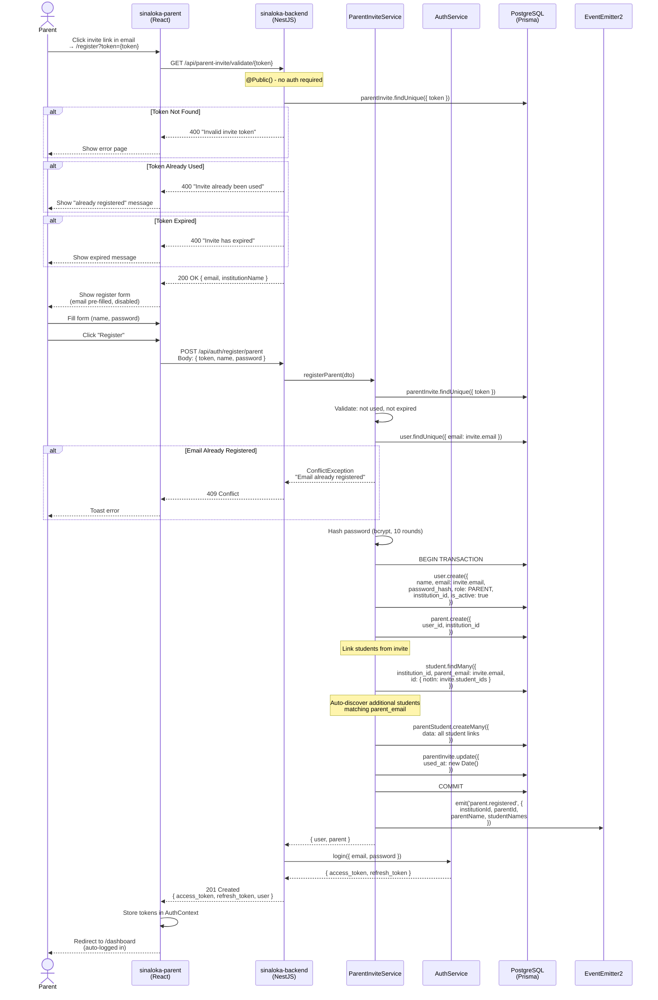
```mermaid
sequenceDiagram
    actor Parent
    participant ParentApp as sinaloka-parent<br/>(React)
    participant Backend as sinaloka-backend<br/>(NestJS)
    participant InviteSvc as ParentInviteService
    participant AuthSvc as AuthService
    participant DB as PostgreSQL<br/>(Prisma)
    participant Events as EventEmitter2

    Parent->>ParentApp: Click invite link in email<br/>→ /register?token={token}

    ParentApp->>Backend: GET /api/parent-invite/validate/{token}
    Note over Backend: @Public() - no auth required

    Backend->>DB: parentInvite.findUnique({ token })

    alt Token Not Found
        Backend-->>ParentApp: 400 "Invalid invite token"
        ParentApp-->>Parent: Show error page
    end

    alt Token Already Used
        Backend-->>ParentApp: 400 "Invite already been used"
        ParentApp-->>Parent: Show "already registered" message
    end

    alt Token Expired
        Backend-->>ParentApp: 400 "Invite has expired"
        ParentApp-->>Parent: Show expired message
    end

    Backend-->>ParentApp: 200 OK { email, institutionName }

    ParentApp-->>Parent: Show register form<br/>(email pre-filled, disabled)

    Parent->>ParentApp: Fill form (name, password)
    Parent->>ParentApp: Click "Register"

    ParentApp->>Backend: POST /api/auth/register/parent<br/>Body: { token, name, password }

    Backend->>InviteSvc: registerParent(dto)

    InviteSvc->>DB: parentInvite.findUnique({ token })
    InviteSvc->>InviteSvc: Validate: not used, not expired

    InviteSvc->>DB: user.findUnique({ email: invite.email })
    alt Email Already Registered
        InviteSvc-->>Backend: ConflictException<br/>"Email already registered"
        Backend-->>ParentApp: 409 Conflict
        ParentApp-->>Parent: Toast error
    end

    InviteSvc->>InviteSvc: Hash password (bcrypt, 10 rounds)

    InviteSvc->>DB: BEGIN TRANSACTION

    InviteSvc->>DB: user.create({<br/>  name, email: invite.email,<br/>  password_hash, role: PARENT,<br/>  institution_id, is_active: true<br/>})

    InviteSvc->>DB: parent.create({<br/>  user_id, institution_id<br/>})

    Note over InviteSvc: Link students from invite

    InviteSvc->>DB: student.findMany({<br/>  institution_id, parent_email: invite.email,<br/>  id: { notIn: invite.student_ids }<br/>})
    Note over InviteSvc: Auto-discover additional students<br/>matching parent_email

    InviteSvc->>DB: parentStudent.createMany({<br/>  data: all student links<br/>})

    InviteSvc->>DB: parentInvite.update({<br/>  used_at: new Date()<br/>})

    InviteSvc->>DB: COMMIT

    InviteSvc->>Events: emit('parent.registered', {<br/>  institutionId, parentId,<br/>  parentName, studentNames<br/>})

    InviteSvc-->>Backend: { user, parent }

    Backend->>AuthSvc: login({ email, password })
    AuthSvc-->>Backend: { access_token, refresh_token }
    Backend-->>ParentApp: 201 Created<br/>{ access_token, refresh_token, user }

    ParentApp->>ParentApp: Store tokens in AuthContext
    ParentApp-->>Parent: Redirect to /dashboard<br/>(auto-logged in)
```

> **Business Rules:**
> - Auto-link: Students explicitly listed in the invite are linked, PLUS any additional students in the institution whose `parent_email` matches the invite email.
> - The invite is marked as used (`used_at` timestamp) inside the transaction to prevent double-registration.
> - After successful registration, the backend performs an auto-login (calls `authService.login`) and returns JWT tokens directly, so the parent is immediately authenticated.
> - A `parent.registered` notification event is emitted for the admin dashboard.

---

## 6. Parent Views Children Dashboard

After login, the parent sees a dashboard with per-child summary cards showing attendance rate, pending payments, and the next upcoming session.

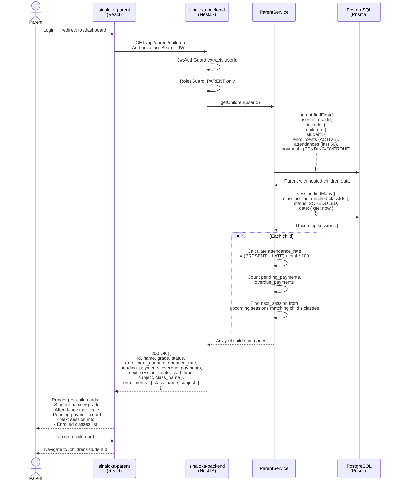
```mermaid
sequenceDiagram
    actor Parent
    participant ParentApp as sinaloka-parent<br/>(React)
    participant Backend as sinaloka-backend<br/>(NestJS)
    participant ParentSvc as ParentService
    participant DB as PostgreSQL<br/>(Prisma)

    Parent->>ParentApp: Login → redirect to /dashboard

    ParentApp->>Backend: GET /api/parent/children<br/>Authorization: Bearer {JWT}

    Backend->>Backend: JwtAuthGuard extracts userId
    Backend->>Backend: RolesGuard: PARENT only

    Backend->>ParentSvc: getChildren(userId)

    ParentSvc->>DB: parent.findFirst({<br/>  user_id: userId,<br/>  include: {<br/>    children: {<br/>      student: {<br/>        enrollments (ACTIVE),<br/>        attendances (last 50),<br/>        payments (PENDING/OVERDUE)<br/>      }<br/>    }<br/>  }<br/>})

    DB-->>ParentSvc: Parent with nested children data

    ParentSvc->>DB: session.findMany({<br/>  class_id: { in: enrolled classIds },<br/>  status: SCHEDULED,<br/>  date: { gte: now }<br/>})
    DB-->>ParentSvc: Upcoming sessions[]

    loop Each child
        ParentSvc->>ParentSvc: Calculate attendance_rate<br/>= (PRESENT + LATE) / total * 100
        ParentSvc->>ParentSvc: Count pending_payments,<br/>overdue_payments
        ParentSvc->>ParentSvc: Find next_session from<br/>upcoming sessions matching child's classes
    end

    ParentSvc-->>Backend: Array of child summaries

    Backend-->>ParentApp: 200 OK [{<br/>  id, name, grade, status,<br/>  enrollment_count, attendance_rate,<br/>  pending_payments, overdue_payments,<br/>  next_session: { date, start_time,<br/>    subject, class_name },<br/>  enrollments: [{ class_name, subject }]<br/>}]

    ParentApp-->>Parent: Render per-child cards:<br/>- Student name + grade<br/>- Attendance rate circle<br/>- Pending payment count<br/>- Next session info<br/>- Enrolled classes list

    Parent->>ParentApp: Tap on a child card
    ParentApp-->>Parent: Navigate to /children/:studentId
```

> **Business Rules:**
> - `ParentStudentGuard` is NOT applied on the `/children` list endpoint -- it returns all children linked to the authenticated parent.
> - Attendance rate is computed from the last 50 attendance records (not all-time), providing a rolling metric.
> - Next session is the soonest `SCHEDULED` session among the child's actively enrolled classes.
> - The dashboard aggregates data in a single API call for performance (avoids N+1 queries).

---

## 7. Parent Views Child Detail Tabs

Parent selects a child and views detailed tabs: Attendance, Sessions, Payments, and Enrollments. Each tab fetches data independently with its own endpoint.

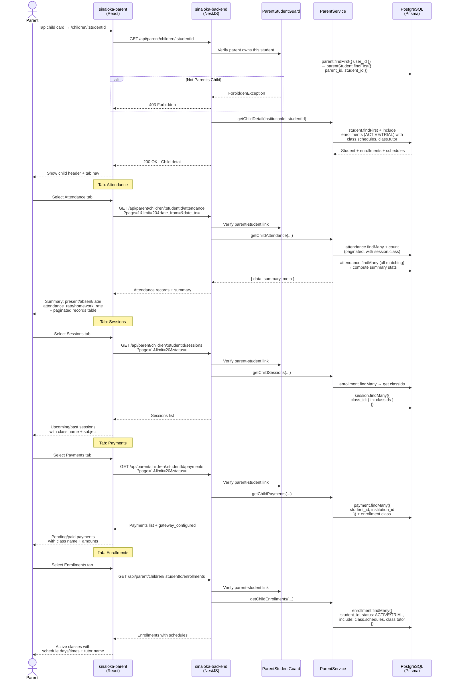
```mermaid
sequenceDiagram
    actor Parent
    participant ParentApp as sinaloka-parent<br/>(React)
    participant Backend as sinaloka-backend<br/>(NestJS)
    participant Guard as ParentStudentGuard
    participant ParentSvc as ParentService
    participant DB as PostgreSQL<br/>(Prisma)

    Parent->>ParentApp: Tap child card → /children/:studentId

    ParentApp->>Backend: GET /api/parent/children/:studentId
    Backend->>Guard: Verify parent owns this student
    Guard->>DB: parent.findFirst({ user_id })<br/>→ parentStudent.findFirst({<br/>  parent_id, student_id })

    alt Not Parent's Child
        Guard-->>Backend: ForbiddenException
        Backend-->>ParentApp: 403 Forbidden
    end

    Backend->>ParentSvc: getChildDetail(institutionId, studentId)
    ParentSvc->>DB: student.findFirst + include<br/>enrollments (ACTIVE/TRIAL) with<br/>class.schedules, class.tutor
    DB-->>ParentSvc: Student + enrollments + schedules
    Backend-->>ParentApp: 200 OK - Child detail
    ParentApp-->>Parent: Show child header + tab nav

    Note over ParentApp: Tab: Attendance

    Parent->>ParentApp: Select Attendance tab
    ParentApp->>Backend: GET /api/parent/children/:studentId/attendance<br/>?page=1&limit=20&date_from=&date_to=
    Backend->>Guard: Verify parent-student link
    Backend->>ParentSvc: getChildAttendance(...)
    ParentSvc->>DB: attendance.findMany + count<br/>(paginated, with session.class)
    ParentSvc->>DB: attendance.findMany (all matching)<br/>→ compute summary stats
    ParentSvc-->>Backend: { data, summary, meta }
    Backend-->>ParentApp: Attendance records + summary
    ParentApp-->>Parent: Summary: present/absent/late/<br/>attendance_rate/homework_rate<br/>+ paginated records table

    Note over ParentApp: Tab: Sessions

    Parent->>ParentApp: Select Sessions tab
    ParentApp->>Backend: GET /api/parent/children/:studentId/sessions<br/>?page=1&limit=20&status=
    Backend->>Guard: Verify parent-student link
    Backend->>ParentSvc: getChildSessions(...)
    ParentSvc->>DB: enrollment.findMany → get classIds
    ParentSvc->>DB: session.findMany({<br/>  class_id: { in: classIds }<br/>})
    Backend-->>ParentApp: Sessions list
    ParentApp-->>Parent: Upcoming/past sessions<br/>with class name + subject

    Note over ParentApp: Tab: Payments

    Parent->>ParentApp: Select Payments tab
    ParentApp->>Backend: GET /api/parent/children/:studentId/payments<br/>?page=1&limit=20&status=
    Backend->>Guard: Verify parent-student link
    Backend->>ParentSvc: getChildPayments(...)
    ParentSvc->>DB: payment.findMany({<br/>  student_id, institution_id<br/>}) + enrollment.class
    Backend-->>ParentApp: Payments list + gateway_configured
    ParentApp-->>Parent: Pending/paid payments<br/>with class name + amounts

    Note over ParentApp: Tab: Enrollments

    Parent->>ParentApp: Select Enrollments tab
    ParentApp->>Backend: GET /api/parent/children/:studentId/enrollments
    Backend->>Guard: Verify parent-student link
    Backend->>ParentSvc: getChildEnrollments(...)
    ParentSvc->>DB: enrollment.findMany({<br/>  student_id, status: ACTIVE/TRIAL,<br/>  include: class.schedules, class.tutor<br/>})
    Backend-->>ParentApp: Enrollments with schedules
    ParentApp-->>Parent: Active classes with<br/>schedule days/times + tutor name
```

> **Business Rules:**
> - `ParentStudentGuard` is applied on ALL child-specific endpoints. It verifies the authenticated parent has a `parentStudent` link to the requested `studentId`. Returns 403 if not linked.
> - Attendance summary computes stats from ALL matching records (not just the current page), ensuring accurate rates regardless of pagination.
> - Sessions tab only shows sessions from classes where the child has an ACTIVE or TRIAL enrollment.
> - The `gateway_configured` flag in payment response indicates whether the Midtrans payment gateway is set up for online payment.

---

## 8. Admin Invites Tutor

Admin fills an invitation form, the backend creates an inactive User + Tutor record with a 48-hour invite token, and sends an email to the tutor.

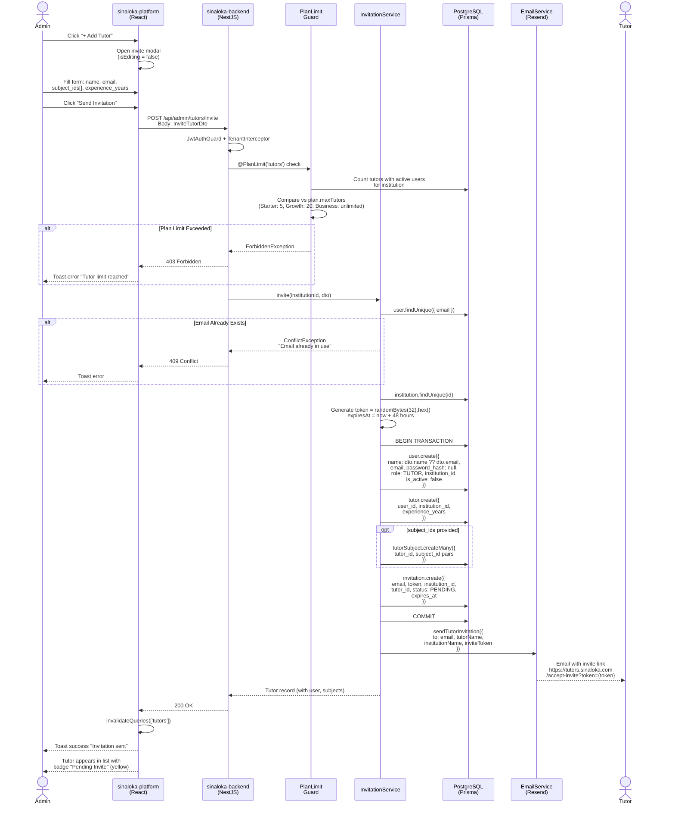
```mermaid
sequenceDiagram
    actor Admin
    participant Platform as sinaloka-platform<br/>(React)
    participant Backend as sinaloka-backend<br/>(NestJS)
    participant PlanGuard as PlanLimit<br/>Guard
    participant InviteSvc as InvitationService
    participant DB as PostgreSQL<br/>(Prisma)
    participant Email as EmailService<br/>(Resend)
    actor Tutor

    Admin->>Platform: Click "+ Add Tutor"
    Platform->>Platform: Open invite modal<br/>(isEditing = false)

    Admin->>Platform: Fill form: name, email,<br/>subject_ids[], experience_years
    Admin->>Platform: Click "Send Invitation"

    Platform->>Backend: POST /api/admin/tutors/invite<br/>Body: InviteTutorDto

    Backend->>Backend: JwtAuthGuard + TenantInterceptor
    Backend->>PlanGuard: @PlanLimit('tutors') check
    PlanGuard->>DB: Count tutors with active users<br/>for institution
    PlanGuard->>PlanGuard: Compare vs plan.maxTutors<br/>(Starter: 5, Growth: 20, Business: unlimited)

    alt Plan Limit Exceeded
        PlanGuard-->>Backend: ForbiddenException
        Backend-->>Platform: 403 Forbidden
        Platform-->>Admin: Toast error "Tutor limit reached"
    end

    Backend->>InviteSvc: invite(institutionId, dto)

    InviteSvc->>DB: user.findUnique({ email })
    alt Email Already Exists
        InviteSvc-->>Backend: ConflictException<br/>"Email already in use"
        Backend-->>Platform: 409 Conflict
        Platform-->>Admin: Toast error
    end

    InviteSvc->>DB: institution.findUnique(id)

    InviteSvc->>InviteSvc: Generate token = randomBytes(32).hex()<br/>expiresAt = now + 48 hours

    InviteSvc->>DB: BEGIN TRANSACTION

    InviteSvc->>DB: user.create({<br/>  name: dto.name ?? dto.email,<br/>  email, password_hash: null,<br/>  role: TUTOR, institution_id,<br/>  is_active: false<br/>})

    InviteSvc->>DB: tutor.create({<br/>  user_id, institution_id,<br/>  experience_years<br/>})

    opt subject_ids provided
        InviteSvc->>DB: tutorSubject.createMany({<br/>  tutor_id, subject_id pairs<br/>})
    end

    InviteSvc->>DB: invitation.create({<br/>  email, token, institution_id,<br/>  tutor_id, status: PENDING,<br/>  expires_at<br/>})

    InviteSvc->>DB: COMMIT

    InviteSvc->>Email: sendTutorInvitation({<br/>  to: email, tutorName,<br/>  institutionName, inviteToken<br/>})
    Email-->>Tutor: Email with invite link<br/>https://tutors.sinaloka.com<br/>/accept-invite?token={token}

    InviteSvc-->>Backend: Tutor record (with user, subjects)
    Backend-->>Platform: 200 OK

    Platform->>Platform: invalidateQueries(['tutors'])
    Platform-->>Admin: Toast success "Invitation sent"
    Platform-->>Admin: Tutor appears in list with<br/>badge "Pending Invite" (yellow)
```

> **Business Rules:**
> - The User is created with `is_active: false` and `password_hash: null` -- it cannot be used to login until the tutor accepts the invite.
> - Invite tokens use `randomBytes(32).toString('hex')` (64 character hex string) and expire after 48 hours.
> - The tutor name defaults to the email address if no name is provided.
> - Subjects are optional during invite -- admin can assign them later via edit.
> - In the tutor list, pending invites show a yellow "Pending Invite" badge with a Clock icon.

---

## 9. Tutor Accepts Invite

Tutor clicks the email link, the system validates the token, the tutor fills in their password and bank info, and the account is activated.

```mermaid
sequenceDiagram
    actor Tutor
    participant TutorApp as sinaloka-tutors<br/>(React)
    participant Backend as sinaloka-backend<br/>(NestJS)
    participant InviteSvc as InvitationService
    participant DB as PostgreSQL<br/>(Prisma)
    participant Events as EventEmitter2

    Tutor->>TutorApp: Click invite link in email<br/>→ /accept-invite?token={token}

    TutorApp->>Backend: GET /api/invitation/{token}
    Note over Backend: @Public() - no auth required

    Backend->>InviteSvc: validateToken(token)
    InviteSvc->>DB: invitation.findUnique({ token })<br/>include: institution, tutor.user

    alt Token Not Found
        InviteSvc-->>Backend: NotFoundException
        Backend-->>TutorApp: 404 "Invitation not found"
        TutorApp-->>Tutor: Show error page
    end

    alt Token Cancelled
        InviteSvc-->>Backend: ForbiddenException
        Backend-->>TutorApp: 403 "Invitation cancelled"
        TutorApp-->>Tutor: Show cancelled message
    end

    alt Token Already Accepted
        InviteSvc-->>Backend: GoneException
        Backend-->>TutorApp: 410 "Already accepted"
        TutorApp-->>Tutor: Show "already used" message
    end

    alt Token Expired
        InviteSvc->>DB: Update status → EXPIRED
        InviteSvc-->>Backend: GoneException
        Backend-->>TutorApp: 410 "Invitation expired"
        TutorApp-->>Tutor: Show expired message
    end

    InviteSvc-->>Backend: { email, institutionName, tutorName }
    Backend-->>TutorApp: 200 OK

    TutorApp-->>Tutor: Show accept form:<br/>email (pre-filled, disabled),<br/>name, password, bank_name,<br/>bank_account_number,<br/>bank_account_holder

    Tutor->>TutorApp: Fill form + click "Accept"

    TutorApp->>Backend: POST /api/invitation/accept<br/>Body: AcceptInviteDto { token,<br/>password, name?, bank_name?,<br/>bank_account_number?,<br/>bank_account_holder? }

    Backend->>InviteSvc: acceptInvite(dto)

    InviteSvc->>DB: invitation.findUnique({ token })<br/>include: tutor.user
    InviteSvc->>InviteSvc: Validate: not cancelled,<br/>not accepted, not expired

    InviteSvc->>InviteSvc: Hash password (bcrypt, 10 rounds)

    InviteSvc->>DB: BEGIN TRANSACTION

    InviteSvc->>DB: user.update({<br/>  id: tutor.user_id,<br/>  password_hash: hash,<br/>  is_active: true,<br/>  name: dto.name (if provided)<br/>})

    opt Bank info provided
        InviteSvc->>DB: tutor.update({<br/>  bank_name, bank_account_number,<br/>  bank_account_holder<br/>})
    end

    InviteSvc->>DB: invitation.update({<br/>  status: ACCEPTED<br/>})

    InviteSvc->>DB: COMMIT

    InviteSvc->>Events: emit('tutor.invite_accepted', {<br/>  institutionId, tutorId, tutorName<br/>})
    Note over Events: Admin receives notification<br/>(icon: UserCheck, color: emerald)

    InviteSvc-->>Backend: { message: "Invitation accepted" }
    Backend-->>TutorApp: 200 OK

    TutorApp-->>Tutor: Redirect to /login
    Tutor->>TutorApp: Login with email + password
```

> **Business Rules:**
> - The User's `is_active` flag is set to `true` and `password_hash` is updated in a single transaction with the invitation status change.
> - Bank information is optional during acceptance -- the tutor can add it later via profile edit.
> - The `tutor.invite_accepted` notification appears in the admin's notification panel.
> - After acceptance, the tutor's status in the admin list changes from "Pending Invite" (yellow) to "Unverified" (gray). Admin can then verify the tutor.

---

## 10. Admin Creates Tutor (Direct)

Admin creates a tutor directly with full credentials (including password), bypassing the invite flow. The tutor account is immediately active and usable.

```mermaid
sequenceDiagram
    actor Admin
    participant Platform as sinaloka-platform<br/>(React)
    participant Backend as sinaloka-backend<br/>(NestJS)
    participant PlanGuard as PlanLimit<br/>Guard
    participant TutorSvc as TutorService
    participant DB as PostgreSQL<br/>(Prisma)

    Admin->>Platform: Navigate to /tutors
    Admin->>Platform: Click "+ Add Tutor"<br/>(alternative: direct create mode)

    Admin->>Platform: Fill form: name, email,<br/>password, subject_ids[],<br/>experience_years, bank_name,<br/>bank_account_number,<br/>bank_account_holder

    Admin->>Platform: Click "Create Tutor"

    Platform->>Backend: POST /api/admin/tutors<br/>Body: CreateTutorDto

    Backend->>Backend: JwtAuthGuard + TenantInterceptor
    Backend->>PlanGuard: @PlanLimit('tutors') check
    PlanGuard->>DB: Count active tutors for institution

    alt Plan Limit Exceeded
        PlanGuard-->>Backend: ForbiddenException
        Backend-->>Platform: 403 Forbidden
        Platform-->>Admin: Toast error
    end

    Backend->>TutorSvc: create(institutionId, dto)

    TutorSvc->>DB: user.findUnique({ email })
    alt Email Already Exists
        TutorSvc-->>Backend: ConflictException<br/>"Email already in use"
        Backend-->>Platform: 409 Conflict
        Platform-->>Admin: Toast error
    end

    TutorSvc->>TutorSvc: Hash password (bcrypt, 10 rounds)

    TutorSvc->>DB: BEGIN TRANSACTION

    TutorSvc->>DB: user.create({<br/>  name, email, password_hash,<br/>  role: TUTOR, institution_id,<br/>  is_active: true<br/>})

    TutorSvc->>DB: tutor.create({<br/>  user_id, institution_id,<br/>  experience_years, bank_name,<br/>  bank_account_number,<br/>  bank_account_holder<br/>})

    opt subject_ids provided
        TutorSvc->>DB: tutorSubject.createMany({<br/>  tutor_id + subject_id pairs<br/>})
    end

    TutorSvc->>DB: tutor.findFirst({<br/>  include: subjects, user<br/>})

    TutorSvc->>DB: COMMIT

    TutorSvc-->>Backend: Full tutor record
    Backend-->>Platform: 201 Created

    Platform->>Platform: invalidateQueries(['tutors'])
    Platform-->>Admin: Toast success "Tutor created"
    Platform-->>Admin: Tutor appears in list with<br/>badge "Unverified" (gray)
    Note over Platform: Tutor can login immediately<br/>(is_active = true from creation)
```

> **Business Rules:**
> - Direct creation differs from invite: User is created with `is_active: true` and a hashed password, so the tutor can login immediately.
> - `subject_ids` must have at least 1 entry (validated by Zod schema `z.array().min(1)`).
> - Password must be 8-128 characters.
> - No invite record is created -- this is a direct creation path.
> - The tutor starts as "Unverified". Admin can verify them via edit or bulk verify.

---

## 11. Tutor Self-Service: Dashboard and Schedule

After login, the tutor sees their dashboard with key metrics (pending payout, today's classes) and can navigate to view their full schedule with filter tabs.

```mermaid
sequenceDiagram
    actor Tutor
    participant TutorApp as sinaloka-tutors<br/>(React)
    participant Backend as sinaloka-backend<br/>(NestJS)
    participant TutorSvc as TutorService
    participant SessionSvc as SessionService
    participant DB as PostgreSQL<br/>(Prisma)

    Tutor->>TutorApp: Login with email + password
    TutorApp->>Backend: POST /api/auth/login
    Backend-->>TutorApp: { access_token, refresh_token, user }
    TutorApp->>TutorApp: Store tokens, redirect to /dashboard

    Note over TutorApp: Dashboard Page

    par Fetch Profile
        TutorApp->>Backend: GET /api/tutor/profile
        Backend->>TutorSvc: getProfile(userId)
        TutorSvc->>DB: tutor.findFirst({<br/>  user_id, include: subjects, user<br/>})
        DB-->>Backend: Tutor profile
        Backend-->>TutorApp: Profile data
    and Fetch Today's Schedule
        TutorApp->>Backend: GET /api/tutor/schedule<br/>?date_from=today&date_to=today<br/>&status=SCHEDULED
        Backend->>SessionSvc: getTutorSchedule(userId, query)
        SessionSvc->>DB: tutor.findFirst({ user_id })
        SessionSvc->>DB: session.findMany({<br/>  class: { tutor_id },<br/>  date range, status<br/>})
        DB-->>Backend: Today's sessions
        Backend-->>TutorApp: Sessions list
    and Fetch Pending Payouts
        TutorApp->>Backend: GET /api/tutor/payouts<br/>?status=PENDING
        Backend->>DB: payout.findMany({<br/>  tutor_id, status: PENDING<br/>})
        Backend-->>TutorApp: Pending payouts
    end

    TutorApp-->>Tutor: Dashboard:<br/>- Welcome message + profile summary<br/>- Pending payout total amount<br/>- Today's class cards (time, class name,<br/>  room, student count)

    Note over TutorApp: Schedule Page

    Tutor->>TutorApp: Navigate to /schedule
    TutorApp->>Backend: GET /api/tutor/schedule<br/>?page=1&limit=20<br/>&sort_by=date&sort_order=asc

    Backend->>SessionSvc: getTutorSchedule(userId, query)
    SessionSvc->>DB: tutor.findFirst({ user_id })
    SessionSvc->>DB: session.findMany({<br/>  class: { tutor_id }<br/>}) + session.count
    DB-->>Backend: Paginated sessions
    Backend-->>TutorApp: { data, total, page, limit }

    TutorApp-->>Tutor: Session list with tabs:<br/>- Upcoming (SCHEDULED)<br/>- Completed<br/>- Cancelled

    opt Filter by Status
        Tutor->>TutorApp: Click "Completed" tab
        TutorApp->>Backend: GET /api/tutor/schedule<br/>?status=COMPLETED
        Backend-->>TutorApp: Filtered sessions
        TutorApp-->>Tutor: Updated list
    end

    opt Filter by Date Range
        Tutor->>TutorApp: Select date range
        TutorApp->>Backend: GET /api/tutor/schedule<br/>?date_from=X&date_to=Y
        Backend-->>TutorApp: Filtered sessions
        TutorApp-->>Tutor: Updated list
    end
```

> **Business Rules:**
> - The `GET /api/tutor/profile` endpoint uses `@CurrentUser()` to get `userId` from JWT, then finds the tutor record. No `institutionId` filter needed -- `user_id` is unique.
> - Schedule sessions are filtered by `class.tutor_id` matching the authenticated tutor. A tutor can only see their own sessions.
> - The dashboard fetches profile, today's schedule, and pending payouts in parallel for fast rendering.
> - Session data includes flattened snapshot fields (tutor name, class name, subject) for historical accuracy.

---

## 12. Tutor Submits Attendance and Finalizes

Tutor opens a session, fetches enrolled students, marks attendance for each student, then completes the session. On completion, a payout is auto-created based on the fee mode.

```mermaid
sequenceDiagram
    actor Tutor
    participant TutorApp as sinaloka-tutors<br/>(React)
    participant Backend as sinaloka-backend<br/>(NestJS)
    participant SessionSvc as SessionService
    participant AttendanceSvc as AttendanceService
    participant InvoiceSvc as InvoiceGenerator
    participant PayoutSvc as PayoutService
    participant DB as PostgreSQL<br/>(Prisma)
    participant Events as EventEmitter2

    Tutor->>TutorApp: Open session detail /:sessionId

    TutorApp->>Backend: GET /api/tutor/schedule/:id/students
    Backend->>SessionSvc: getSessionStudents(userId, sessionId)

    SessionSvc->>DB: session.findUnique(id)
    SessionSvc->>DB: tutor.findFirst({ user_id })
    SessionSvc->>SessionSvc: Verify tutor owns session

    SessionSvc->>DB: enrollment.findMany({<br/>  class_id, status: ACTIVE,<br/>  enrolled_at: lte session date<br/>})
    SessionSvc->>DB: attendance.findMany({ session_id })

    SessionSvc->>SessionSvc: Merge: for each enrolled student,<br/>attach existing attendance (if any)

    SessionSvc-->>Backend: { students: [{<br/>  id, name, grade,<br/>  attendance: P/A/L/null,<br/>  homework_done, notes<br/>}] }
    Backend-->>TutorApp: Student list with any existing attendance

    TutorApp-->>Tutor: Display student list with<br/>P/A/L toggles, homework checkbox,<br/>notes input per student

    Note over Tutor: Mark attendance for each student

    Tutor->>TutorApp: Mark each student P/A/L,<br/>toggle homework, enter notes
    Tutor->>TutorApp: Click "Submit Attendance"

    TutorApp->>Backend: POST /api/tutor/attendance<br/>Body: { session_id, records: [{<br/>  student_id, status, homework_done, notes<br/>}] }

    Backend->>AttendanceSvc: batchCreate(userId, dto)

    AttendanceSvc->>DB: session.findUnique + include class
    AttendanceSvc->>DB: tutor.findFirst({ user_id })
    AttendanceSvc->>AttendanceSvc: Verify tutor owns session

    AttendanceSvc->>DB: attendance.findMany({<br/>  session_id, student_id: { in: ids }<br/>})
    alt Duplicates Found
        AttendanceSvc-->>Backend: ConflictException<br/>"Attendance already exists"
        Backend-->>TutorApp: 409 Conflict
        TutorApp-->>Tutor: Toast error
    end

    AttendanceSvc->>DB: attendance.createMany({<br/>  session_id, institution_id,<br/>  student_id, status,<br/>  homework_done, notes<br/>})

    loop Each PRESENT or LATE student
        AttendanceSvc->>InvoiceSvc: generatePerSessionPayment({<br/>  institutionId, studentId,<br/>  sessionId, classId<br/>})
        Note over InvoiceSvc: Auto-generates student<br/>payment invoice if configured
    end

    AttendanceSvc->>Events: emit('attendance.submitted', {<br/>  institutionId, sessionId,<br/>  className, tutorName, studentCount<br/>})

    AttendanceSvc-->>Backend: Created attendance records
    Backend-->>TutorApp: 200 OK - Attendance array
    TutorApp-->>Tutor: Toast success "Attendance submitted"

    Note over Tutor: Complete the session

    Tutor->>TutorApp: Enter topic_covered + session_summary
    Tutor->>TutorApp: Click "Complete Session"

    TutorApp->>Backend: PATCH /api/tutor/schedule/:id/complete<br/>Body: { topic_covered, session_summary? }

    Backend->>SessionSvc: completeSession(userId, id, dto)

    SessionSvc->>DB: session.findUnique(id)
    SessionSvc->>SessionSvc: Verify tutor owns session
    SessionSvc->>SessionSvc: Verify status === SCHEDULED

    SessionSvc->>DB: class.findUnique(class_id)<br/>include: subject, tutor.user
    SessionSvc->>SessionSvc: Build snapshot data<br/>(tutor name, subject, class info)

    SessionSvc->>DB: session.update({<br/>  status: COMPLETED,<br/>  topic_covered, session_summary,<br/>  tutor_fee_amount, snapshot fields<br/>})

    alt Fee Mode: FIXED_PER_SESSION
        SessionSvc->>PayoutSvc: create(institutionId, {<br/>  tutor_id, amount: class.tutor_fee,<br/>  status: PENDING,<br/>  description: "Session: {class} - {date}"<br/>})
        PayoutSvc->>DB: payout.create({...})
    else Fee Mode: PER_STUDENT_ATTENDANCE
        SessionSvc->>DB: attendance.count({<br/>  session_id, status: PRESENT/LATE<br/>})
        SessionSvc->>PayoutSvc: create(institutionId, {<br/>  tutor_id,<br/>  amount: fee_per_student * attendingCount,<br/>  status: PENDING<br/>})
        PayoutSvc->>DB: payout.create({...})
    else Fee Mode: MONTHLY_SALARY
        Note over SessionSvc: No per-session payout.<br/>Handled by monthly cron/manual.
    end

    SessionSvc-->>Backend: Updated session (COMPLETED)
    Backend-->>TutorApp: 200 OK
    TutorApp-->>Tutor: Toast success "Session completed"<br/>Session status badge → COMPLETED
```

> **Business Rules:**
> - Attendance must be submitted BEFORE completing the session (for PER_STUDENT_ATTENDANCE fee mode to work correctly).
> - Duplicate attendance submissions are blocked -- ConflictException if records already exist for those students.
> - `topic_covered` is required when completing a session; `session_summary` is optional.
> - Snapshot data is saved on completion to preserve historical accuracy even if class/tutor data changes later.
> - Three fee modes determine payout creation:
>   - `FIXED_PER_SESSION`: one payout per session at the fixed tutor_fee amount
>   - `PER_STUDENT_ATTENDANCE`: payout = fee_per_student * count of PRESENT/LATE students
>   - `MONTHLY_SALARY`: no per-session payout; handled by `PayoutCron` on the 1st of each month

---

## 13. Tutor Requests Reschedule

Tutor selects a scheduled session and requests a reschedule with a proposed new date/time and reason. Admin sees the request in the session drawer.

```mermaid
sequenceDiagram
    actor Tutor
    participant TutorApp as sinaloka-tutors<br/>(React)
    participant Backend as sinaloka-backend<br/>(NestJS)
    participant SessionSvc as SessionService
    participant DB as PostgreSQL<br/>(Prisma)
    actor Admin
    participant Platform as sinaloka-platform<br/>(React)

    Tutor->>TutorApp: Select a SCHEDULED session
    Tutor->>TutorApp: Open reschedule modal

    Tutor->>TutorApp: Fill proposed_date,<br/>proposed_start_time,<br/>proposed_end_time,<br/>reschedule_reason

    Tutor->>TutorApp: Click "Request Reschedule"

    TutorApp->>Backend: PATCH /api/tutor/schedule/:id/request-reschedule<br/>Body: RequestRescheduleDto

    Backend->>SessionSvc: requestReschedule(userId, id, dto)

    SessionSvc->>DB: session.findUnique(id)<br/>include: class
    SessionSvc->>DB: tutor.findFirst({ user_id })

    SessionSvc->>SessionSvc: Verify tutor owns session<br/>(class.tutor_id === tutor.id)

    alt Not Tutor's Session
        SessionSvc-->>Backend: ForbiddenException<br/>"Can only reschedule own sessions"
        Backend-->>TutorApp: 403 Forbidden
    end

    SessionSvc->>SessionSvc: Verify status === SCHEDULED

    alt Wrong Status
        SessionSvc-->>Backend: BadRequestException<br/>"Only SCHEDULED sessions can be rescheduled"
        Backend-->>TutorApp: 400 Bad Request
    end

    SessionSvc->>DB: session.update({<br/>  id: sessionId,<br/>  status: RESCHEDULE_REQUESTED,<br/>  proposed_date, proposed_start_time,<br/>  proposed_end_time, reschedule_reason<br/>})
    DB-->>SessionSvc: Updated session

    SessionSvc-->>Backend: Flattened session data
    Backend-->>TutorApp: 200 OK

    TutorApp-->>Tutor: Session badge → "Reschedule Requested"<br/>Toast success

    Note over Admin: Admin reviews reschedule request

    Admin->>Platform: Open session drawer or schedule page
    Platform->>Backend: GET /api/admin/sessions/:id
    Backend-->>Platform: Session with reschedule fields<br/>(proposed_date, proposed_start_time,<br/>proposed_end_time, reschedule_reason)

    Platform-->>Admin: Display reschedule request details<br/>in session drawer

    alt Admin Approves
        Admin->>Platform: Click "Approve"
        Platform->>Backend: PATCH /api/admin/sessions/:id/approve-reschedule<br/>Body: { approved: true }
        Backend->>SessionSvc: approveReschedule(...)
        SessionSvc->>DB: session.update({<br/>  date: proposed_date,<br/>  start_time: proposed_start_time,<br/>  end_time: proposed_end_time,<br/>  status: SCHEDULED,<br/>  clear proposed fields<br/>})
        Backend-->>Platform: Updated session
        Platform-->>Admin: Session date/time updated
    else Admin Rejects
        Admin->>Platform: Click "Reject"
        Platform->>Backend: PATCH /api/admin/sessions/:id/approve-reschedule<br/>Body: { approved: false }
        Backend->>SessionSvc: approveReschedule(...)
        SessionSvc->>DB: session.update({<br/>  status: SCHEDULED,<br/>  clear proposed fields<br/>})
        Backend-->>Platform: Session reverted
        Platform-->>Admin: Session back to SCHEDULED
    end
```

> **Business Rules:**
> - Only sessions with status `SCHEDULED` can be rescheduled. Other statuses (COMPLETED, CANCELLED, RESCHEDULE_REQUESTED) are rejected.
> - The tutor can only reschedule their own sessions (verified via `class.tutor_id`).
> - When a reschedule is requested, the session status changes to `RESCHEDULE_REQUESTED` and the proposed date/time + reason are stored on the session record.
> - When approved, the proposed date/time replaces the original, and status returns to `SCHEDULED`. When rejected, the proposed fields are cleared and status returns to `SCHEDULED`.

---

## 14. Tutor Views Payouts

Tutor navigates to their payouts page, sees a summary of total/pending/paid amounts, and can view details including payment proof images.

```mermaid
sequenceDiagram
    actor Tutor
    participant TutorApp as sinaloka-tutors<br/>(React)
    participant Backend as sinaloka-backend<br/>(NestJS)
    participant PayoutCtrl as TutorPayoutController
    participant PayoutSvc as PayoutService
    participant DB as PostgreSQL<br/>(Prisma)

    Tutor->>TutorApp: Navigate to /payouts

    TutorApp->>Backend: GET /api/tutor/payouts<br/>?page=1&limit=20<br/>&sort_by=date&sort_order=desc<br/>Authorization: Bearer {JWT}

    Backend->>Backend: JwtAuthGuard + RolesGuard: TUTOR
    Backend->>PayoutCtrl: findOwn(user, institutionId, query)

    PayoutCtrl->>DB: tutor.findFirst({<br/>  user_id, institution_id<br/>})

    alt Tutor Not Found
        PayoutCtrl-->>Backend: NotFoundException
        Backend-->>TutorApp: 404
    end

    PayoutCtrl->>PayoutSvc: findByTutor(institutionId,<br/>tutor.id, query)

    PayoutSvc->>DB: payout.findMany({<br/>  institution_id, tutor_id,<br/>  skip, take, orderBy,<br/>  include: tutor.user.name<br/>})
    PayoutSvc->>DB: payout.count({...})

    DB-->>PayoutSvc: Paginated payouts + total

    PayoutSvc->>PayoutSvc: flattenPayoutTutor() for each<br/>(extract tutor.name from nested user)

    PayoutSvc-->>Backend: { data, meta }
    Backend-->>TutorApp: 200 OK

    TutorApp->>TutorApp: Compute summary client-side:<br/>- Total amount (all payouts)<br/>- Pending amount (status: PENDING)<br/>- Paid amount (status: PAID)

    TutorApp-->>Tutor: Display:<br/>- Summary cards (total, pending, paid)<br/>- Payout list table (date, description,<br/>  amount, status badge, proof)

    opt View Paid Payout Detail
        Tutor->>TutorApp: Click on a PAID payout row
        TutorApp-->>Tutor: Show detail view:<br/>- Amount, date, period<br/>- Description<br/>- Payment proof image<br/>  (proof_url rendered as img)
    end

    opt Filter by Status
        Tutor->>TutorApp: Select status filter (PENDING/PAID)
        TutorApp->>Backend: GET /api/tutor/payouts<br/>?status=PAID
        Backend-->>TutorApp: Filtered results
        TutorApp-->>Tutor: Updated list
    end
```

> **Business Rules:**
> - Tutors can only view their own payouts. The controller finds the tutor record via `user_id` and passes `tutor_id` to the service.
> - Payout statuses: `PENDING` (created after session completion, awaiting admin payment), `PAID` (admin marked as paid with optional proof image).
> - Payment proof images (`proof_url`) are uploaded by the admin when marking a payout as PAID. The tutor can view these as confirmation.
> - Summary amounts (total, pending, paid) are computed on the client from the returned data.
> - The `flattenPayoutTutor()` helper extracts `tutor.user.name` into `tutor.name` for simpler frontend consumption.

---

## 15. Admin Manages Tutor (Edit, Verify, Delete)

Admin can edit tutor profiles (subjects are replaced), toggle verification in bulk, and soft-delete tutors (deactivate user + rename email to free it for reuse).

```mermaid
sequenceDiagram
    actor Admin
    participant Platform as sinaloka-platform<br/>(React)
    participant Backend as sinaloka-backend<br/>(NestJS)
    participant TutorSvc as TutorService
    participant DB as PostgreSQL<br/>(Prisma)

    Note over Admin,DB: === EDIT TUTOR ===

    Admin->>Platform: Click "Edit Profile" on tutor card
    Platform->>Backend: GET /api/admin/tutors/:id
    Backend->>TutorSvc: findOne(institutionId, id)
    TutorSvc->>DB: tutor.findFirst({<br/>  id, institution_id,<br/>  user: { is_active: true },<br/>  include: subjects, user<br/>})
    DB-->>Backend: Tutor detail
    Backend-->>Platform: 200 OK

    Platform->>Platform: Pre-fill edit form:<br/>name, email (read-only), subjects,<br/>experience_years, bank info,<br/>is_verified toggle, monthly_salary

    Admin->>Platform: Modify fields + click "Save Changes"

    Platform->>Backend: PATCH /api/admin/tutors/:id<br/>Body: UpdateTutorDto

    Backend->>TutorSvc: update(institutionId, id, dto)
    TutorSvc->>TutorSvc: findOne() to verify exists

    opt Name Changed
        TutorSvc->>DB: user.update({ name })
    end

    opt Avatar Changed
        TutorSvc->>DB: user.update({ avatar_url })
    end

    opt Subjects Changed
        TutorSvc->>DB: tutorSubject.deleteMany({<br/>  tutor_id<br/>})
        TutorSvc->>DB: tutorSubject.createMany({<br/>  new subject pairs<br/>})
        Note over TutorSvc: Subjects are REPLACED,<br/>not merged
    end

    TutorSvc->>DB: tutor.update({<br/>  experience_years, bank info,<br/>  is_verified, rating, monthly_salary<br/>})
    DB-->>Backend: Updated tutor
    Backend-->>Platform: 200 OK

    Platform->>Platform: invalidateQueries(['tutors'])
    Platform-->>Admin: Toast success "Tutor updated"

    Note over Admin,DB: === BULK VERIFY / UNVERIFY ===

    Admin->>Platform: Select multiple tutors via checkboxes
    Platform->>Platform: Floating bar appears

    Platform->>Platform: Determine action:<br/>if verifiedCount <= selected/2<br/>  → show "Verify" button<br/>else → show "Unverify" button

    Admin->>Platform: Click "Verify" (or "Unverify")

    Platform->>Backend: PATCH /api/admin/tutors/bulk<br/>Body: { ids: [...], is_verified: true/false }

    Backend->>TutorSvc: bulkVerify(institutionId, ids, is_verified)
    TutorSvc->>DB: tutor.updateMany({<br/>  id: { in: ids },<br/>  institution_id<br/>  }, { is_verified })
    DB-->>TutorSvc: { count: N }
    TutorSvc-->>Backend: { updated: N }
    Backend-->>Platform: 200 OK

    Platform->>Platform: invalidateQueries(['tutors'])
    Platform-->>Admin: Toast "N tutors verified"

    Note over Admin,DB: === DELETE TUTOR (Soft Delete) ===

    Admin->>Platform: Click "Delete Tutor" on tutor card
    Platform-->>Admin: ConfirmDialog appears

    Admin->>Platform: Confirm deletion

    Platform->>Backend: DELETE /api/admin/tutors/:id

    Backend->>TutorSvc: delete(institutionId, id)
    TutorSvc->>TutorSvc: findOne() → get tutor + user_id

    TutorSvc->>DB: BEGIN TRANSACTION

    TutorSvc->>DB: user.findUnique(user_id)<br/>→ get current email

    TutorSvc->>DB: refreshToken.deleteMany({<br/>  user_id<br/>})
    Note over TutorSvc: Invalidate all sessions

    TutorSvc->>DB: user.update({<br/>  id: user_id,<br/>  is_active: false,<br/>  email: "deleted_{timestamp}_{email}"<br/>})
    Note over TutorSvc: Soft-delete: deactivate +<br/>rename email to free it for reuse

    TutorSvc->>DB: COMMIT

    opt Plan Grace Period Check
        TutorSvc->>DB: institution.findUnique(id)<br/>→ plan_type, plan_limit_reached_at

        alt Grace Period Was Active
            TutorSvc->>TutorSvc: Check if BOTH tutors AND students<br/>are now below plan limits
            alt Both Below Limit
                TutorSvc->>DB: institution.update({<br/>  plan_limit_reached_at: null<br/>})
                Note over TutorSvc: Clear grace period
            end
        end
    end

    TutorSvc-->>Backend: void
    Backend-->>Platform: 204 No Content

    Platform->>Platform: invalidateQueries(['tutors'])
    Platform-->>Admin: Toast success "Tutor deleted"
```

> **Business Rules:**
> - **Edit**: Subjects use a replace strategy -- all existing `tutorSubject` records are deleted and new ones created. This is NOT a merge/append operation.
> - **Verify**: The floating bar determines the action based on the majority of selected tutors. If more than half are unverified, the button says "Verify" (and vice versa).
> - **Delete**: This is a **soft-delete**. The user record is NOT deleted from the database. Instead:
>   - `is_active` is set to `false` (preventing login)
>   - `email` is renamed to `deleted_{timestamp}_{original_email}` to free the email for potential reuse
>   - All refresh tokens are invalidated (forcibly logs out the tutor)
> - After deletion, if the institution was in a plan grace period, the system checks if BOTH tutor and student counts have dropped below their respective limits. Only if BOTH are below limit is the grace period cleared.
> - The soft-deleted tutor no longer appears in the tutor list because `findAll` filters by `user.is_active: true`.

---

# Part 3: Classes, Academic Years, Schedules & Enrollments

---

## Table of Contents

1. [Create Class](#1-create-class)
2. [Update Class](#2-update-class)
3. [Generate Sessions from Class](#3-generate-sessions-from-class)
4. [Create Enrollment (with Conflict Check)](#4-create-enrollment-with-conflict-check)
5. [Bulk Import Enrollments (CSV)](#5-bulk-import-enrollments-csv)
6. [Enrollment Status Transitions](#6-enrollment-status-transitions)
7. [Create Academic Year + Semester](#7-create-academic-year--semester)
8. [Archive Semester (Cascade)](#8-archive-semester-cascade)
9. [Roll Over Semester](#9-roll-over-semester)
10. [Manual Session Creation](#10-manual-session-creation)
11. [Tutor Request Reschedule - Admin Approve/Reject](#11-tutor-request-reschedule--admin-approvereject)
12. [Session Complete & Auto-Payout](#12-session-complete--auto-payout)
13. [Cancel Session](#13-cancel-session)
14. [Navigate Schedules Calendar](#14-navigate-schedules-calendar)

---

## 1. Create Class

Admin fills the class form (name, subject, tutor, schedule days/times, fee, room, semester). Client-side validates tutor-subject match and detects tutor schedule conflicts before sending the POST request. Backend performs its own validation (billing mode, tutor verified, tutor-subject relation) then creates the class and schedules atomically within a transaction.

```mermaid
sequenceDiagram
    actor Admin
    participant UI as Platform UI<br/>(ClassFormModal)
    participant API as Backend<br/>(ClassController)
    participant Svc as ClassService
    participant DB as Prisma/DB

    Admin->>UI: Open "Add Class" modal
    UI->>API: GET /api/admin/subjects
    API-->>UI: subjects list
    Admin->>UI: Select subject
    UI->>API: GET /api/admin/subjects/{id}/tutors
    API-->>UI: tutors for subject

    Admin->>UI: Select tutor
    UI->>API: GET /api/admin/classes?tutor_id={id}&limit=100
    API-->>UI: tutor's existing classes (for conflict preview)

    Admin->>UI: Fill form (name, schedule days/times, fee, room, etc.)

    Note over UI: Client-side validation

    UI->>UI: Validate required fields<br/>(name, subject, tutor, schedules >= 1,<br/>capacity > 0, fee >= 0)

    UI->>UI: Check tutor schedule conflicts<br/>(compare new schedules vs tutor's<br/>existing class schedules)

    alt Schedule conflict detected
        UI-->>Admin: Toast error: "Conflict with {class}<br/>on {day} {time}"
    else No conflict
        Admin->>UI: Click "Create"
        UI->>API: POST /api/admin/classes<br/>{name, subject_id, tutor_id, schedules[],<br/>capacity, fee, tutor_fee, tutor_fee_mode,<br/>room, status, semester_id}

        API->>Svc: create(institutionId, dto)

        Svc->>DB: institution.findUnique<br/>(check billing_mode)
        DB-->>Svc: institution

        alt Billing mode not configured
            Svc-->>API: 400 BadRequest
            API-->>UI: Error response
            UI-->>Admin: Toast error
        end

        Svc->>DB: tutor.findFirst<br/>(id, institution_id)
        DB-->>Svc: tutor

        alt Tutor not found or not verified
            Svc-->>API: 404/400 Error
            API-->>UI: Error response
            UI-->>Admin: Toast error
        end

        Svc->>DB: subject.findFirst<br/>(id, institution_id)
        DB-->>Svc: subject

        Svc->>DB: tutorSubject.findUnique<br/>(tutor_id + subject_id)
        DB-->>Svc: tutorSubject

        alt Tutor does not teach subject
            Svc-->>API: 400 BadRequest
            API-->>UI: Error response
            UI-->>Admin: Toast error
        end

        Note over Svc,DB: BEGIN TRANSACTION

        Svc->>DB: class.create({name, subject_id,<br/>tutor_id, capacity, fee, ...})
        DB-->>Svc: class record

        Svc->>DB: classSchedule.createMany<br/>(schedules mapped to class_id)
        DB-->>Svc: created

        Svc->>DB: class.findUnique(include:<br/>subject, tutor, schedules)
        DB-->>Svc: full class with relations

        Note over Svc,DB: COMMIT

        Svc-->>API: class response
        API-->>UI: 201 Created
        UI->>UI: Invalidate classes query cache
        UI-->>Admin: Toast success + close modal
    end
```

> **Business Rules:**
> - Billing mode must be configured on the institution (via onboarding) before any class can be created.
> - Only verified tutors (`is_verified = true`) can be assigned to classes.
> - Tutor must have a `tutorSubject` record linking them to the selected subject.
> - Schedule days must be unique (no duplicate days). Time format is `HH:mm` with `start_time < end_time`.
> - Client-side conflict detection compares time overlap: `start1 < end2 && start2 < end1` on matching days.
> - The class and all its schedules are created in a single Prisma `$transaction`.

---

## 2. Update Class

Admin edits an existing class. If schedules changed, old schedules are deleted and new ones created atomically. If tutor or subject changed, tutor-subject relationship is re-validated.

```mermaid
sequenceDiagram
    actor Admin
    participant UI as Platform UI<br/>(ClassFormModal - Edit)
    participant API as Backend<br/>(ClassController)
    participant Svc as ClassService
    participant DB as Prisma/DB

    Admin->>UI: Click "Edit Class" from drawer/table
    UI->>API: GET /api/admin/classes/{id}
    API->>Svc: findOne(institutionId, id)
    Svc->>DB: class.findFirst(include:<br/>subject, tutor, schedules, enrollments)
    DB-->>Svc: classDetail
    Svc-->>API: classDetail
    API-->>UI: class data (pre-fills form)

    Admin->>UI: Edit fields (name, tutor, schedules, fee, etc.)

    opt Subject changed
        UI->>API: GET /api/admin/subjects/{newId}/tutors
        API-->>UI: tutors for new subject
        UI->>UI: Reset tutor selection
    end

    opt Tutor changed
        UI->>API: GET /api/admin/classes?tutor_id={newId}&limit=100
        API-->>UI: new tutor's classes
        UI->>UI: Check schedule conflict with new tutor
    end

    Admin->>UI: Click "Save Changes"

    UI->>API: PATCH /api/admin/classes/{id}<br/>{...changed fields, schedules?}

    API->>Svc: update(institutionId, id, dto)

    Svc->>DB: class.findFirst(id, institution_id)
    DB-->>Svc: existing class

    alt Class not found
        Svc-->>API: 404 NotFound
        API-->>UI: Error
        UI-->>Admin: Toast error
    end

    opt tutor_id or subject_id changed
        Svc->>DB: tutor.findFirst (verify exists + is_verified)
        DB-->>Svc: tutor

        Svc->>DB: tutorSubject.findUnique<br/>(effectiveTutorId + effectiveSubjectId)
        DB-->>Svc: tutorSubject

        alt Tutor does not teach subject
            Svc-->>API: 400 BadRequest
            API-->>UI: Error
            UI-->>Admin: Toast error
        end
    end

    Note over Svc,DB: BEGIN TRANSACTION

    opt Schedules provided in DTO
        Svc->>DB: classSchedule.deleteMany<br/>(where: class_id)
        DB-->>Svc: deleted old schedules

        Svc->>DB: classSchedule.createMany<br/>(new schedules)
        DB-->>Svc: created new schedules
    end

    Svc->>DB: class.update({...changed fields},<br/>include: subject, tutor, schedules)
    DB-->>Svc: updated class

    Note over Svc,DB: COMMIT

    Svc-->>API: updated class
    API-->>UI: 200 OK
    UI->>UI: Invalidate classes query cache
    UI-->>Admin: Toast success + close modal
```

> **Business Rules:**
> - Schedule update is atomic: delete all old schedules, then create new ones in the same transaction.
> - If `tutor_id` or `subject_id` changes, the service re-validates the tutor-subject relationship using the effective IDs (new value or existing value if not changed).
> - Only the provided fields are updated (partial update via spread operator).
> - `semester_id` can be set to `null` to unlink from any semester.

---

## 3. Generate Sessions from Class

Admin selects a class and a date range. The system iterates every day in the range, matches days against the class's weekly schedule, skips dates that already have sessions, and bulk-creates new SCHEDULED sessions.

```mermaid
sequenceDiagram
    actor Admin
    participant UI as Platform UI<br/>(GenerateSessionsModal)
    participant API as Backend<br/>(SessionController)
    participant Svc as SessionService
    participant DB as Prisma/DB

    Admin->>UI: Open GenerateSessionsModal<br/>(from class drawer or /schedules header)

    UI->>UI: Pre-fill class info<br/>(name, schedule days + times)

    Admin->>UI: Set duration (default 30 days)<br/>or select date range

    UI->>UI: estimateSessionCount()<br/>Iterate date_from to date_to,<br/>count days matching class schedule

    UI-->>Admin: Preview: "{range}" ~ {N} sessions

    Admin->>UI: Click "Generate"

    UI->>API: POST /api/admin/sessions/generate<br/>{class_id, date_from, date_to}

    API->>Svc: generateSessions(institutionId,<br/>userId, dto)

    Svc->>Svc: validateClassForSession(class_id)
    Svc->>DB: class.findUnique<br/>(id, institution_id, include: schedules)
    DB-->>Svc: classRecord

    alt Class not found
        Svc-->>API: 404 NotFound
        API-->>UI: Error
        UI-->>Admin: Toast error
    end

    alt Class not ACTIVE
        Svc-->>API: 400 "Cannot create sessions<br/>for an archived class"
        API-->>UI: Error
        UI-->>Admin: Toast error
    end

    alt date_from > date_to
        Svc-->>API: 400 BadRequest
        API-->>UI: Error
        UI-->>Admin: Toast error
    end

    Svc->>Svc: Build scheduleByDay map<br/>(day_of_week number -> schedule)

    Svc->>DB: session.findMany<br/>(class_id, date range)<br/>select: date
    DB-->>Svc: existingSessions

    Svc->>Svc: Build existingDates Set

    loop Each day from date_from to date_to
        Svc->>Svc: Check dayOfWeek in targetDays
        opt Day matches a schedule day
            Svc->>Svc: Check dateStr not in existingDates
            opt Not a duplicate
                Svc->>Svc: Add to sessionsToCreate[]<br/>{class_id, date, start_time,<br/>end_time, SCHEDULED}
            end
        end
    end

    alt sessionsToCreate is empty
        Svc-->>API: {count: 0, sessions: []}
        API-->>UI: No sessions generated
        UI-->>Admin: Toast info
    else Sessions to create
        Svc->>DB: session.createMany<br/>(data, skipDuplicates: true)
        DB-->>Svc: {count: N}

        Svc-->>API: {count: N, sessions: [...]}
        API-->>UI: 201 Created
        UI->>UI: Invalidate sessions query cache
        UI-->>Admin: Toast success:<br/>"{N} sessions generated"
    end
```

> **Business Rules:**
> - Only ACTIVE classes can have sessions generated.
> - `date_from` must be before or equal to `date_to`.
> - Uses `date-fns` (`addDays`, `getDay`, `isBefore`, `isEqual`) for iteration.
> - `DAY_MAP` converts schedule day names (Monday=1, ..., Sunday=0) to JS `getDay()` values.
> - Existing sessions in the date range are queried first; their dates form a Set used to skip duplicates.
> - `createMany` with `skipDuplicates: true` provides an additional safety net.
> - All sessions are created with status `SCHEDULED` and `created_by` set to the admin user.

---

## 4. Create Enrollment (with Conflict Check)

Admin selects one or more students and a class. For each student, a conflict check is performed (comparing the target class schedule against all of the student's existing ACTIVE/TRIAL enrollment schedules). Students without conflicts are enrolled. If the institution uses MONTHLY_FIXED billing, a mid-month payment may be auto-generated.

```mermaid
sequenceDiagram
    actor Admin
    participant UI as Platform UI<br/>(NewEnrollmentModal)
    participant API as Backend<br/>(EnrollmentController)
    participant Svc as EnrollmentService
    participant Inv as InvoiceGeneratorService
    participant DB as Prisma/DB

    Admin->>UI: Open "New Enrollment" modal

    par Fetch students and classes
        UI->>API: GET /api/admin/students?limit=100
        API-->>UI: students list
    and
        UI->>API: GET /api/admin/classes?limit=100
        API-->>UI: classes list
    end

    Admin->>UI: Select student(s) (multi-select)
    Admin->>UI: Select class (single)
    Admin->>UI: Choose type (ACTIVE/TRIAL)
    Admin->>UI: Toggle Auto Invoice (default ON)

    Admin->>UI: Click "Enroll {N} Students"

    loop For each selected student
        UI->>API: POST /api/admin/enrollments/check-conflict<br/>{student_id, class_id}

        API->>Svc: checkConflict(institutionId, dto)

        Svc->>DB: class.findFirst(class_id,<br/>include: schedules)
        DB-->>Svc: targetClass + schedules

        Svc->>DB: enrollment.findMany<br/>(student_id, status IN [ACTIVE, TRIAL],<br/>include: class.schedules)
        DB-->>Svc: existingEnrollments

        loop Each existing enrollment
            Svc->>Svc: schedulesConflict()<br/>(day match + time overlap:<br/>a.start < b.end && b.start < a.end)
        end

        Svc-->>API: {has_conflict, conflicting_classes[]}
        API-->>UI: conflict result

        alt has_conflict = true
            UI-->>Admin: Toast warning:<br/>"Student {name} skipped -<br/>conflict with {className}"
        else No conflict
            UI->>API: POST /api/admin/enrollments<br/>{student_id, class_id, status,<br/>payment_status}

            API->>Svc: create(institutionId, dto)

            Note over Svc: Service also runs checkConflict<br/>internally as safety net

            Svc->>DB: enrollment.findFirst<br/>(student_id + class_id) -- duplicate check
            DB-->>Svc: null (no duplicate)

            Svc->>DB: enrollment.create<br/>(institution_id, student_id, class_id,<br/>status, payment_status, enrolled_at)
            DB-->>Svc: enrollment

            Svc->>Inv: generateMidMonthEnrollmentPayment<br/>(institutionId, studentId,<br/>enrollmentId, classId, enrolledAt)

            alt Institution billing = MONTHLY_FIXED & mid-month
                Inv->>DB: Create prorated payment record
                DB-->>Inv: payment created
            end

            Svc-->>API: enrollment record
            API-->>UI: 201 Created
        end
    end

    UI->>UI: Invalidate enrollments query cache
    UI-->>Admin: Toast success:<br/>"{N} students enrolled"<br/>+ close modal
```

> **Business Rules:**
> - Conflict check compares target class schedules against all ACTIVE/TRIAL enrollment class schedules for the student.
> - Schedule overlap: `a.day === b.day && a.start_time < b.end_time && b.start_time < a.end_time`.
> - Duplicate enrollment (same student + class + institution) is rejected with `409 Conflict`.
> - The `create()` method internally re-runs `checkConflict()` as a server-side safety net.
> - `InvoiceGeneratorService.generateMidMonthEnrollmentPayment()` creates a prorated payment when the billing mode is MONTHLY_FIXED and enrollment happens mid-month.
> - Students are enrolled in parallel via `Promise.all` on the frontend.

---

## 5. Bulk Import Enrollments (CSV)

Admin uploads a CSV file containing `student_id, class_id, status` rows. Each row is validated (schema, student existence, class existence, duplicate check, schedule conflict). Eligible rows create enrollments; invalid/conflicting rows are reported in the response.

```mermaid
sequenceDiagram
    actor Admin
    participant UI as Platform UI<br/>(BulkImportModal)
    participant API as Backend<br/>(EnrollmentController)
    participant Svc as EnrollmentService
    participant Inv as InvoiceGeneratorService
    participant DB as Prisma/DB

    Admin->>UI: Open "Bulk Import" modal
    Admin->>UI: Upload CSV file<br/>(drag or click)

    UI->>UI: Validate file type (.csv)

    Admin->>UI: Click "Import"

    UI->>API: POST /api/admin/enrollments/import<br/>(multipart/form-data: file)

    API->>API: Validate file exists +<br/>mimetype = text/csv

    API->>Svc: importFromCsv(buffer, institutionId)

    Svc->>Svc: csv-parse: parse buffer<br/>(columns, skip_empty, trim)

    alt rows > 500
        Svc-->>API: 400 "CSV exceeds max 500 rows"
        API-->>UI: Error
        UI-->>Admin: Toast error
    end

    Svc->>Svc: Initialize counters:<br/>created=0, skipped=0, errors=[]

    loop For each CSV row (i)
        Svc->>Svc: Step 1: Zod validate row<br/>(ImportEnrollmentRowSchema)

        alt Schema invalid (bad UUID, missing field)
            Svc->>Svc: errors.push({row, message})
            Note over Svc: continue to next row
        end

        Svc->>DB: Step 2: student.findFirst<br/>(student_id, institution_id)
        DB-->>Svc: student?

        alt Student not found
            Svc->>Svc: errors.push({row,<br/>"Student not found"})
            Note over Svc: continue
        end

        Svc->>DB: Step 3: class.findFirst<br/>(class_id, institution_id)
        DB-->>Svc: class?

        alt Class not found
            Svc->>Svc: errors.push({row,<br/>"Class not found"})
            Note over Svc: continue
        end

        Svc->>DB: Step 4: enrollment.findFirst<br/>(student_id + class_id)
        DB-->>Svc: existing?

        alt Duplicate enrollment
            Svc->>Svc: skipped++<br/>errors.push({row,<br/>"Already enrolled"})
            Note over Svc: continue
        end

        Svc->>Svc: Step 5: checkConflict<br/>(student_id, class_id)
        Svc->>DB: class schedules + student enrollments
        DB-->>Svc: conflict result

        alt Schedule conflict
            Svc->>Svc: skipped++<br/>errors.push({row,<br/>"Conflict with: {names}"})
            Note over Svc: continue
        end

        Svc->>DB: Step 6: enrollment.create<br/>(institution_id, student_id,<br/>class_id, status, payment_status=NEW)
        DB-->>Svc: enrollment

        Svc->>Inv: Step 7: generateMidMonthEnrollmentPayment
        Inv-->>Svc: (payment created if applicable)

        Svc->>Svc: created++
    end

    Svc-->>API: {created, skipped, errors[]}
    API-->>UI: 200 OK

    alt Full success (no errors)
        UI-->>Admin: Toast success:<br/>"{created} enrollments imported"
    else Partial success
        UI-->>Admin: Toast warning:<br/>"{created} created, {errors} errors"
    else Total failure
        UI-->>Admin: Toast error
    end

    UI->>UI: Invalidate enrollments query cache
```

> **Business Rules:**
> - Maximum 500 rows per CSV import.
> - CSV columns: `student_id` (UUID), `class_id` (UUID), `status` (ACTIVE/TRIAL/WAITLISTED/DROPPED).
> - Each row goes through 7 steps: schema validation, student lookup, class lookup, duplicate check, conflict check, create enrollment, generate payment.
> - Rows are processed sequentially (not parallel) to maintain consistency.
> - `payment_status` defaults to `NEW` for CSV imports (no auto-invoice toggle).
> - Skipped rows (duplicates, conflicts) increment `skipped` counter and are included in `errors[]` for transparency.

---

## 6. Enrollment Status Transitions

Admin changes enrollment status via the edit modal or quick-action buttons. Only ACTIVE and TRIAL students appear in session attendance lists.

```mermaid
sequenceDiagram
    actor Admin
    participant UI as Platform UI<br/>(EnrollmentTable)
    participant API as Backend<br/>(EnrollmentController)
    participant Svc as EnrollmentService
    participant DB as Prisma/DB

    Note over Admin,DB: Status transition state diagram:<br/>ACTIVE <-> TRIAL <-> WAITLISTED <-> DROPPED<br/>(any status can transition to any other)

    alt Quick action: "Set Active"
        Admin->>UI: Click "Set Active" in row dropdown
        UI->>API: PATCH /api/admin/enrollments/{id}<br/>{status: "ACTIVE"}
    else Quick action: "Convert to Full" (TRIAL only)
        Admin->>UI: Click "Convert to Full"
        UI->>API: PATCH /api/admin/enrollments/{id}<br/>{status: "ACTIVE"}
    else Quick action: "Drop"
        Admin->>UI: Click "Drop"
        UI->>API: PATCH /api/admin/enrollments/{id}<br/>{status: "DROPPED"}
    else Edit modal
        Admin->>UI: Click "Edit Enrollment"
        UI->>UI: Open EditEnrollmentModal<br/>(shows student + class info, read-only)
        Admin->>UI: Select new status from dropdown<br/>(ACTIVE, TRIAL, WAITLISTED, DROPPED)
        Admin->>UI: Click "Save Changes"
        UI->>API: PATCH /api/admin/enrollments/{id}<br/>{status: selectedStatus}
    else Bulk status change
        Admin->>UI: Select multiple enrollments via checkboxes
        Admin->>UI: Choose status from floating bar dropdown
        UI->>API: PATCH /api/admin/enrollments/bulk<br/>{ids: [...], status: selectedStatus}
    end

    API->>Svc: update(institutionId, id, dto)<br/>or bulkUpdate(institutionId, dto)

    Svc->>DB: enrollment.findFirst / updateMany<br/>(verify exists, institution_id)
    DB-->>Svc: enrollment(s)

    alt Not found
        Svc-->>API: 404 NotFound
        API-->>UI: Error
        UI-->>Admin: Toast error
    end

    Svc->>DB: enrollment.update<br/>(data: {status})
    DB-->>Svc: updated enrollment

    Svc-->>API: updated enrollment(s)
    API-->>UI: 200 OK
    UI->>UI: Invalidate enrollments query cache
    UI-->>Admin: Toast success

    Note over Admin,DB: Effect on attendance:<br/>Session student lists query enrollments<br/>WHERE status IN ['ACTIVE', 'TRIAL']<br/>DROPPED and WAITLISTED students<br/>do NOT appear in attendance lists
```

> **Business Rules:**
> - All four statuses (ACTIVE, TRIAL, WAITLISTED, DROPPED) can transition to any other status. There are no hard restrictions on transitions.
> - Quick actions provide shortcuts: "Set Active" (from any non-ACTIVE), "Convert to Full" (TRIAL -> ACTIVE), "Drop" (any -> DROPPED).
> - Only `status` can be edited after enrollment creation. Student and class assignment are immutable.
> - Session attendance lists (`getSessionStudents` / `getAdminSessionStudents`) filter enrollments by `status IN ['ACTIVE', 'TRIAL']`, so DROPPED and WAITLISTED students are automatically excluded.
> - Bulk update via `PATCH /api/admin/enrollments/bulk` accepts up to 100 IDs at once.

---

## 7. Create Academic Year + Semester

Admin creates an academic year (name, date range), then creates one or more semesters under it. Classes are later linked to semesters via the class form's `semester_id` dropdown.

```mermaid
sequenceDiagram
    actor Admin
    participant UI as Platform UI<br/>(AcademicYears Page)
    participant API as Backend<br/>(AcademicYearController)
    participant Svc as AcademicYearService
    participant DB as Prisma/DB

    Note over Admin,DB: Step A: Create Academic Year

    Admin->>UI: Click "Add Year" button
    UI->>UI: Open YearFormModal

    Admin->>UI: Fill form (name, start_date, end_date)

    UI->>UI: Client validate:<br/>all fields required,<br/>end_date > start_date

    Admin->>UI: Click "Create"

    UI->>API: POST /api/admin/academic-years<br/>{name, start_date, end_date}

    API->>Svc: createYear(tenantId, dto)

    Svc->>DB: academicYear.findUnique<br/>(institution_id + name unique constraint)
    DB-->>Svc: existing?

    alt Name already exists
        Svc-->>API: 409 Conflict
        API-->>UI: Error
        UI-->>Admin: Toast error:<br/>"Academic year name already exists"
    end

    Svc->>DB: academicYear.create<br/>(institution_id, name, start_date, end_date)
    DB-->>Svc: academicYear

    Svc-->>API: academicYear
    API-->>UI: 201 Created
    UI->>UI: Invalidate academic-years query cache
    UI-->>Admin: Toast success + close modal

    Note over Admin,DB: Step B: Create Semester under Year

    Admin->>UI: Click "+ Add Semester"<br/>inside year card

    UI->>UI: Open SemesterFormModal<br/>(yearId bound to parent year)

    Admin->>UI: Fill form (name, start_date, end_date)

    UI->>UI: Client validate:<br/>all fields required,<br/>end_date > start_date

    Admin->>UI: Click "Create"

    UI->>API: POST /api/admin/academic-years/{yearId}/semesters<br/>{name, start_date, end_date}

    API->>Svc: createSemester(tenantId, yearId, dto)

    Svc->>DB: academicYear.findFirst<br/>(yearId, institution_id)
    DB-->>Svc: year

    alt Year not found
        Svc-->>API: 404 NotFound
        API-->>UI: Error
        UI-->>Admin: Toast error
    end

    Svc->>DB: semester.findUnique<br/>(academic_year_id + name unique constraint)
    DB-->>Svc: existing?

    alt Semester name duplicate in year
        Svc-->>API: 409 Conflict
        API-->>UI: Error
        UI-->>Admin: Toast error:<br/>"Semester name already exists"
    end

    Svc->>DB: semester.create<br/>(institution_id, academic_year_id,<br/>name, start_date, end_date)
    DB-->>Svc: semester

    Svc-->>API: semester
    API-->>UI: 201 Created
    UI->>UI: Invalidate academic-years query cache
    UI-->>Admin: Toast success + close modal

    Note over Admin,DB: Step C: Link class to semester<br/>(done via ClassFormModal semester_id field)
```

> **Business Rules:**
> - Academic year names are unique per institution (compound unique: `institution_id` + `name`).
> - Semester names are unique within an academic year (compound unique: `academic_year_id` + `name`).
> - Both year and semester require `start_date < end_date` (validated via Zod schema refine).
> - New academic years default to `ACTIVE` status.
> - Classes link to semesters via `semester_id` in the class form. The semester dropdown is built by flattening all `year.semesters` into options formatted as "Year Name - Semester Name".

---

## 8. Archive Semester (Cascade)

Admin archives a semester. All ACTIVE classes within that semester are also archived. If no other ACTIVE semesters remain in the parent academic year, the year itself is also archived.

```mermaid
sequenceDiagram
    actor Admin
    participant UI as Platform UI<br/>(AcademicYears Page)
    participant API as Backend<br/>(SemesterController)
    participant Svc as AcademicYearService
    participant DB as Prisma/DB

    Admin->>UI: Click "Archive" in semester dropdown

    UI->>UI: Open ConfirmDialog<br/>"Are you sure you want to<br/>archive this semester?"

    Admin->>UI: Confirm archive

    UI->>API: PATCH /api/admin/semesters/{id}/archive

    API->>Svc: archiveSemester(tenantId, id)

    Svc->>DB: semester.findFirst<br/>(id, institution_id,<br/>include: academic_year)
    DB-->>Svc: semester + academic_year

    alt Semester not found
        Svc-->>API: 404 NotFound
        API-->>UI: Error
        UI-->>Admin: Toast error
    end

    alt Semester already ARCHIVED
        Svc-->>API: 400 BadRequest:<br/>"Semester is already archived"
        API-->>UI: Error
        UI-->>Admin: Toast error
    end

    Note over Svc,DB: BEGIN TRANSACTION

    Svc->>DB: semester.update<br/>(status: ARCHIVED)
    DB-->>Svc: updated semester

    Svc->>DB: class.updateMany<br/>(semester_id = id AND status = ACTIVE<br/>-> status = ARCHIVED)
    DB-->>Svc: {count: N} classes archived

    Svc->>DB: semester.count<br/>(academic_year_id, status = ACTIVE,<br/>id != current semester)
    DB-->>Svc: activeSemesters count

    alt activeSemesters === 0
        Svc->>DB: academicYear.update<br/>(status: ARCHIVED)
        DB-->>Svc: year archived
        Note over Svc: year_archived = true
    else activeSemesters > 0
        Note over Svc: year_archived = false
    end

    Note over Svc,DB: COMMIT

    Svc-->>API: {archived_classes: true,<br/>year_archived: bool}
    API-->>UI: 200 OK
    UI->>UI: Invalidate academic-years query cache
    UI-->>Admin: Toast success
```

> **Business Rules:**
> - Archive is a soft-deactivation alternative to deletion. Archived semesters cannot be archived again.
> - All ACTIVE classes linked to the semester are cascaded to ARCHIVED status within the same transaction.
> - The year auto-archival check excludes the current semester (`id != current`) when counting remaining ACTIVE semesters.
> - This is performed in a single Prisma `$transaction` for atomicity.
> - Archived classes will no longer allow session generation (since `validateClassForSession` checks `status === 'ACTIVE'`).

---

## 9. Roll Over Semester

Admin copies class definitions (name, subject, tutor, schedules, capacity, fee) from a source semester into a target semester. Enrollments and sessions are NOT copied. Classes whose names already exist in the target are skipped.

```mermaid
sequenceDiagram
    actor Admin
    participant UI as Platform UI<br/>(RollOverModal)
    participant API as Backend<br/>(SemesterController)
    participant Svc as AcademicYearService
    participant DB as Prisma/DB

    Admin->>UI: Click "Roll Over" in target<br/>semester dropdown

    UI->>UI: Open RollOverModal<br/>(target semester info displayed)

    Admin->>UI: Select source semester<br/>from dropdown (all semesters except target)

    UI->>API: GET /api/admin/semesters/{sourceId}
    API->>Svc: findSemesterById(tenantId, sourceId)
    Svc->>DB: semester.findFirst(include:<br/>classes with subject, tutor, schedules)
    DB-->>Svc: semesterDetail
    Svc-->>API: semesterDetail
    API-->>UI: source semester + classes list

    UI-->>Admin: Display checklist of classes<br/>(name, subject, tutor per class)

    Admin->>UI: Select/deselect classes to copy<br/>(default: all selected)

    Admin->>UI: Click "Roll Over"

    UI->>API: POST /api/admin/semesters/{targetId}/roll-over<br/>{source_semester_id,<br/>class_ids?: [...] or undefined}

    API->>Svc: rollOver(tenantId, targetSemesterId, dto)

    alt source === target
        Svc-->>API: 400 "Source and target<br/>must be different"
        API-->>UI: Error
        UI-->>Admin: Toast error
    end

    Svc->>DB: semester.findFirst (target)
    DB-->>Svc: targetSemester
    Svc->>DB: semester.findFirst (source)
    DB-->>Svc: sourceSemester

    Svc->>DB: class.findMany<br/>(semester_id = source,<br/>optional: id IN class_ids,<br/>include: schedules)
    DB-->>Svc: sourceClasses[]

    alt No classes found in source
        Svc-->>API: 400 "No classes found"
        API-->>UI: Error
        UI-->>Admin: Toast error
    end

    Svc->>DB: class.findMany<br/>(semester_id = target, select: name)
    DB-->>Svc: existingTargetClasses

    Svc->>Svc: Filter: remove classes whose<br/>names already exist in target

    alt All classes already exist
        Svc-->>API: 400 "All classes already<br/>exist in target"
        API-->>UI: Error
        UI-->>Admin: Toast error
    end

    Note over Svc,DB: BEGIN TRANSACTION

    loop Each class to copy
        Svc->>DB: class.create<br/>(institution_id, semester_id = target,<br/>name, subject_id, tutor_id,<br/>capacity, fee, tutor_fee, tutor_fee_mode,<br/>room, status = ACTIVE)
        DB-->>Svc: newClass

        opt Source class has schedules
            Svc->>DB: classSchedule.createMany<br/>(class_id = newClass.id,<br/>day, start_time, end_time)
            DB-->>Svc: schedules created
        end
    end

    Note over Svc,DB: COMMIT

    Svc-->>API: {created_count, skipped_count,<br/>classes: [...]}
    API-->>UI: 200 OK
    UI->>UI: Invalidate academic-years query cache
    UI-->>Admin: Toast success:<br/>"{created} created, {skipped} skipped"
```

> **Business Rules:**
> - Source and target semesters must be different (validated server-side).
> - Classes are matched by name for deduplication: if a class with the same name exists in the target semester, it is skipped.
> - Copied class data: name, subject_id, tutor_id, capacity, fee, tutor_fee, tutor_fee_mode, tutor_fee_per_student, room, schedules.
> - NOT copied: enrollments, sessions, attendance records. The new classes start fresh.
> - All new classes are created with `status = 'ACTIVE'` regardless of the source class status.
> - `class_ids` in the request is optional: if omitted or empty, all classes from the source are copied.

---

## 10. Manual Session Creation

Admin creates a single ad-hoc session by specifying a class, date, and time. A `SESSION_CREATED` notification event is emitted.

```mermaid
sequenceDiagram
    actor Admin
    participant UI as Platform UI<br/>(ScheduleSessionModal)
    participant API as Backend<br/>(SessionController)
    participant Svc as SessionService
    participant Emitter as EventEmitter2
    participant DB as Prisma/DB

    Admin->>UI: Click "Schedule Session" button<br/>in /schedules page header

    UI->>UI: Open ScheduleSessionModal<br/>(default: first class, today, 10:00-11:30)

    UI->>API: GET /api/admin/classes?limit=100
    API-->>UI: classes list (for dropdown)

    Admin->>UI: Select class, set date,<br/>set start_time, end_time

    Admin->>UI: Click "Schedule"

    UI->>API: POST /api/admin/sessions<br/>{class_id, date, start_time, end_time}

    API->>Svc: create(institutionId, userId, dto)

    Svc->>Svc: validateClassForSession(class_id)
    Svc->>DB: class.findUnique<br/>(id, institution_id, include: schedules)
    DB-->>Svc: classRecord

    alt Class not found
        Svc-->>API: 404 NotFound
        API-->>UI: Error
        UI-->>Admin: Toast error
    end

    alt Class not ACTIVE
        Svc-->>API: 400 "Cannot create sessions<br/>for an archived class"
        API-->>UI: Error
        UI-->>Admin: Toast error
    end

    Svc->>DB: session.create<br/>(class_id, date, start_time, end_time,<br/>institution_id, created_by: userId,<br/>status: SCHEDULED)
    DB-->>Svc: session (include: class + subject + tutor)

    Svc->>Emitter: emit SESSION_CREATED<br/>{institutionId, sessionId,<br/>className, date}

    Note over Emitter: NotificationService<br/>handles the event<br/>(sends notifications to<br/>relevant stakeholders)

    Svc-->>API: session (flattened)
    API-->>UI: 201 Created
    UI->>UI: Invalidate sessions query cache
    UI-->>Admin: Toast success + close modal
```

> **Business Rules:**
> - Manual session creation is for ad-hoc sessions outside the regular schedule (e.g., make-up classes, special sessions).
> - Only ACTIVE classes can have sessions created.
> - Default status is `SCHEDULED`. The `created_by` field records which admin created the session.
> - A `SESSION_CREATED` event is emitted via `EventEmitter2`, handled by the `NotificationService` for notifying tutors/parents.
> - Unlike generate sessions, manual creation creates exactly one session at a time.

---

## 11. Tutor Request Reschedule -> Admin Approve/Reject

Tutor proposes a new date/time for a SCHEDULED session. The session status changes to RESCHEDULE_REQUESTED. Admin can then approve (session date/time updated, reset to SCHEDULED) or reject (discard proposal, reset to SCHEDULED).

```mermaid
sequenceDiagram
    actor Tutor
    participant TUI as Tutors App<br/>(sinaloka-tutors)
    actor Admin
    participant PUI as Platform UI<br/>(SessionDetailDrawer)
    participant API as Backend<br/>(Controllers)
    participant Svc as SessionService
    participant DB as Prisma/DB

    Note over Tutor,DB: Phase 1: Tutor requests reschedule

    Tutor->>TUI: Open session detail<br/>Click "Request Reschedule"

    Tutor->>TUI: Fill proposed_date,<br/>proposed_start_time, proposed_end_time,<br/>reschedule_reason (required)

    Tutor->>TUI: Submit request

    TUI->>API: PATCH /api/tutor/schedule/{id}/request-reschedule<br/>{proposed_date, proposed_start_time,<br/>proposed_end_time, reschedule_reason}

    API->>Svc: requestReschedule(userId, sessionId, dto)

    Svc->>DB: session.findUnique(id,<br/>include: class)
    DB-->>Svc: session

    alt Session not found
        Svc-->>API: 404 NotFound
        API-->>TUI: Error
        TUI-->>Tutor: Error message
    end

    Svc->>DB: tutor.findFirst(user_id)
    DB-->>Svc: tutor

    alt Not this tutor's session
        Svc-->>API: 403 Forbidden:<br/>"Only reschedule your own sessions"
        API-->>TUI: Error
        TUI-->>Tutor: Error message
    end

    alt Session status != SCHEDULED
        Svc-->>API: 400 "Only SCHEDULED sessions<br/>can be rescheduled"
        API-->>TUI: Error
        TUI-->>Tutor: Error message
    end

    Svc->>DB: session.update<br/>(status: RESCHEDULE_REQUESTED,<br/>proposed_date, proposed_start_time,<br/>proposed_end_time, reschedule_reason)
    DB-->>Svc: updated session

    Svc-->>API: session
    API-->>TUI: 200 OK
    TUI-->>Tutor: Success: "Reschedule requested"

    Note over Tutor,DB: Phase 2: Admin reviews in Platform

    Admin->>PUI: Open session detail drawer<br/>(sees RESCHEDULE_REQUESTED badge)

    PUI-->>Admin: Shows proposed date/time + reason<br/>+ Approve / Reject buttons

    alt Admin approves
        Admin->>PUI: Click "Approve"

        PUI->>API: PATCH /api/admin/sessions/{id}/approve<br/>{approved: true}

        API->>Svc: approveReschedule(institutionId,<br/>userId, sessionId, {approved: true})

        Svc->>Svc: findOne (verify RESCHEDULE_REQUESTED)

        Svc->>DB: session.update<br/>(date = proposed_date,<br/>start_time = proposed_start_time,<br/>end_time = proposed_end_time,<br/>status = SCHEDULED,<br/>approved_by = userId,<br/>clear proposed_* fields)
        DB-->>Svc: updated session

        Svc-->>API: session
        API-->>PUI: 200 OK
        PUI->>PUI: Invalidate sessions cache
        PUI-->>Admin: Toast success:<br/>"Reschedule approved"

    else Admin rejects
        Admin->>PUI: Click "Reject"

        PUI->>API: PATCH /api/admin/sessions/{id}/approve<br/>{approved: false}

        API->>Svc: approveReschedule(institutionId,<br/>userId, sessionId, {approved: false})

        Svc->>Svc: findOne (verify RESCHEDULE_REQUESTED)

        Svc->>DB: session.update<br/>(status = SCHEDULED,<br/>clear proposed_* fields,<br/>clear reschedule_reason)
        DB-->>Svc: updated session

        Svc-->>API: session
        API-->>PUI: 200 OK
        PUI->>PUI: Invalidate sessions cache
        PUI-->>Admin: Toast success:<br/>"Reschedule rejected"
    end
```

> **Business Rules:**
> - Only sessions with status `SCHEDULED` can receive a reschedule request.
> - Tutor ownership is verified: `session.class.tutor_id === tutor.id`.
> - The reschedule_reason field is required (min 1, max 500 chars).
> - On approval: the session's `date`, `start_time`, `end_time` are updated to the proposed values. `approved_by` is set to the admin's userId. All proposed fields and reason are cleared (set to null).
> - On rejection: status returns to `SCHEDULED`, all proposed fields and reason are cleared. The original date/time remain unchanged.
> - Both approve and reject use the same endpoint (`PATCH /:id/approve`) with `{approved: true/false}`.

---

## 12. Session Complete & Auto-Payout

When a session is marked COMPLETED (by tutor or admin), class data is snapshotted onto the session record, and a payout is automatically created based on the class's `tutor_fee_mode`.

```mermaid
sequenceDiagram
    actor Actor as Tutor or Admin
    participant UI as App UI<br/>(Tutors or Platform)
    participant API as Backend<br/>(Controller)
    participant Svc as SessionService
    participant Pay as PayoutService
    participant DB as Prisma/DB

    alt Tutor completes (sinaloka-tutors)
        Actor->>UI: Fill topic_covered + session_summary
        UI->>API: PATCH /api/tutor/schedule/{id}/complete<br/>{topic_covered, session_summary?}
        API->>Svc: completeSession(userId, sessionId, dto)
    else Admin marks completed (sinaloka-platform)
        Actor->>UI: Change status to COMPLETED
        UI->>API: PATCH /api/admin/sessions/{id}<br/>{status: "COMPLETED"}
        API->>Svc: update(institutionId, id, {status: COMPLETED})
    end

    Note over Svc: Tutor path shown below<br/>(Admin path is equivalent)

    Svc->>DB: session.findUnique(id,<br/>include: class.tutor)
    DB-->>Svc: session

    alt Session not found
        Svc-->>API: 404
        API-->>UI: Error
    end

    opt Tutor path only
        Svc->>DB: tutor.findFirst(user_id)
        DB-->>Svc: tutor

        alt Not tutor's session
            Svc-->>API: 403 Forbidden
        end

        alt Status != SCHEDULED
            Svc-->>API: 400 "Only SCHEDULED<br/>sessions can be completed"
        end
    end

    Note over Svc,DB: Step 1: Snapshot class data

    Svc->>DB: class.findUnique(class_id,<br/>include: subject, tutor.user)
    DB-->>Svc: classForFee

    Svc->>Svc: buildSnapshotData(classForFee)<br/>snapshot_tutor_id, snapshot_tutor_name,<br/>snapshot_subject_name, snapshot_class_name,<br/>snapshot_class_fee, snapshot_class_room,<br/>snapshot_tutor_fee_mode,<br/>snapshot_tutor_fee_per_student

    Note over Svc,DB: Step 2: Update session to COMPLETED

    Svc->>DB: session.update<br/>(status: COMPLETED,<br/>topic_covered, session_summary,<br/>tutor_fee_amount, ...snapshot)
    DB-->>Svc: updated session

    Note over Svc,DB: Step 3: Auto-create payout<br/>based on tutor_fee_mode

    alt fee_mode = FIXED_PER_SESSION
        Svc->>Svc: amount = class.tutor_fee

        opt tutor_fee > 0
            Svc->>Pay: create(institutionId,<br/>{tutor_id, amount: tutorFee,<br/>date, status: PENDING,<br/>description: "Session: {class} - {date}"})

            Pay->>DB: payout.create(...)
            DB-->>Pay: payout record
            Pay-->>Svc: payout created
        end

    else fee_mode = PER_STUDENT_ATTENDANCE
        Svc->>Svc: feePerStudent = class.tutor_fee_per_student

        opt feePerStudent > 0
            Svc->>DB: attendance.count<br/>(session_id, status IN [PRESENT, LATE])
            DB-->>Svc: attendingCount

            opt attendingCount > 0
                Svc->>Svc: totalFee = feePerStudent * attendingCount

                Svc->>Pay: create(institutionId,<br/>{tutor_id, amount: totalFee,<br/>date, status: PENDING,<br/>description: "Session: {class} - {date}<br/>({N} students)"})

                Pay->>DB: payout.create(...)
                DB-->>Pay: payout record
                Pay-->>Svc: payout created
            end
        end

    else fee_mode = MONTHLY_SALARY
        Note over Svc: No per-session payout.<br/>Handled by separate<br/>cron/manual endpoint.
    end

    Svc-->>API: session (flattened, with snapshots)
    API-->>UI: 200 OK
    UI->>UI: Invalidate sessions cache
    UI-->>Actor: Toast success

    Note over Actor,DB: Session is now LOCKED<br/>(COMPLETED = terminal state,<br/>cannot be edited or cancelled)
```

> **Business Rules:**
> - COMPLETED is a terminal state. Once completed, a session cannot be edited, cancelled, or re-completed.
> - Snapshot data preserves the class configuration at the time of completion (tutor name, subject, fee, room). This ensures historical accuracy even if the class is later modified.
> - Payout calculation:
>   - `FIXED_PER_SESSION`: Payout = `class.tutor_fee` (flat rate per session).
>   - `PER_STUDENT_ATTENDANCE`: Payout = `class.tutor_fee_per_student` x count of students with PRESENT or LATE attendance.
>   - `MONTHLY_SALARY`: No per-session payout created; handled by a separate monthly process.
> - Payouts are created with status `PENDING` and must be reviewed/approved separately in the Payouts module.
> - The admin path (`update` with `status: COMPLETED`) also checks: cannot edit a completed session, cannot edit a past session (unless setting to COMPLETED).

---

## 13. Cancel Session

Admin or tutor cancels a session. The session status becomes CANCELLED (terminal state). A `SESSION_CANCELLED` notification is emitted when cancelled by tutor.

```mermaid
sequenceDiagram
    actor Actor as Admin or Tutor
    participant UI as App UI
    participant API as Backend<br/>(Controller)
    participant Svc as SessionService
    participant Emitter as EventEmitter2
    participant DB as Prisma/DB

    alt Admin cancels (Platform)
        Actor->>UI: Click "Cancel Session"<br/>in drawer or table dropdown

        alt Via status update
            UI->>API: PATCH /api/admin/sessions/{id}<br/>{status: "CANCELLED"}

            API->>Svc: update(institutionId, id,<br/>{status: CANCELLED})

            Svc->>Svc: findOne(institutionId, id)

            alt Status = COMPLETED
                Svc-->>API: 400 "Cannot edit a<br/>completed session"
                API-->>UI: Error
                UI-->>Actor: Toast error
            end

            alt Past session date
                Svc-->>API: 400 "Cannot edit a session<br/>whose date has passed"
                API-->>UI: Error
                UI-->>Actor: Toast error
            end

            Svc->>DB: session.update<br/>(status: CANCELLED)
            DB-->>Svc: updated session

            Svc-->>API: session
            API-->>UI: 200 OK

        else Via delete endpoint
            UI->>API: DELETE /api/admin/sessions/{id}

            API->>Svc: delete(institutionId, id)

            Svc->>Svc: findOne (check exists)

            alt Status = COMPLETED
                Svc-->>API: 400 "Cannot delete<br/>a completed session"
                API-->>UI: Error
                UI-->>Actor: Toast error
            end

            Svc->>DB: session.delete(id)
            DB-->>Svc: deleted

            Svc-->>API: deleted
            API-->>UI: 200 OK
        end

    else Tutor cancels (Tutors App)
        Actor->>UI: Click "Cancel Session"

        UI->>API: PATCH /api/tutor/schedule/{id}/cancel

        API->>Svc: cancelSession(userId, sessionId)

        Svc->>DB: session.findUnique(id,<br/>include: class)
        DB-->>Svc: session

        alt Session not found
            Svc-->>API: 404
            API-->>UI: Error
            UI-->>Actor: Error
        end

        Svc->>DB: tutor.findFirst(user_id)
        DB-->>Svc: tutor

        alt Not tutor's session
            Svc-->>API: 403 "Only cancel<br/>your own sessions"
            API-->>UI: Error
            UI-->>Actor: Error
        end

        Svc->>DB: session.update<br/>(status: CANCELLED)
        DB-->>Svc: updated session

        Svc->>Emitter: emit SESSION_CANCELLED<br/>{institutionId, sessionId,<br/>className, date}

        Note over Emitter: NotificationService<br/>sends notifications<br/>to parents/admin

        Svc-->>API: session
        API-->>UI: 200 OK
    end

    UI->>UI: Invalidate sessions cache
    UI-->>Actor: Toast success:<br/>"Session cancelled"

    Note over Actor,DB: CANCELLED = terminal state<br/>(LOCKED, no further edits)
```

> **Business Rules:**
> - CANCELLED is a terminal state, just like COMPLETED. Cancelled sessions cannot be edited or completed.
> - Admin can cancel via two paths: setting `status: CANCELLED` via PATCH, or using DELETE to remove the session record entirely. DELETE is only allowed for non-COMPLETED sessions.
> - Tutor cancellation has ownership verification: the tutor must be assigned to the session's class.
> - `SESSION_CANCELLED` event is only emitted on the tutor cancellation path (not the admin path). This triggers notifications to parents and admin.
> - In the UI, cancelled sessions are displayed with `line-through` text, grayscale styling, and `bg-muted` background.

---

## 14. Navigate Schedules Calendar

Admin opens the Schedules page and navigates the calendar view. Sessions are fetched based on the visible date range and displayed as color-coded events. Clicking an event opens the session detail drawer.

```mermaid
sequenceDiagram
    actor Admin
    participant UI as Platform UI<br/>(Schedules Page)
    participant API as Backend<br/>(SessionController)
    participant Svc as SessionService
    participant DB as Prisma/DB

    Admin->>UI: Navigate to /schedules

    UI->>UI: Initialize state:<br/>view=calendar, calendarMode=month,<br/>currentDate=today

    UI->>UI: Calculate date range for month view<br/>(first day of month to last day)

    UI->>API: GET /api/admin/sessions<br/>?date_from={monthStart}<br/>&date_to={monthEnd}<br/>&limit=100&sort_by=date&sort_order=asc

    API->>Svc: findAll(institutionId, query)

    Svc->>DB: session.findMany<br/>(where: institution_id,<br/>date >= monthStart, date <= monthEnd,<br/>include: class + subject + tutor)
    DB-->>Svc: sessions[]

    Svc->>Svc: flattenSession per session<br/>(apply snapshot data if COMPLETED)

    Svc-->>API: {data, total, page, limit}
    API-->>UI: sessions list

    UI->>UI: Render month grid<br/>(7 cols x 5-6 rows)

    UI->>UI: Place session cards on dates<br/>(color by subject, border by status)

    Note over UI: Subject colors:<br/>Mathematics=blue, Science=emerald,<br/>English=purple, Others=default<br/><br/>Status borders:<br/>COMPLETED=green left border<br/>RESCHEDULE_REQUESTED=amber left border<br/>CANCELLED=line-through + grayscale

    UI-->>Admin: Calendar rendered

    alt Admin clicks session card
        Admin->>UI: Click session event

        UI->>API: GET /api/admin/sessions/{id}
        API->>Svc: findOne(institutionId, id)
        Svc->>DB: session (include: class,<br/>subject, tutor, attendances)
        DB-->>Svc: sessionDetail
        Svc-->>API: sessionDetail
        API-->>UI: session detail

        par Fetch session students
            UI->>API: GET /api/admin/sessions/{id}/students
            API->>Svc: getAdminSessionStudents(institutionId, id)
            Svc->>DB: enrollment.findMany<br/>(class_id, status=ACTIVE,<br/>enrolled_at <= sessionDate)
            DB-->>Svc: enrollments + students
            Svc->>DB: attendance.findMany(session_id)
            DB-->>Svc: attendances
            Svc->>Svc: Merge enrollment students<br/>with attendance records
            Svc-->>API: {students: [...]}
            API-->>UI: students with attendance
        end

        UI->>UI: Open SessionDetailDrawer<br/>(class info, date/time, tutor,<br/>attendance list, action buttons)
    end

    alt Admin switches to week view
        Admin->>UI: Click "Week" tab

        UI->>UI: Calculate week range<br/>(Monday to Sunday of current week)

        UI->>API: GET /api/admin/sessions<br/>?date_from={weekStart}&date_to={weekEnd}
        API-->>UI: sessions for the week

        UI->>UI: Render week timeline<br/>(7 cols x 14 hour rows, 08:00-21:00)
    end

    alt Admin switches to day view
        Admin->>UI: Click "Day" tab

        UI->>UI: Set date range to single day

        UI->>API: GET /api/admin/sessions<br/>?date_from={today}&date_to={today}
        API-->>UI: sessions for the day

        UI->>UI: Render day timeline<br/>(1 col x 14 hour rows)
    end

    alt Admin navigates (prev/next/today)
        Admin->>UI: Click prev/next chevron or "Today"

        UI->>UI: Adjust currentDate<br/>(month: +/-1 month,<br/>week: +/-7 days,<br/>day: +/-1 day)

        UI->>API: GET /api/admin/sessions<br/>?date_from={newStart}&date_to={newEnd}
        API-->>UI: sessions for new range

        UI->>UI: Re-render calendar
    end

    alt Admin applies filters
        Admin->>UI: Select class and/or status filter

        UI->>API: GET /api/admin/sessions<br/>?date_from=...&date_to=...<br/>&class_id={id}&status={status}
        API-->>UI: filtered sessions

        UI->>UI: Re-render calendar with filter
    end
```

> **Business Rules:**
> - The calendar always fetches sessions for the visible date range, sent as `date_from` and `date_to` query params.
> - Month view uses `limit=100` to show all sessions in the month. Week and day views also use a high limit.
> - Session cards are color-coded by subject name (hash-based color mapping) and status (border color).
> - The session detail drawer shows attendance as a merge of enrollment records (students enrolled in the class at the time of the session) and attendance records (marked presence/absence).
> - `enrolled_at <= sessionDate` filter ensures students enrolled after the session date do not appear in that session's attendance list.
> - Filters (class, status, date range) are all sent as server-side query params. Each filter change triggers a new API call.
> - The "Locking Logic" in the drawer determines available actions: COMPLETED or past sessions show a lock icon; active future sessions show edit/attendance/cancel buttons.
---

# Part 4: Finance

## Table of Contents

1. [Auto-Generate Monthly Payments (Cron)](#1-auto-generate-monthly-payments-cron)
2. [Auto Per-Session Payment](#2-auto-per-session-payment)
3. [Mid-Month Enrollment Payment](#3-mid-month-enrollment-payment)
4. [Record Payment (Manual)](#4-record-payment-manual)
5. [Batch Record Payments](#5-batch-record-payments)
6. [Midtrans Checkout, Webhook, and PAID](#6-midtrans-checkout-webhook-and-paid)
7. [Overdue Detection and Flag Propagation](#7-overdue-detection-and-flag-propagation)
8. [Payment Reminder Flow](#8-payment-reminder-flow)
9. [Generate Invoice PDF](#9-generate-invoice-pdf)
10. [Session Complete, Auto Payout](#10-session-complete-auto-payout)
11. [Reconcile Payout](#11-reconcile-payout)
12. [Generate Salaries (Bulk)](#12-generate-salaries-bulk)
13. [Generate Payout Slip PDF](#13-generate-payout-slip-pdf)
14. [Create Expense (with Recurring)](#14-create-expense-with-recurring)
15. [Finance Overview Dashboard](#15-finance-overview-dashboard)
16. [Settlement Flow (Super Admin)](#16-settlement-flow-super-admin)
17. [Export CSV/PDF](#17-export-csvpdf)

---

## 1. Auto-Generate Monthly Payments (Cron)

Cron job runs on the 1st of every month at 00:00 WIB. Queries all MONTHLY_FIXED institutions and creates one PENDING payment per active enrollment, deduplicating via the `@@unique([enrollment_id, billing_period])` constraint.

```mermaid
sequenceDiagram
    participant Cron as MonthlyPaymentCron<br/>@Cron('0 0 1 * *')
    participant IG as InvoiceGeneratorService
    participant DB as PostgreSQL

    Cron->>DB: findMany institutions<br/>WHERE billing_mode='MONTHLY_FIXED'<br/>AND is_active=true
    DB-->>Cron: Institution[]

    loop Per institution
        Cron->>IG: generateMonthlyPayments({institutionId})
        IG->>DB: findUnique institution<br/>SELECT billing_mode
        DB-->>IG: {billing_mode: 'MONTHLY_FIXED'}

        Note over IG: billingPeriod = "YYYY-MM"<br/>dueDate = 1st of current month

        IG->>DB: findMany enrollments<br/>WHERE institution_id AND<br/>status IN ['ACTIVE','TRIAL']<br/>INCLUDE class.fee
        DB-->>IG: Enrollment[] with class.fee

        loop Per enrollment
            IG->>DB: CREATE payment<br/>amount=class.fee<br/>billing_period="YYYY-MM"<br/>due_date=1st<br/>status=PENDING<br/>notes="Auto: Monthly YYYY-MM"

            alt Success
                DB-->>IG: Payment created
                Note over IG: created++
            else P2002 (duplicate)
                DB-->>IG: UniqueConstraintViolation
                Note over IG: Skip (already exists)
            else Other error
                DB-->>IG: Error
                Note over IG: Log error, continue
            end
        end

        IG-->>Cron: {created: N}
        Note over Cron: Log "InstitutionName: N payments created"
    end

    Note over Cron: Log total created<br/>across all institutions
```

> **Business rules:**
> - Deduplication relies on `@@unique([enrollment_id, billing_period])` -- Prisma P2002 errors are silently skipped.
> - Only `ACTIVE` and `TRIAL` enrollments receive payments.
> - Amount comes from `class.fee` at generation time (not cached).
> - Cron timezone: `Asia/Jakarta` (WIB).

---

## 2. Auto Per-Session Payment

When a tutor marks a student as PRESENT or LATE in attendance, the backend checks the institution's billing mode. If PER_SESSION, it auto-generates a PENDING payment for that session.

```mermaid
sequenceDiagram
    participant Tutor as Tutor (sinaloka-tutors)
    participant API as AttendanceController
    participant Att as AttendanceService
    participant IG as InvoiceGeneratorService
    participant DB as PostgreSQL

    Tutor->>API: POST /api/tutor/attendance<br/>{session_id, records: [{student_id, status: PRESENT}]}
    API->>Att: batchCreate(session_id, records)
    Att->>DB: CREATE attendance records

    loop Per student with status PRESENT or LATE
        Att->>IG: generatePerSessionPayment({<br/>  institutionId, studentId,<br/>  sessionId, classId<br/>})

        IG->>DB: findUnique institution<br/>SELECT billing_mode
        DB-->>IG: {billing_mode}

        alt billing_mode !== 'PER_SESSION'
            Note over IG: Return early (no-op)
        else billing_mode === 'PER_SESSION'
            IG->>DB: findFirst session<br/>SELECT date
            DB-->>IG: {date: sessionDate}

            IG->>DB: findFirst enrollment<br/>WHERE student_id AND class_id<br/>AND status IN ['ACTIVE','TRIAL']
            DB-->>IG: Enrollment

            IG->>DB: findFirst class<br/>SELECT fee
            DB-->>IG: {fee: classFee}

            IG->>DB: CREATE payment<br/>amount=classFee<br/>billing_period="session-{sessionId}"<br/>due_date=sessionDate<br/>status=PENDING<br/>notes="Auto: Session YYYY-MM-DD"

            alt Success
                DB-->>IG: Payment created
            else P2002 (duplicate)
                DB-->>IG: UniqueConstraintViolation
                Note over IG: Skip (already exists)
            end
        end
    end

    Att-->>API: Attendance records
    API-->>Tutor: 201 Created
```

> **Business rules:**
> - Billing period uses format `session-{sessionId}` for per-session dedup (unique per enrollment+session).
> - Only triggers for PRESENT and LATE statuses, not ABSENT.
> - If billing_mode is not PER_SESSION, the method returns immediately.

---

## 3. Mid-Month Enrollment Payment

When a student is enrolled mid-month at a MONTHLY_FIXED institution, the system auto-generates a payment for the current month with a 7-day grace period for due date.

```mermaid
sequenceDiagram
    participant Admin as Admin (Platform)
    participant API as EnrollmentController
    participant Enroll as EnrollmentService
    participant IG as InvoiceGeneratorService
    participant DB as PostgreSQL

    Admin->>API: POST /api/admin/enrollments<br/>{student_id, class_id}
    API->>Enroll: create(institutionId, dto)
    Enroll->>DB: CREATE enrollment<br/>status=ACTIVE, enrolled_at=now
    DB-->>Enroll: Enrollment

    Enroll->>IG: generateMidMonthEnrollmentPayment({<br/>  institutionId, studentId,<br/>  enrollmentId, classId,<br/>  enrolledAt<br/>})

    IG->>DB: findUnique institution<br/>SELECT billing_mode
    DB-->>IG: {billing_mode}

    alt billing_mode !== 'MONTHLY_FIXED'
        Note over IG: Return early (no-op)
    else billing_mode === 'MONTHLY_FIXED'
        Note over IG: billingPeriod = "YYYY-MM"<br/>dueDate = enrolledAt + 7 days<br/>Amount = full monthly fee (no pro-rata)

        IG->>DB: findFirst class<br/>SELECT fee
        DB-->>IG: {fee: classFee}

        IG->>DB: CREATE payment<br/>amount=classFee<br/>billing_period="YYYY-MM"<br/>due_date=enrolledAt+7d<br/>status=PENDING<br/>notes="Auto: Monthly YYYY-MM (mid-month enrollment)"

        alt Success
            DB-->>IG: Payment created
        else P2002 (duplicate)
            DB-->>IG: UniqueConstraintViolation
            Note over IG: Skip (cron already generated it)
        end
    end

    Enroll-->>API: Enrollment
    API-->>Admin: 201 Created
```

> **Business rules:**
> - Amount is always the **full monthly fee** -- no pro-rata. This is standard for Indonesian tutoring (bimbel).
> - Due date = enrollment date + 7 days (grace period).
> - If the cron already created a payment for this month, the P2002 dedup catches it.

---

## 4. Record Payment (Manual)

Admin manually records a payment as PAID. This updates the payment status, recalculates the enrollment's aggregate payment_status, and can optionally apply a discount.

```mermaid
sequenceDiagram
    participant Admin as Admin (Platform)
    participant UI as PaymentModal
    participant API as PaymentController
    participant Svc as PaymentService
    participant DB as PostgreSQL

    Admin->>UI: Click DollarSign icon on<br/>PENDING/OVERDUE payment
    UI->>UI: Open RecordPaymentModal<br/>Show: amount_due, payment_date,<br/>method, discount

    Admin->>UI: Fill date, method, discount<br/>Click Confirm

    UI->>API: PATCH /api/admin/payments/{id}<br/>{status: "PAID", paid_date,<br/>method: "TRANSFER",<br/>discount_amount: 50000}

    API->>Svc: update(institutionId, id, dto)
    Svc->>DB: findFirst payment WHERE id<br/>INCLUDE student, enrollment.class
    DB-->>Svc: Payment (with old status)

    Svc->>DB: UPDATE payment SET<br/>status=PAID, paid_date,<br/>method, discount_amount
    DB-->>Svc: Updated payment

    Note over Svc: Status changed:<br/>old !== new

    Svc->>Svc: syncEnrollmentPaymentStatus(enrollment_id)
    Svc->>DB: findMany payments<br/>WHERE enrollment_id<br/>SELECT status
    DB-->>Svc: [{status: PAID}, {status: PENDING}, ...]

    Note over Svc: Derive status:<br/>All PAID => PAID<br/>Any OVERDUE => OVERDUE<br/>Any PENDING => PENDING<br/>Else => NEW

    Svc->>DB: UPDATE enrollment<br/>SET payment_status = derived
    DB-->>Svc: Updated

    Svc-->>API: Updated payment
    API-->>UI: 200 OK
    UI->>UI: Toast success<br/>Invalidate queries
```

> **Business rules:**
> - Only payments in PENDING or OVERDUE status can be recorded.
> - Enrollment payment_status is a derived field recalculated from all its payments.
> - Discount reduces the displayed amount but the original `amount` field is preserved.

---

## 5. Batch Record Payments

Admin selects multiple payments and records them all as PAID in one operation. Each affected enrollment's payment_status is resynchronized.

```mermaid
sequenceDiagram
    participant Admin as Admin (Platform)
    participant UI as BatchRecordModal
    participant API as PaymentController
    participant Svc as PaymentService
    participant Events as EventEmitter2
    participant NL as NotificationListener
    participant WS as NotificationGateway
    participant DB as PostgreSQL

    Admin->>UI: Select multiple checkboxes<br/>Click "Record Batch (N)"
    UI->>UI: Open BatchRecordModal<br/>Show: date picker, method select

    Admin->>UI: Fill date, method<br/>Click Confirm

    UI->>API: POST /api/admin/payments/batch-record<br/>{payment_ids: [...], paid_date, method}

    API->>Svc: batchRecord(institutionId, dto)

    Svc->>DB: COUNT payments WHERE<br/>id IN [...] AND institution_id<br/>AND status IN ['PENDING','OVERDUE']
    DB-->>Svc: count

    alt count !== payment_ids.length
        Svc-->>API: 404 "One or more payments<br/>not found or not eligible"
        API-->>UI: Error
    else All eligible
        Svc->>DB: findMany payments WHERE id IN [...]<br/>SELECT enrollment_id
        DB-->>Svc: [{enrollment_id}, ...]
        Note over Svc: Collect unique enrollment IDs

        Svc->>DB: updateMany payments<br/>SET status=PAID, paid_date, method
        DB-->>Svc: {count: N}

        loop Per unique enrollment_id
            Svc->>Svc: syncEnrollmentPaymentStatus(enrollmentId)
            Svc->>DB: Recalculate & update enrollment
        end

        Svc->>DB: findMany recorded payments<br/>INCLUDE student.name
        DB-->>Svc: Payment[] with names

        loop Per recorded payment
            Svc->>Events: emit('payment.received',<br/>{institutionId, paymentId,<br/>studentName, amount})
            Events->>NL: onPaymentReceived(event)
            NL->>DB: CREATE notification
            NL->>WS: pushToInstitution(notification)
        end

        Svc-->>API: {updated: N}
        API-->>UI: 200 OK
        UI->>UI: Toast "N payments recorded"<br/>Invalidate queries
    end
```

> **Business rules:**
> - Validation is all-or-nothing: if any payment_id is not found or ineligible, the entire batch fails.
> - Each recorded payment emits a `payment.received` event, creating an admin notification via WebSocket.
> - Enrollment payment_status is synced for every distinct enrollment affected.

---

## 6. Midtrans Checkout, Webhook, and PAID

Full payment gateway flow: Admin or Parent initiates checkout, Midtrans processes the payment, webhook updates status and creates a Settlement record.

```mermaid
sequenceDiagram
    participant Admin as Admin (Platform)
    participant Parent as Parent (sinaloka-parent)
    participant PGC as PaymentGatewayController
    participant Mid as MidtransService
    participant Midtrans as Midtrans API
    participant DB as PostgreSQL
    participant Settle as Settlement (DB)
    participant FeeCalc as calculateFee()

    rect rgb(240, 248, 255)
        Note over Admin,PGC: --- Checkout Initiation ---

        alt Admin initiates
            Admin->>PGC: POST /api/payments/{id}/checkout
        else Parent initiates
            Parent->>PGC: POST /api/payments/{id}/checkout
            PGC->>DB: Verify parent owns student<br/>via parentStudent link
        end

        PGC->>DB: findFirst payment<br/>INCLUDE student, enrollment.class
        DB-->>PGC: Payment

        alt status not PENDING/OVERDUE
            PGC-->>Admin: 400 "Must be PENDING or OVERDUE"
        end

        PGC->>DB: getPaymentGatewayConfig(institutionId)
        DB-->>PGC: {server_key, client_key, is_sandbox}

        Note over PGC: orderId = "{paymentId}-{timestamp}"

        PGC->>Mid: createSnapTransaction(config, params)
        Mid->>Midtrans: POST /snap/v1/transactions<br/>{order_id, gross_amount,<br/>customer_details, item_details}
        Midtrans-->>Mid: {token, redirect_url}
        Mid-->>PGC: {token, redirect_url}

        PGC->>DB: UPDATE payment<br/>SET snap_token, snap_redirect_url,<br/>midtrans_transaction_id
        DB-->>PGC: Updated

        PGC-->>Admin: {snap_token, redirect_url}
    end

    rect rgb(255, 248, 240)
        Note over Admin,Parent: --- Share / Open Link ---

        alt Admin shares link
            Admin->>Admin: Copy redirect_url<br/>Send to parent (WhatsApp/etc)
            Admin->>Parent: Share payment link
        else Parent clicks Bayar
            Parent->>Parent: window.open(redirect_url)
        end

        Parent->>Midtrans: Open Midtrans Snap page<br/>Select payment method<br/>(QRIS / VA / e-wallet)
        Midtrans-->>Parent: Payment instruction
        Parent->>Midtrans: Complete payment
    end

    rect rgb(240, 255, 240)
        Note over Midtrans,DB: --- Webhook Processing ---

        Midtrans->>PGC: POST /api/payments/midtrans-webhook<br/>{order_id, transaction_status,<br/>status_code, gross_amount,<br/>signature_key, payment_type}

        Note over PGC: Extract UUID from<br/>order_id "{uuid}-{timestamp}"

        PGC->>DB: findFirst payment WHERE id<br/>SELECT id, status, amount, institution_id
        DB-->>PGC: Payment

        alt already PAID
            PGC-->>Midtrans: {status: "already_paid"}
        end

        PGC->>DB: getPaymentGatewayConfig(institution_id)
        DB-->>PGC: {server_key}

        PGC->>Mid: verifySignature({orderId,<br/>statusCode, grossAmount,<br/>serverKey, signatureKey})
        Mid->>Mid: SHA512(orderId + statusCode<br/>+ grossAmount + serverKey)
        Mid-->>PGC: valid/invalid

        alt Invalid signature
            PGC-->>Midtrans: {status: "invalid_signature"}
        end

        Note over PGC: Verify amount match:<br/>|webhookAmount - paymentAmount| <= 0.01

        alt Amount mismatch
            PGC-->>Midtrans: {status: "amount_mismatch"}
        end

        PGC->>Mid: mapTransactionStatus(transaction_status)
        Mid-->>PGC: "PAID" (settlement/capture)<br/>or "PENDING" (expire)<br/>or null

        alt newStatus === 'PAID'
            PGC->>FeeCalc: calculateFee(amount, payment_type)
            FeeCalc-->>PGC: {midtransFee, transferAmount, platformCost}

            PGC->>DB: $transaction (SERIALIZABLE)
            PGC->>DB: UPDATE payment SET status=PAID,<br/>paid_date=now, method=MIDTRANS,<br/>midtrans_payment_type
            PGC->>Settle: CREATE settlement<br/>{institution_id, payment_id,<br/>gross_amount, midtrans_fee,<br/>transfer_amount, platform_cost,<br/>status: PENDING}
            DB-->>PGC: Transaction committed
        end

        PGC-->>Midtrans: {status: "ok"}
    end

    rect rgb(248, 240, 255)
        Note over Parent: --- Parent Status Poll ---
        loop Poll every 3 seconds
            Parent->>PGC: GET /api/payments/{id}/status
            PGC->>DB: findFirst payment<br/>SELECT status, paid_date, method
            DB-->>PGC: {status, paid_date, method}
            PGC-->>Parent: {status}
            alt status === 'PAID'
                Parent->>Parent: Show PaymentRedirectPage<br/>(finish)
                Note over Parent: Stop polling
            end
        end
    end
```

> **Business rules:**
> - Order ID format: `{paymentId}-{timestamp}` -- Midtrans rejects reused order_ids.
> - Signature verification: SHA512(orderId + statusCode + grossAmount + serverKey).
> - Settlement is created atomically with the payment update inside a DB transaction.
> - Platform absorbs the Midtrans fee: `transferAmount = grossAmount` (institution receives full amount).
> - Fee rates vary by payment_type: QRIS 0.7%, bank_transfer Rp4000 flat, credit_card 2.9%, etc.
> - Webhook endpoint is `@Public()` (no JWT required).
> - Parent poll: `GET /api/payments/{id}/status` -- returns minimal payment status fields.

---

## 7. Overdue Detection and Flag Propagation

Overdue detection runs lazily on every `findAll` and `getOverdueSummary` call, marking PENDING payments past due_date as OVERDUE and computing flagged students.

```mermaid
sequenceDiagram
    participant Admin as Admin (Platform)
    participant API as PaymentController
    participant Svc as PaymentService
    participant Settings as SettingsService
    participant DB as PostgreSQL
    participant UI as Platform UI

    Admin->>API: GET /api/admin/payments<br/>OR GET /api/admin/payments/overdue-summary

    API->>Svc: findAll() or getOverdueSummary()

    rect rgb(255, 245, 238)
        Note over Svc,DB: --- refreshOverdueStatus ---
        Svc->>Svc: refreshOverdueStatus(institutionId)

        Note over Svc: today = start of day (00:00:00)

        Svc->>DB: updateMany payments<br/>WHERE institution_id<br/>AND status = 'PENDING'<br/>AND due_date < today<br/>SET status = 'OVERDUE'
        DB-->>Svc: {count: N} payments updated
    end

    alt Called from getOverdueSummary
        Svc->>Settings: getBilling(institutionId)
        Settings-->>Svc: {late_payment_auto_lock,<br/>late_payment_threshold}

        Svc->>DB: groupBy payments<br/>BY student_id<br/>WHERE status='OVERDUE'<br/>_sum amount, _count id
        DB-->>Svc: OverdueByStudent[]

        Note over Svc: overdue_count = sum of all _count<br/>total_overdue_amount = sum of all _sum

        opt late_payment_auto_lock enabled
            Note over Svc: Filter students where<br/>total_debt >= threshold
        end

        Svc->>DB: findMany students<br/>WHERE id IN flaggedIds<br/>SELECT id, name
        DB-->>Svc: Student[]

        Note over Svc: Build flagged_students[]:<br/>{student_id, student_name,<br/>total_debt, overdue_payments}<br/>Sort by total_debt DESC

        Svc-->>API: {overdue_count,<br/>total_overdue_amount,<br/>flagged_students[]}
    end

    API-->>Admin: Response

    rect rgb(240, 248, 255)
        Note over UI: --- UI Flag Propagation ---
        UI->>UI: Finance Overview:<br/>Overdue Alert card<br/>with flagged student count

        UI->>UI: Payments Table:<br/>OVERDUE badge (red)<br/>Aging indicator: "X days overdue"

        UI->>UI: Dashboard:<br/>Overdue count card

        UI->>UI: Enrollment rows:<br/>Amber highlight for overdue
    end
```

> **Business rules:**
> - Payments due **today** are NOT overdue (comparison uses start of day).
> - Overdue status propagates lazily -- no dedicated cron, runs on every list/summary query.
> - `late_payment_auto_lock`: if enabled, only students exceeding the threshold amount are flagged.
> - Aging = ceil((now - due_date) / 1 day) -- shown as "X days overdue" in red text.

---

## 8. Payment Reminder Flow

Two paths: manual reminder by admin (WhatsApp via Fonnte) and automatic daily cron (in-app notifications via WebSocket).

```mermaid
sequenceDiagram
    participant Admin as Admin (Platform)
    participant API as PaymentController
    participant Svc as PaymentService
    participant Events as EventEmitter2
    participant PRL as PaymentRemindListener
    participant WA as WhatsappService
    participant Fonnte as Fonnte API
    participant Cron as PaymentReminderCron<br/>@Cron('0 2 * * *')
    participant NotifSvc as NotificationService
    participant WS as NotificationGateway
    participant Parent as Parent (sinaloka-parent)
    participant DB as PostgreSQL

    rect rgb(255, 248, 240)
        Note over Admin,Fonnte: --- Manual Reminder (Admin) ---

        Admin->>API: POST /api/admin/payments/{id}/remind
        API->>Svc: remind(institutionId, paymentId)
        Svc->>DB: findFirst payment<br/>INCLUDE student, enrollment.class
        DB-->>Svc: Payment

        Svc->>Events: emit('payment.remind',<br/>{institutionId, paymentId})
        Svc-->>API: {reminded: true, method: 'whatsapp'}
        API-->>Admin: 200 OK

        Events->>PRL: handlePaymentRemind(payload)
        PRL->>WA: sendPaymentReminder(<br/>institutionId, paymentId)

        WA->>DB: Find payment + student + parent phone
        DB-->>WA: Payment with parent phone

        WA->>WA: Resolve template<br/>Interpolate variables:<br/>{student_name, amount,<br/>due_date, class_name}

        WA->>Fonnte: POST https://api.fonnte.com/send<br/>{target: phone, message: text}
        Fonnte-->>WA: {status: true}

        WA->>DB: CREATE whatsapp_message log
    end

    rect rgb(240, 248, 255)
        Note over Cron,Parent: --- Auto Reminder (Daily Cron) ---

        Note over Cron: Runs daily at 09:00 WIB

        Cron->>DB: findMany institutions<br/>Filter: whatsapp_auto_reminders !== false
        DB-->>Cron: Institution[] with settings

        Cron->>DB: findMany payments WHERE<br/>institution_id IN [...] AND<br/>(status=PENDING AND due_date<=remindDate)<br/>OR status=OVERDUE<br/>INCLUDE student.parent_links.parent.user_id
        DB-->>Cron: Payment[] with parent info

        loop Per payment
            loop Per parent user_id
                Cron->>DB: findFirst notification<br/>WHERE user_id AND type='payment.reminder'<br/>AND created_at >= (now - 24h)<br/>AND data.paymentId = payment.id
                DB-->>Cron: existing?

                alt Already reminded in last 24h
                    Note over Cron: Skip (dedup)
                else No recent reminder
                    Cron->>NotifSvc: create({<br/>  institutionId, userId: parentUserId,<br/>  type: 'payment.reminder',<br/>  title: 'Pengingat Pembayaran',<br/>  body: "Pembayaran untuk {name}..."<br/>})
                    NotifSvc->>DB: CREATE notification
                    DB-->>NotifSvc: Notification

                    NotifSvc-->>Cron: Notification
                    Cron->>WS: pushToUser(institutionId,<br/>parentUserId, notification)
                    WS-->>Parent: WebSocket push<br/>Real-time notification
                end
            end
        end

        Note over Cron: Log summary:<br/>N sent, N skipped (no parent),<br/>N skipped (dedup), N failed
    end
```

> **Business rules:**
> - Manual reminder uses WhatsApp (Fonnte API) with templated messages. No-op if Fonnte is not configured.
> - Auto cron runs at 09:00 WIB (`0 2 * * *` UTC). Dedup: max one reminder per payment per parent per 24 hours.
> - `whatsapp_auto_reminders` setting can disable auto-reminders per institution.
> - `whatsapp_remind_days_before`: how many days before due_date to start reminding (default 1).

---

## 9. Generate Invoice PDF

Admin generates a PDF invoice for a payment. Uses a serializable transaction to safely increment the invoice counter and compute a unique invoice number.

```mermaid
sequenceDiagram
    participant Admin as Admin (Platform)
    participant API as PaymentController
    participant Inv as InvoiceService
    participant Settings as SettingsService
    participant DB as PostgreSQL
    participant FS as File System

    Admin->>API: POST /api/admin/payments/{id}/generate-invoice
    API->>Inv: generateInvoice(institutionId, paymentId)

    Inv->>DB: findFirst payment<br/>INCLUDE student, enrollment.class
    DB-->>Inv: Payment

    alt payment not found
        Inv-->>API: 404 "Payment not found"
    end

    alt invoice_number already exists
        Inv-->>API: 409 "Invoice already exists"
    end

    Inv->>DB: findUnique institution
    DB-->>Inv: Institution (name, address, phone, email, logo_url)

    Inv->>Settings: getBilling(institutionId)
    Settings-->>Inv: {invoice_prefix, bank_accounts[]}

    rect rgb(255, 248, 240)
        Note over Inv,DB: --- Serializable Transaction ---
        Inv->>DB: $transaction (Serializable)

        Inv->>DB: SELECT institution.settings
        DB-->>Inv: {billing: {invoice_counter: {"2026-03": 5}}}

        Note over Inv: monthKey = "2026-03"<br/>currentCount = 5 + 1 = 6<br/>invoiceNumber = "INV-202603-006"

        Inv->>DB: UPDATE institution.settings<br/>SET billing.invoice_counter["2026-03"] = 6
        DB-->>Inv: Committed
    end

    Inv->>Inv: generatePdf({<br/>  institution header,<br/>  student name, class name,<br/>  parent name,<br/>  amount, discount,<br/>  due_date, status,<br/>  bank_accounts[]<br/>})

    Note over Inv: PDFDocument (pdfkit):<br/>- Institution header + logo<br/>- Invoice title + number + date<br/>- Bill To section<br/>- Amount table (subtotal, discount, total)<br/>- Due date + status<br/>- Bank account instructions<br/>- Footer

    Inv->>FS: mkdirSync(uploadDir/institutionId/invoices)
    Inv->>FS: writeFileSync(INV-202603-006.pdf, buffer)

    Inv->>DB: UPDATE payment<br/>SET invoice_number = "INV-202603-006"<br/>invoice_url = "{institutionId}/invoices/INV-202603-006.pdf"
    DB-->>Inv: Updated payment

    Inv-->>API: Updated payment with invoice_url
    API-->>Admin: 200 OK
    Admin->>Admin: Download/view invoice PDF
```

> **Business rules:**
> - Invoice number format: `{prefix}{YYYYMM}-{NNN}` (e.g., INV-202603-006). Counter is per-month per-institution.
> - Serializable isolation prevents race conditions on the counter.
> - If `invoice_number` already exists on the payment, returns 409 Conflict.
> - PDF includes institution's bank accounts for payment instructions.
> - Language is determined by `institution.default_language` (id or en).

---

## 10. Session Complete, Auto Payout

When a session is marked COMPLETED (by tutor or admin), the system auto-creates a PENDING payout based on the class's `tutor_fee_mode`.

```mermaid
sequenceDiagram
    participant Actor as Tutor or Admin
    participant API as SessionController
    participant Svc as SessionService
    participant PaySvc as PayoutService
    participant DB as PostgreSQL

    alt Tutor completes session
        Actor->>API: POST /api/tutor/sessions/{id}/complete<br/>{topic_covered, session_summary}
        API->>Svc: completeSession(userId, sessionId, dto)
    else Admin completes session
        Actor->>API: PATCH /api/admin/sessions/{id}<br/>{status: "COMPLETED"}
        API->>Svc: update(institutionId, id, dto)
    end

    Svc->>DB: findUnique session<br/>INCLUDE class (with tutor, subject)
    DB-->>Svc: Session

    Svc->>DB: findUnique class<br/>INCLUDE tutor, subject
    DB-->>Svc: Class {tutor_fee, tutor_fee_mode,<br/>tutor_fee_per_student, tutor_id}

    Note over Svc: Snapshot data:<br/>tutor_id, tutor_name, subject_name,<br/>class_name, class_fee, room,<br/>tutor_fee_mode, tutor_fee_per_student

    Svc->>DB: UPDATE session SET<br/>status=COMPLETED,<br/>tutor_fee_amount=class.tutor_fee,<br/>snapshot fields...
    DB-->>Svc: Updated session

    alt tutor_fee_mode === 'FIXED_PER_SESSION'
        Note over Svc: amount = class.tutor_fee (flat)

        opt tutor_fee > 0
            Svc->>PaySvc: create(institutionId, {<br/>  tutor_id, amount: tutor_fee,<br/>  date: sessionDate,<br/>  status: PENDING,<br/>  description: "Session: ClassName - YYYY-MM-DD"<br/>})
            PaySvc->>DB: CREATE payout
            DB-->>PaySvc: Payout
        end

    else tutor_fee_mode === 'PER_STUDENT_ATTENDANCE'
        Svc->>DB: COUNT attendances<br/>WHERE session_id AND<br/>status IN ['PRESENT','LATE']
        DB-->>Svc: attendingCount

        Note over Svc: amount = fee_per_student * attendingCount

        opt attendingCount > 0 AND fee_per_student > 0
            Svc->>PaySvc: create(institutionId, {<br/>  tutor_id,<br/>  amount: feePerStudent * attendingCount,<br/>  date: sessionDate,<br/>  status: PENDING,<br/>  description: "Session: ClassName - YYYY-MM-DD (N students)"<br/>})
            PaySvc->>DB: CREATE payout
            DB-->>PaySvc: Payout
        end

    else tutor_fee_mode === 'MONTHLY_SALARY'
        Note over Svc: No per-session payout.<br/>Handled by Generate Salaries<br/>(cron or manual).
    end

    Svc-->>API: Flattened session
    API-->>Actor: 200 OK
```

> **Business rules:**
> - Three fee modes: FIXED_PER_SESSION (flat fee), PER_STUDENT_ATTENDANCE (fee x attending students), MONTHLY_SALARY (no auto-payout).
> - Session snapshots class/tutor data at completion time to preserve historical accuracy.
> - `tutor_fee_amount` is stored on the session for later payout calculation and reporting.
> - Only PRESENT and LATE attendance counts for PER_STUDENT_ATTENDANCE (ABSENT does not count).

---

## 11. Reconcile Payout

Admin opens the reconciliation view for a payout, adds bonuses/deductions, uploads proof of transfer, and confirms the payout.

```mermaid
sequenceDiagram
    participant Admin as Admin (Platform)
    participant UI as ReconciliationView
    participant Upload as UploadService
    participant API as PayoutController
    participant Svc as PayoutService
    participant DB as PostgreSQL

    Admin->>UI: Click "Reconcile" on PENDING payout
    UI->>API: GET /api/admin/payouts/{id}
    API->>Svc: findOne(institutionId, id)
    Svc->>DB: findFirst payout<br/>INCLUDE tutor.user.name
    DB-->>Svc: Payout with tutor info
    Svc-->>UI: Payout details

    Note over UI: Display reconciliation panels:<br/>Left: details + proof upload<br/>Right: summary card with<br/>base_amount, bonuses, deductions,<br/>net = base + bonuses - deductions

    opt Upload proof of transfer
        Admin->>UI: Drag & drop / select file<br/>(image or PDF)
        UI->>Upload: POST /api/uploads/proofs<br/>FormData (file)
        Upload->>Upload: Save file to disk
        Upload-->>UI: {url: proof_file_url}

        UI->>API: PATCH /api/admin/payouts/{id}<br/>{proof_url: proof_file_url}
        API->>Svc: update(institutionId, id, dto)
        Svc->>DB: UPDATE payout SET proof_url
        DB-->>Svc: Updated
    end

    Admin->>UI: Enter bonuses, deductions
    Note over UI: net = baseAmount + bonus - deduction

    Admin->>UI: Click "Confirm Payout"

    UI->>API: PATCH /api/admin/payouts/{id}<br/>{status: "PAID",<br/>amount: netPayoutAmount,<br/>description: "... | Bonuses: +Rp X Deductions: -Rp Y"}

    API->>Svc: update(institutionId, id, dto)
    Svc->>DB: findFirst payout (verify exists)
    DB-->>Svc: Payout

    Svc->>DB: UPDATE payout SET<br/>status=PAID,<br/>amount=netPayoutAmount,<br/>description with bonus/deduction breakdown
    DB-->>Svc: Updated payout

    Svc-->>API: Updated payout
    API-->>UI: 200 OK
    UI->>UI: Status tracker: PAID<br/>Toast success
```

> **Business rules:**
> - Net payout formula: `base_amount + bonuses - deductions`.
> - The `amount` field is overwritten with the final net amount.
> - Bonus/deduction details are appended to the `description` field (no separate DB columns).
> - Proof of payment (image/PDF) is uploaded separately to `/api/uploads/proofs`.
> - Status transitions: PENDING -> PROCESSING -> PAID (or direct PENDING -> PAID).

---

## 12. Generate Salaries (Bulk)

Admin or cron generates monthly salary payouts for all tutors with `monthly_salary > 0`. Deduplicates by checking the description prefix.

```mermaid
sequenceDiagram
    participant Actor as Admin or PayoutCron
    participant API as PayoutController
    participant Svc as PayoutService
    participant DB as PostgreSQL

    alt Admin triggers manually
        Actor->>API: POST /api/admin/payouts/generate-salaries
        API->>Svc: generateMonthlySalaries(institutionId)
    else Cron triggers on 1st of month
        Note over Actor: PayoutCronService<br/>@Cron('0 0 1 * *')
        Actor->>DB: findMany institutions<br/>SELECT id
        DB-->>Actor: Institution[]

        loop Per institution
            Actor->>Svc: generateMonthlySalaries(institutionId)
        end
    end

    Note over Svc: monthKey = "YYYY-MM"<br/>salaryPrefix = "Salary: YYYY-MM"

    Svc->>DB: findMany tutors WHERE<br/>institution_id AND<br/>monthly_salary NOT NULL AND > 0<br/>INCLUDE user.name
    DB-->>Svc: Tutor[]

    loop Per tutor
        Svc->>DB: findFirst payout WHERE<br/>tutor_id AND institution_id AND<br/>description STARTS WITH "Salary: YYYY-MM"
        DB-->>Svc: existing?

        alt Payout already exists for this month
            Note over Svc: Skip (dedup)
        else No existing salary payout
            Svc->>DB: CREATE payout<br/>tutor_id, amount=monthly_salary,<br/>date=now, status=PENDING,<br/>description="Salary: YYYY-MM - TutorName"
            DB-->>Svc: Payout created
            Note over Svc: created++
        end
    end

    Svc-->>Actor: {created: N}

    alt Cron
        Note over Actor: Log "Generated N salary payouts<br/>for institution {id}"
    else Admin
        Actor-->>API: {created: N}
        API-->>Actor: 200 OK
    end
```

> **Business rules:**
> - Deduplication via description prefix: `"Salary: YYYY-MM"`. If a payout already exists with this prefix for the tutor+institution, it is skipped.
> - Only tutors with `monthly_salary > 0` receive salary payouts.
> - Cron runs at midnight on the 1st for ALL institutions (not filtered by billing_mode).
> - Admin can also trigger manually via `POST /api/admin/payouts/generate-salaries` for their own institution.

---

## 13. Generate Payout Slip PDF

Admin generates a PDF payout slip for a completed payout. Uses serializable transaction for the slip counter.

```mermaid
sequenceDiagram
    participant Admin as Admin (Platform)
    participant API as PayoutController
    participant Slip as PayoutSlipService
    participant DB as PostgreSQL
    participant FS as File System

    Admin->>API: POST /api/admin/payouts/{id}/generate-slip
    API->>Slip: generateSlip(institutionId, payoutId)

    Slip->>DB: findFirst payout<br/>INCLUDE tutor.user.name
    DB-->>Slip: Payout

    alt Payout not found
        Slip-->>API: 404 "Payout not found"
    end

    alt slip_url already exists
        Slip-->>API: 409 "Payout slip already generated"
    end

    Slip->>DB: findUnique institution
    DB-->>Slip: Institution (name, address, logo, default_language)

    rect rgb(255, 248, 240)
        Note over Slip,DB: --- Serializable Transaction ---
        Slip->>DB: $transaction (Serializable)

        Slip->>DB: SELECT institution.settings
        DB-->>Slip: {billing: {payout_slip_counter: {"2026-03": 2}}}

        Note over Slip: monthKey = "2026-03"<br/>currentCount = 2 + 1 = 3<br/>slipNumber = "PAY-202603-003"

        Slip->>DB: UPDATE institution.settings<br/>SET billing.payout_slip_counter["2026-03"] = 3
        DB-->>Slip: Committed
    end

    opt Payout has period_start and period_end
        Slip->>DB: findMany sessions WHERE<br/>institution_id AND tutor_id<br/>AND status=COMPLETED<br/>AND tutor_fee_amount NOT NULL<br/>AND date BETWEEN period_start, period_end<br/>INCLUDE class.name<br/>ORDER BY date ASC
        DB-->>Slip: Session[]
    end

    Slip->>Slip: generatePdf({<br/>  institution header + logo,<br/>  slip title + number + date,<br/>  tutor name, bank account,<br/>  period range,<br/>  session breakdown table<br/>  (date, class, fee per row),<br/>  net payout amount,<br/>  status<br/>})

    Slip->>FS: mkdirSync(uploadDir/institutionId/slips)
    Slip->>FS: writeFileSync(PAY-202603-003.pdf, buffer)

    Slip->>DB: UPDATE payout<br/>SET slip_url = "{institutionId}/slips/PAY-202603-003.pdf"
    DB-->>Slip: Updated payout

    Slip-->>API: Updated payout with slip_url
    API-->>Admin: 200 OK
    Admin->>Admin: Download/view slip PDF
```

> **Business rules:**
> - Slip number format: `PAY-{YYYYMM}-{NNN}` (e.g., PAY-202603-003). Counter is per-month per-institution.
> - Serializable isolation prevents race conditions on the counter.
> - If `slip_url` already exists, returns 409 Conflict.
> - Session breakdown only included if payout has period_start and period_end (session-based payouts).
> - Salary payouts may not have period dates, so the session breakdown is omitted.

---

## 14. Create Expense (with Recurring)

Admin creates an expense record, optionally marking it as recurring. A nightly cron processes recurring expenses to generate future occurrences.

```mermaid
sequenceDiagram
    participant Admin as Admin (Platform)
    participant UI as ExpenseDrawer
    participant Upload as UploadService
    participant API as ExpenseController
    participant Svc as ExpenseService
    participant Cron as ExpenseCron<br/>@Cron('0 17 * * *')
    participant DB as PostgreSQL

    rect rgb(240, 248, 255)
        Note over Admin,DB: --- Create Expense ---

        Admin->>UI: Open expense drawer<br/>Fill: amount, date, category,<br/>description

        opt Upload receipt
            Admin->>Upload: POST /api/uploads/receipts<br/>FormData (file)
            Upload-->>UI: {url: receipt_url}
        end

        opt Toggle recurring
            Admin->>UI: Enable recurring<br/>Set frequency: weekly/monthly<br/>Set end_date (optional)
        end

        Admin->>UI: Click Save

        UI->>API: POST /api/admin/expenses<br/>{amount, date, category,<br/>description, receipt_url,<br/>is_recurring, recurrence_frequency,<br/>recurrence_end_date}

        API->>Svc: create(institutionId, dto)
        Svc->>DB: CREATE expense
        DB-->>Svc: Expense
        Svc-->>API: Expense
        API-->>UI: 201 Created
    end

    rect rgb(255, 248, 240)
        Note over Cron,DB: --- Recurring Processing (Daily Cron) ---

        Note over Cron: Runs at 00:00 WIB daily<br/>(0 17 * * * UTC)

        Cron->>DB: findMany institutions<br/>SELECT id, name
        DB-->>Cron: Institution[]

        loop Per institution
            Cron->>Svc: processRecurringExpenses(institutionId)

            Svc->>DB: findMany expenses WHERE<br/>institution_id AND is_recurring=true
            DB-->>Svc: RecurringExpense[]

            loop Per recurring expense
                Note over Svc: Determine start date:<br/>last_generated_at OR expense.date

                Note over Svc: Advance to next occurrence<br/>(+7 days if weekly, +1 month if monthly)

                loop While current <= min(end_date, today)
                    Svc->>DB: findFirst expense WHERE<br/>category AND amount AND date<br/>AND is_recurring=false
                    DB-->>Svc: existing?

                    alt Already exists (dedup)
                        Note over Svc: Skip
                    else No duplicate
                        Svc->>DB: CREATE expense<br/>is_recurring=false<br/>(standalone occurrence)
                        DB-->>Svc: Created
                        Note over Svc: created++
                    end

                    Note over Svc: Advance to next occurrence
                end

                Svc->>DB: UPDATE expense<br/>SET last_generated_at = now
                DB-->>Svc: Updated
            end

            Svc-->>Cron: {processed: N, created: M}
        end

        Note over Cron: Log summary
    end
```

> **Business rules:**
> - Recurring expenses generate standalone (non-recurring) copies at each occurrence.
> - Dedup check: same category + amount + date + is_recurring=false.
> - `recurrence_end_date` is optional -- if not set, generates up to today.
> - `last_generated_at` tracks progress to avoid reprocessing past occurrences.
> - Categories default to: RENT, UTILITIES, SUPPLIES, MARKETING, OTHER (customizable via billing settings).

---

## 15. Finance Overview Dashboard

Admin opens the finance overview page. Multiple parallel API calls fetch summary data, breakdowns, and overdue info.

```mermaid
sequenceDiagram
    participant Admin as Admin (Platform)
    participant UI as FinanceOverview Page
    participant Report as ReportController
    participant ReportSvc as ReportService
    participant PayAPI as PaymentController
    participant PaySvc as PaymentService
    participant DB as PostgreSQL

    Admin->>UI: Navigate to /finance
    Note over UI: Default period: This Month<br/>period_start = startOfMonth(now)<br/>period_end = endOfMonth(now)

    par Parallel API Calls
        UI->>Report: GET /api/admin/reports/financial-summary<br/>{period_start, period_end}
        Report->>ReportSvc: getFinancialSummary(institutionId, start, end)

        ReportSvc->>DB: aggregate payments WHERE status=PAID<br/>AND paid_date IN range
        ReportSvc->>DB: aggregate payouts WHERE date IN range
        ReportSvc->>DB: aggregate expenses WHERE date IN range
        Note over ReportSvc: All three run in parallel

        DB-->>ReportSvc: revenue _sum, _count
        DB-->>ReportSvc: payouts _sum, _count
        DB-->>ReportSvc: expenses _sum, _count

        Note over ReportSvc: net_profit = revenue - payouts - expenses

        ReportSvc->>DB: findMany payments (PAID, last 6 months)
        DB-->>ReportSvc: Monthly payment data
        Note over ReportSvc: Group by month for chart

        ReportSvc-->>UI: {total_revenue, total_payouts,<br/>total_expenses, net_profit,<br/>revenue_by_month[]}
    and
        UI->>Report: GET /api/admin/reports/revenue-breakdown<br/>{period_start, period_end}
        Report->>ReportSvc: getRevenueBreakdown(...)

        ReportSvc->>DB: groupBy payments BY status
        ReportSvc->>DB: groupBy payments BY method (PAID only)
        ReportSvc->>DB: findMany payments (PAID) INCLUDE class

        DB-->>ReportSvc: by_status, by_method, by_class
        ReportSvc-->>UI: {by_class[], by_payment_method[],<br/>by_status[]}
    and
        UI->>Report: GET /api/admin/reports/expense-breakdown<br/>{period_start, period_end}
        Report->>ReportSvc: getExpenseBreakdown(...)

        ReportSvc->>DB: groupBy expenses BY category
        ReportSvc->>DB: findMany expenses (last 6 months)

        DB-->>ReportSvc: by_category, monthly data
        ReportSvc-->>UI: {by_category[],<br/>monthly_trend[]}
    and
        UI->>PayAPI: GET /api/admin/payments/overdue-summary
        PayAPI->>PaySvc: getOverdueSummary(institutionId)
        PaySvc->>PaySvc: refreshOverdueStatus()
        PaySvc->>DB: groupBy overdue payments BY student
        DB-->>PaySvc: OverdueByStudent[]
        PaySvc-->>UI: {overdue_count,<br/>total_overdue_amount,<br/>flagged_students[]}
    end

    Note over UI: Render dashboard:<br/>- Profit Flow cards: Revenue - Payouts - Expenses = Net<br/>- Overdue alert (if count > 0)<br/>- Revenue bar chart (6 months)<br/>- Expense trend bar chart (6 months)<br/>- Revenue breakdown (by class, method, status)<br/>- Expense breakdown (by category)<br/>- Receivables table (flagged students)
```

> **Business rules:**
> - Net Profit = Total Revenue (PAID payments) - Total Payouts - Total Expenses.
> - Revenue counts only PAID payments within the period (by paid_date).
> - Charts show 6-month rolling data regardless of selected period.
> - Overdue summary triggers `refreshOverdueStatus` to mark stale PENDING payments.
> - Period filter options: This Month, This Quarter, Year to Date, Custom range.

---

## 16. Settlement Flow (Super Admin)

After a Midtrans webhook creates a Settlement record, Super Admin views settlement summaries across institutions and marks them as transferred.

```mermaid
sequenceDiagram
    participant Midtrans as Midtrans Webhook
    participant PGC as PaymentGatewayController
    participant FeeCalc as calculateFee()
    participant DB as PostgreSQL
    participant SA as Super Admin (Platform)
    participant API as SettlementController
    participant Svc as SettlementService

    rect rgb(240, 255, 240)
        Note over Midtrans,DB: --- Settlement Creation (from webhook) ---

        Midtrans->>PGC: POST /api/payments/midtrans-webhook<br/>{transaction_status: "settlement"}

        Note over PGC: After signature + amount verified

        PGC->>FeeCalc: calculateFee(grossAmount, paymentType)

        Note over FeeCalc: Fee rates by payment_type:<br/>QRIS: 0.7% | bank_transfer: Rp4000<br/>credit_card: 2.9% | gopay: 2%

        FeeCalc-->>PGC: {midtransFee, transferAmount,<br/>platformCost}

        Note over FeeCalc: Platform absorbs fee:<br/>transferAmount = grossAmount<br/>platformCost = midtransFee

        PGC->>DB: $transaction<br/>UPDATE payment (PAID)<br/>CREATE settlement {<br/>  institution_id, payment_id,<br/>  gross_amount, midtrans_fee,<br/>  transfer_amount, platform_cost,<br/>  status: PENDING<br/>}
        DB-->>PGC: Committed
    end

    rect rgb(240, 248, 255)
        Note over SA,DB: --- View & Transfer ---

        SA->>API: GET /api/admin/settlements/summary
        API->>Svc: getSummary()

        Svc->>DB: groupBy settlements<br/>BY institution_id, status<br/>_sum transfer_amount, platform_cost<br/>_count id
        DB-->>Svc: Grouped data

        Svc->>DB: findMany institution names
        DB-->>Svc: Institution names

        Note over Svc: Build per-institution summary:<br/>pending_count, pending_amount,<br/>transferred_count, transferred_amount,<br/>total_platform_cost

        Svc-->>SA: {institutions[], totals}
    end

    rect rgb(255, 248, 240)
        Note over SA,DB: --- Mark Single Transfer ---

        SA->>API: PATCH /api/admin/settlements/{id}/transfer<br/>{transferred_at, notes}
        API->>Svc: markTransferred(id, dto, userId)

        Svc->>DB: findUnique settlement
        DB-->>Svc: Settlement

        alt Already TRANSFERRED
            Svc-->>API: 400 "Already transferred"
        end

        Svc->>DB: UPDATE settlement SET<br/>status=TRANSFERRED,<br/>transferred_at, transferred_by=userId,<br/>notes
        DB-->>Svc: Updated
        Svc-->>API: Updated settlement
        API-->>SA: 200 OK
    end

    rect rgb(248, 240, 255)
        Note over SA,DB: --- Batch Transfer ---

        SA->>API: PATCH /api/admin/settlements/batch-transfer<br/>{settlement_ids[], transferred_at, notes}
        API->>Svc: batchTransfer(dto, userId)

        Svc->>DB: COUNT settlements WHERE<br/>id IN [...] AND status=PENDING
        DB-->>Svc: count

        alt count !== settlement_ids.length
            Svc-->>API: 400 "Some not found or already transferred"
        end

        Svc->>DB: updateMany settlements<br/>SET status=TRANSFERRED,<br/>transferred_at, transferred_by, notes
        DB-->>Svc: {count: N}

        Svc-->>API: {updated: N}
        API-->>SA: 200 OK
    end
```

> **Business rules:**
> - Settlement controller is restricted to `SUPER_ADMIN` role only.
> - Platform absorbs Midtrans fees: institution receives the full gross_amount (`transferAmount = grossAmount`).
> - `platformCost = midtransFee` -- this is Sinaloka's cost for providing the payment gateway.
> - Fee rates are configurable via `MIDTRANS_FEE_RATES` env var (JSON override).
> - Status flow: PENDING (created by webhook) -> TRANSFERRED (marked by Super Admin).
> - Settlement report endpoint provides per-institution monthly breakdowns.

---

## 17. Export CSV/PDF

Admin exports financial data as CSV (from Finance Overview or individual pages) or generates a Finance Report PDF.

```mermaid
sequenceDiagram
    participant Admin as Admin (Platform)
    participant UI as FinanceOverview / Pages
    participant ReportAPI as ReportController
    participant ReportSvc as ReportService
    participant ExpAPI as ExpenseController
    participant ExpSvc as ExpenseService
    participant DB as PostgreSQL

    rect rgb(240, 248, 255)
        Note over Admin,DB: --- CSV Export (Finance Overview) ---

        Admin->>UI: Click Export dropdown<br/>Select type: payments / payouts / expenses

        UI->>ReportAPI: GET /api/admin/reports/export-csv<br/>?type=payments&period_start=X&period_end=Y
        ReportAPI->>ReportSvc: exportCsv(institutionId, type, start, end)

        alt type === 'payments'
            ReportSvc->>DB: findMany payments<br/>WHERE due_date IN range<br/>INCLUDE student.name, enrollment.class.name
            DB-->>ReportSvc: Payment[]
            Note over ReportSvc: CSV columns: date, student,<br/>class, amount, status, method,<br/>invoice_number, notes
        else type === 'payouts'
            ReportSvc->>DB: findMany payouts<br/>WHERE date IN range<br/>INCLUDE tutor.user.name
            DB-->>ReportSvc: Payout[]
            Note over ReportSvc: CSV columns: date, tutor,<br/>amount, status, period_start,<br/>period_end, description
        else type === 'expenses'
            ReportSvc->>DB: findMany expenses<br/>WHERE date IN range
            DB-->>ReportSvc: Expense[]
            Note over ReportSvc: CSV columns: date, category,<br/>amount, description
        end

        ReportSvc->>ReportSvc: stringify(data, {header: true})
        ReportSvc-->>ReportAPI: CSV string
        ReportAPI-->>UI: Content-Type: text/csv<br/>Content-Disposition: attachment<br/>filename="{type}_export_{date}.csv"

        UI->>UI: Browser downloads file
    end

    rect rgb(255, 248, 240)
        Note over Admin,DB: --- Expense Page Export ---

        Admin->>UI: Click Export on /finance/expenses

        UI->>ExpAPI: GET /api/admin/expenses/export<br/>?category=RENT&search=sewa
        ExpAPI->>ExpSvc: exportCsv(institutionId, query)

        ExpSvc->>DB: findMany expenses<br/>WHERE institution_id<br/>AND category, search filters
        DB-->>ExpSvc: Expense[]

        Note over ExpSvc: CSV columns: Date, Category,<br/>Description, Amount, Recurring,<br/>Receipt URL

        ExpSvc-->>ExpAPI: CSV string
        ExpAPI-->>UI: StreamableFile (text/csv)<br/>expenses_export_{date}.csv
    end

    rect rgb(248, 240, 255)
        Note over Admin,DB: --- Finance Report PDF ---

        Admin->>UI: Click "Generate Report"<br/>Select tab: Finance<br/>Set date_from, date_to

        UI->>ReportAPI: GET /api/admin/reports/finance<br/>?date_from=X&date_to=Y
        ReportAPI->>ReportSvc: generateFinanceReport(institutionId, filters)

        par Parallel aggregation
            ReportSvc->>DB: aggregate payments<br/>WHERE PAID, paid_date IN range
        and
            ReportSvc->>DB: aggregate payouts<br/>WHERE date IN range
        and
            ReportSvc->>DB: aggregate expenses<br/>WHERE date IN range
        end

        DB-->>ReportSvc: revenue, payouts, expenses totals

        Note over ReportSvc: net_profit = revenue - payouts - expenses

        ReportSvc->>ReportSvc: Generate PDF (pdfkit):<br/>- Finance Report title<br/>- Period range<br/>- Total Income (count)<br/>- Total Payouts (count)<br/>- Total Expenses (count)<br/>- Net Profit (bold)

        ReportSvc-->>ReportAPI: PDF Buffer
        ReportAPI-->>UI: Content-Type: application/pdf<br/>Content-Disposition: inline<br/>filename="finance-report.pdf"

        UI->>UI: Preview in modal iframe<br/>Download button available
    end

    rect rgb(240, 255, 240)
        Note over Admin,DB: --- Payout Audit Export ---

        Admin->>UI: Click "Export Audit"<br/>on payout reconciliation view

        UI->>ReportAPI: GET /api/admin/payouts/{id}/export-audit
        ReportAPI->>ReportSvc: exportAudit(institutionId, payoutId)

        ReportSvc->>DB: findFirst payout<br/>INCLUDE tutor info
        DB-->>ReportSvc: Payout

        ReportSvc->>DB: findMany sessions<br/>WHERE tutor, COMPLETED,<br/>date IN period range
        DB-->>ReportSvc: Session[]

        Note over ReportSvc: CSV sections:<br/>- Summary (ID, tutor, bank, date,<br/>  period, amount, status, description)<br/>- Session Breakdown (date, class, fee)

        ReportSvc-->>ReportAPI: CSV string
        ReportAPI-->>UI: Content-Type: text/csv<br/>payout-audit-{id}.csv
    end
```

> **Business rules:**
> - CSV exports use the active period filter from the UI.
> - Finance Report PDF includes aggregate totals only (no line items) -- for a concise summary.
> - Expense export from the expense page respects category and search filters.
> - Payout audit CSV includes both summary fields and a session-by-session fee breakdown.
> - PDF reports respect the institution's `default_language` (id/en) for labels.
> - Reports are streamed inline (PDF) or as attachments (CSV).

---

# Part 5: Settings, Plans, Dashboard, Notifications, WhatsApp & Audit Log

## 1. Update General Settings

Admin edits institution identity fields (name, email, phone, address, timezone, language). The ConfirmChangesModal shows a diff before saving. If language changes, the frontend switches i18n locale.

```mermaid
sequenceDiagram
    participant Admin
    participant GeneralTab as GeneralTab.tsx
    participant Hook as useSettingsPage
    participant Modal as ConfirmChangesModal
    participant API as Backend API
    participant DB as PostgreSQL
    participant i18n as i18n / localStorage

    Admin->>GeneralTab: Open Settings > General tab
    GeneralTab->>Hook: initialize form state
    Hook->>API: GET /api/settings/general
    API->>DB: SELECT institution settings
    DB-->>API: settings data
    API-->>Hook: { name, email, phone, address, timezone, default_language }
    Hook->>Hook: store in state + initialRef snapshot

    Admin->>GeneralTab: Edit fields (name, language, etc.)
    GeneralTab->>Hook: update local state

    Admin->>GeneralTab: Click "Save Changes"
    Hook->>Hook: collectChanges() + detectScalarChange()

    alt No changes detected
        Hook-->>GeneralTab: toast info "Tidak ada perubahan"
    else Changes detected
        Hook->>Modal: open with changes diff (old vs new per field)
        Admin->>Modal: Review diff and click Confirm
        Modal->>API: PATCH /api/settings/general
        Note right of API: Payload: { name, email, phone,<br/>address, timezone, default_language }
        API->>DB: UPDATE institution SET ...
        DB-->>API: updated institution
        API-->>Hook: 200 OK + updated data

        Hook->>Hook: invalidate(['settings', 'general'])
        Hook->>Hook: invalidate(['auth'])

        opt Language changed
            Hook->>i18n: i18n.changeLanguage(newLang)
            i18n->>i18n: update localStorage('language')
            i18n->>i18n: set document.lang attribute
        end

        Hook-->>GeneralTab: toast success
        GeneralTab->>Hook: reset initialRef to new values
    end
```

> **Business rules:**
> - `initialRef` snapshot is taken after fetch; `collectChanges()` compares current state against it.
> - Invalidating `['auth']` causes the auth context (institution name, etc.) to refresh across all pages.
> - Language change is applied immediately on the client via `i18n.changeLanguage()`.

---

## 2. Update Billing Settings

Admin manages expense categories (auto-uppercase, dedup), bank accounts (add/remove), and late payment config. All changes are bundled into a single PATCH call.

```mermaid
sequenceDiagram
    participant Admin
    participant BillingTab as BillingTab.tsx
    participant Hook as useSettingsPage
    participant Modal as ConfirmChangesModal
    participant API as Backend API
    participant DB as PostgreSQL

    Admin->>BillingTab: Open Settings > Billing tab
    BillingTab->>Hook: initialize billing state
    Hook->>API: GET /api/settings/billing
    API->>DB: SELECT institution.settings->billing
    DB-->>API: billing JSON
    API-->>Hook: { currency, invoice_prefix, expense_categories,<br/>bank_accounts, late_payment_auto_lock, late_payment_threshold }
    Hook->>Hook: store in state + initialRef

    Note over BillingTab: Billing Mode banner (read-only)<br/>Shows PER_SESSION or MONTHLY_FIXED

    par Manage expense categories
        Admin->>BillingTab: Type category name + click Add
        BillingTab->>Hook: toUpperCase() + dedup check
        alt Duplicate
            Hook-->>BillingTab: skip (already exists)
        else New
            Hook->>Hook: append to expense_categories[]
        end
        Admin->>BillingTab: Click X on badge to remove category
        BillingTab->>Hook: remove from expense_categories[]
    and Manage bank accounts
        Admin->>BillingTab: Click "Add Account"
        BillingTab->>BillingTab: Show inline form
        Admin->>BillingTab: Fill bank_name, account_number, account_holder
        BillingTab->>Hook: validate all 3 fields non-empty
        Hook->>Hook: append { id: crypto.randomUUID(), ... }
        Admin->>BillingTab: Click trash icon on existing account
        BillingTab->>Hook: remove from bank_accounts[]
    and Late payment config
        Admin->>BillingTab: Toggle auto-lock checkbox
        BillingTab->>Hook: update late_payment_auto_lock
        opt auto-lock enabled
            Admin->>BillingTab: Set threshold number
            BillingTab->>Hook: update late_payment_threshold
        end
    end

    Admin->>BillingTab: Click "Save Changes"
    Hook->>Hook: detectArrayChange(categories) + detectArrayChange(bank_accounts)

    alt No changes
        Hook-->>BillingTab: toast info
    else Changes detected
        Hook->>Modal: open with diff (added/removed items)
        Admin->>Modal: Confirm
        Modal->>API: PATCH /api/settings/billing
        Note right of API: Payload: { currency, invoice_prefix,<br/>expense_categories[], bank_accounts[],<br/>late_payment_auto_lock, late_payment_threshold }
        API->>DB: UPDATE institution.settings->billing JSON
        DB-->>API: updated settings
        API-->>Hook: 200 OK
        Hook->>Hook: invalidate(['settings', 'billing'])
        Hook-->>BillingTab: toast success
    end
```

> **Business rules:**
> - `currency` and `invoice_prefix` are stored in state but not displayed in UI; they are round-tripped to preserve existing values.
> - Bank account IDs are generated client-side via `crypto.randomUUID()`.
> - Categories are case-sensitive after uppercase conversion.

---

## 3. Manage Academic Settings

Working days are saved independently. Subjects use separate CRUD endpoints (realtime). Grade levels and rooms use full-array-replacement on the settings JSON.

```mermaid
sequenceDiagram
    participant Admin
    participant AcademicTab as AcademicTab.tsx
    participant Hook as useSettingsPage
    participant Modal as ConfirmChangesModal
    participant API as Backend API
    participant SubjectAPI as Subjects API
    participant DB as PostgreSQL

    Admin->>AcademicTab: Open Settings > Academic tab

    par Fetch academic settings
        Hook->>API: GET /api/settings/academic
        API->>DB: SELECT settings (rooms, grades, working_days)
        DB-->>API: academic settings
        API-->>Hook: { rooms[], grade_levels[], working_days[] }
    and Fetch subjects
        Hook->>SubjectAPI: GET /api/subjects
        SubjectAPI->>DB: SELECT subjects WHERE institution_id
        DB-->>SubjectAPI: subjects[]
        SubjectAPI-->>Hook: subjects list
    end

    Note over AcademicTab: === Working Days ===
    Admin->>AcademicTab: Toggle day buttons (Mon-Sun)
    AcademicTab->>Hook: update working_days[] (0-6)
    Admin->>AcademicTab: Click "Save Working Days"
    Hook->>Modal: show diff (old days vs new days)
    Admin->>Modal: Confirm
    Modal->>API: PATCH /api/settings/academic { working_days: [1,2,3,4,5] }
    API->>DB: UPDATE settings.working_days
    API-->>Hook: 200 OK
    Hook-->>AcademicTab: toast success

    Note over AcademicTab: === Subject Categories (realtime CRUD) ===
    Admin->>AcademicTab: Click + and type subject name
    AcademicTab->>AcademicTab: case-insensitive dedup check
    AcademicTab->>SubjectAPI: POST /api/subjects { name }
    SubjectAPI->>DB: INSERT subject
    DB-->>SubjectAPI: created subject
    SubjectAPI-->>AcademicTab: new subject
    AcademicTab->>AcademicTab: invalidate subjects query

    Admin->>AcademicTab: Click X on subject badge
    AcademicTab->>SubjectAPI: DELETE /api/subjects/:id
    SubjectAPI->>DB: DELETE subject
    SubjectAPI-->>AcademicTab: 200 OK

    Note over AcademicTab: === Grade Levels ===
    Admin->>AcademicTab: Add/remove grade levels
    AcademicTab->>API: PATCH /api/settings/academic { grade_levels: [...full array] }
    API->>DB: UPDATE settings.grade_levels (full replace)
    API-->>AcademicTab: 200 OK

    Note over AcademicTab: === Rooms (full array replace) ===
    Admin->>AcademicTab: Click "Add Room" or edit/delete
    AcademicTab->>AcademicTab: Open modal (name, type, capacity, status)
    opt Type = Online
        AcademicTab->>AcademicTab: Hide capacity field (set null = unlimited)
    end
    Admin->>AcademicTab: Save room in modal
    AcademicTab->>API: PATCH /api/settings/academic { rooms: [...full array] }
    API->>DB: UPDATE settings.rooms (full replace)
    API-->>AcademicTab: 200 OK

    opt Delete room
        AcademicTab->>AcademicTab: ConfirmDialog (danger variant)
        Admin->>AcademicTab: Confirm delete
        AcademicTab->>API: PATCH /api/settings/academic { rooms: [...without deleted] }
        API->>DB: UPDATE settings.rooms
        API-->>AcademicTab: 200 OK
    end
```

> **Business rules:**
> - Working days use format 0-6 (0=Sunday). Minimum 1 day must be active.
> - Subjects are stored in a separate DB table (foreign key references possible), not in settings JSON.
> - Rooms and grade levels use full-array replacement -- the entire array is sent on every save.

---

## 4. Toggle Registration Settings

Each toggle immediately PATCHes the settings. The public registration form at `{slug}.sinaloka.com/register` reflects the change.

```mermaid
sequenceDiagram
    participant Admin
    participant RegTab as RegistrationTab.tsx
    participant RegHook as useRegistrationSettings
    participant API as Backend API
    participant DB as PostgreSQL
    participant PublicForm as {slug}.sinaloka.com/register

    Admin->>RegTab: Open Settings > Registration tab
    RegTab->>RegHook: mount
    RegHook->>API: GET /api/settings/registration
    API->>DB: SELECT settings.registration
    DB-->>API: { student_enabled, tutor_enabled }
    API-->>RegHook: current toggles
    RegHook-->>RegTab: render toggle states

    Note over RegTab: Registration link shown:<br/>https://{slug}.sinaloka.com/register<br/>with Copy button

    Admin->>RegTab: Toggle student_enabled switch
    RegTab->>API: PATCH /api/settings/registration
    Note right of API: { student_enabled: true/false,<br/>tutor_enabled: [preserved] }
    API->>DB: UPDATE institution.settings.registration
    DB-->>API: updated
    API-->>RegTab: 200 OK
    RegTab->>RegHook: invalidate(['settings', 'registration'])

    Note over PublicForm: Next visitor to register page<br/>sees updated form state<br/>(student form shown/hidden)

    Admin->>RegTab: Click "Salin" (copy link)
    RegTab->>RegTab: navigator.clipboard.writeText('https://{slug}.sinaloka.com/register')
    RegTab-->>Admin: toast "registration.linkCopied"
```

> **Business rules:**
> - Toggle is immediate -- no save button needed. Both values are sent to preserve the other toggle's state.
> - Registration link uses the institution's slug subdomain.
> - Registrations that come in require admin approval before becoming active students/tutors.

---

## 5. Change Password

Includes both normal password change and force-change-password flow. New tokens are issued and old sessions are invalidated.

```mermaid
sequenceDiagram
    participant Admin
    participant SecurityTab as SecurityTab.tsx
    participant AuthCtx as useAuth Context
    participant API as Backend API
    participant DB as PostgreSQL
    participant Storage as localStorage

    alt mustChangePassword = true (force flow)
        AuthCtx-->>SecurityTab: mustChangePassword = true
        SecurityTab->>SecurityTab: Disable all tabs except Security
        SecurityTab->>SecurityTab: Show amber warning banner
    end

    Admin->>SecurityTab: Open Settings > Security tab
    Admin->>SecurityTab: Enter current password
    Admin->>SecurityTab: Enter new password

    SecurityTab->>SecurityTab: Real-time validation checklist
    Note over SecurityTab: - length >= 8 (check/cross)<br/>- /[A-Z]/ uppercase (check/cross)<br/>- /[0-9]/ digit (check/cross)

    Admin->>SecurityTab: Enter confirm password
    SecurityTab->>SecurityTab: Validate newPassword === confirmPassword

    Note over SecurityTab: Submit button enabled only when:<br/>all validations pass AND currentPassword filled

    Admin->>SecurityTab: Click "Change Password"
    SecurityTab->>API: POST /api/auth/change-password
    Note right of API: { current_password, new_password }

    alt Current password incorrect
        API-->>SecurityTab: 400 "incorrect"
        SecurityTab->>SecurityTab: Show error banner "errorCurrentWrong"
    else New password same as current
        API-->>SecurityTab: 400 "different"
        SecurityTab->>SecurityTab: Show error banner "errorSamePassword"
    else Success
        API->>DB: Verify current password hash
        API->>DB: UPDATE user SET password_hash = bcrypt(new)
        API->>DB: Invalidate old refresh tokens
        API->>API: Generate new access_token + refresh_token
        API-->>SecurityTab: { access_token, refresh_token }

        SecurityTab->>Storage: setItem('access_token', new)
        SecurityTab->>Storage: setItem('refresh_token', new)
        SecurityTab->>AuthCtx: update tokens in context

        alt mustChangePassword was true
            SecurityTab-->>Admin: toast "successWelcome"
            SecurityTab->>SecurityTab: navigate('/')
        else Normal change
            SecurityTab-->>Admin: toast "Password changed successfully"
        end
    end
```

> **Business rules:**
> - Password requirements: min 8 chars, at least 1 uppercase letter, at least 1 digit.
> - Force change password (`mustChangePassword=true`) blocks all other tabs and pages until completed.
> - New token pair is issued on success; old session tokens become invalid.

---

## 6. Request Plan Upgrade (Midtrans)

Admin selects a paid plan, chooses Midtrans payment. Backend creates a Snap transaction, frontend redirects to Midtrans. After payment, webhook activates the subscription.

```mermaid
sequenceDiagram
    participant Admin
    participant PlansTab as PlansTab.tsx
    participant PayModal as PaymentModal.tsx
    participant API as Backend API
    participant SubPaySvc as SubscriptionPaymentService
    participant Midtrans as Midtrans API
    participant SubSvc as SubscriptionService
    participant DB as PostgreSQL
    participant Email as EmailService

    Admin->>PlansTab: Open Settings > Plans tab

    par Load plan data
        PlansTab->>API: GET /api/admin/plan
        API-->>PlansTab: { currentPlan, allPlans, usage, gracePeriod }
    and Load subscription status
        PlansTab->>API: GET /api/subscription
        API-->>PlansTab: { plan_type, subscription, plan_config }
    and Load invoices
        PlansTab->>API: GET /api/subscription/invoices
        API-->>PlansTab: invoice[]
    end

    Admin->>PlansTab: Click "Request Upgrade" on GROWTH card
    PlansTab->>PayModal: open({ plan_type: GROWTH, type: new|renewal })

    Admin->>PayModal: Select payment method: MIDTRANS
    Admin->>PayModal: Click "Lanjutkan Pembayaran"

    PayModal->>API: POST /api/subscription/pay
    Note right of API: { plan_type: GROWTH, method: MIDTRANS,<br/>type: 'new' }

    API->>SubPaySvc: createPayment(institutionId, dto)
    SubPaySvc->>SubPaySvc: Validate plan requires payment (price !== null)
    SubPaySvc->>DB: Check no existing PENDING payment
    SubPaySvc->>SubPaySvc: Generate orderId: SUB-{institutionId}-{timestamp}
    SubPaySvc->>Midtrans: createSnapTransaction({ orderId, grossAmount, itemName })
    Midtrans-->>SubPaySvc: { token, redirect_url }
    SubPaySvc->>DB: INSERT subscriptionPayment (status=PENDING, midtrans_order_id)
    SubPaySvc-->>API: { payment_id, snap_token, snap_redirect_url }
    API-->>PayModal: response

    PayModal->>PayModal: window.location.href = snap_redirect_url
    Note over Admin,Midtrans: Admin redirected to Midtrans payment page

    Admin->>Midtrans: Complete payment (QRIS / VA / etc.)

    Midtrans->>API: POST /api/subscription/webhook (notification)
    Note right of API: { order_id, transaction_id, transaction_status,<br/>status_code, gross_amount, signature_key }

    API->>SubPaySvc: handleWebhook(body)
    SubPaySvc->>DB: Find payment by midtrans_order_id
    SubPaySvc->>Midtrans: verifySignature(orderId, statusCode, grossAmount, serverKey, signatureKey)

    alt Signature invalid
        SubPaySvc-->>API: { status: 'invalid_signature' }
    else Status = PAID (settlement/capture)
        SubPaySvc->>SubSvc: activateSubscription(institutionId, planType, 'new')
        SubSvc->>DB: $transaction: cancel old subscriptions
        SubSvc->>DB: INSERT subscription (ACTIVE, 30 days)
        SubSvc->>DB: UPDATE institution (plan_type=GROWTH, plan_limit_reached_at=null)
        SubSvc-->>SubPaySvc: subscriptionId

        SubPaySvc->>DB: UPDATE payment (PAID, paid_at, subscription_id)
        SubPaySvc->>DB: Generate invoice number (INV-YYYYMM-XXXXX)
        SubPaySvc->>DB: INSERT subscriptionInvoice (PAID)

        SubPaySvc->>Email: sendSubscriptionPaymentConfirmed() to all ADMINs
        Email-->>Admin: Confirmation email

        SubPaySvc-->>API: { status: 'ok' }
    else Status = expire
        SubPaySvc->>DB: UPDATE payment (EXPIRED)
        SubPaySvc-->>API: { status: 'ok' }
    end
```

> **Business rules:**
> - Only one PENDING payment allowed per institution at a time.
> - Order ID format: `SUB-{institutionId}-{timestamp}`.
> - Subscription duration: 30 days. Grace period: 7 days after expiry.
> - Invoice number auto-generated from sequence: `INV-YYYYMM-XXXXX`.

---

## 7. Request Plan Upgrade (Manual Transfer)

Admin uploads transfer proof. Super Admins are notified. Upon approval, subscription is activated; upon rejection, payment is marked FAILED.

```mermaid
sequenceDiagram
    participant Admin
    participant PayModal as PaymentModal.tsx
    participant API as Backend API
    participant SubPaySvc as SubscriptionPaymentService
    participant DB as PostgreSQL
    participant Email as EmailService
    participant SA as Super Admin
    participant SubSvc as SubscriptionService

    Admin->>PayModal: Select MANUAL_TRANSFER method
    PayModal->>PayModal: Show proof_url input field
    Admin->>PayModal: Paste Google Drive / cloud storage URL
    Admin->>PayModal: Click "Kirim Bukti Transfer"

    PayModal->>API: POST /api/subscription/pay
    Note right of API: { plan_type: GROWTH, method: MANUAL_TRANSFER,<br/>type: 'new', proof_url: 'https://...' }

    API->>SubPaySvc: createPayment(institutionId, dto)
    SubPaySvc->>SubPaySvc: Validate proof_url is provided
    SubPaySvc->>DB: Check no existing PENDING payment
    SubPaySvc->>DB: INSERT subscriptionPayment (PENDING, MANUAL_TRANSFER, proof_url)

    SubPaySvc->>DB: SELECT users WHERE role=SUPER_ADMIN AND is_active
    SubPaySvc->>DB: SELECT institution name
    SubPaySvc->>Email: sendSubscriptionPendingPaymentNotification() to each SA

    SubPaySvc-->>API: { payment_id, status: 'PENDING' }
    API-->>PayModal: response
    PayModal-->>Admin: toast "Menunggu konfirmasi admin"

    Note over SA: SA receives email about pending manual payment

    SA->>API: PATCH /api/admin/subscription-payments/:id/confirm
    Note right of API: { action: 'approve' } or { action: 'reject', notes: '...' }

    API->>SubPaySvc: confirmPayment(paymentId, dto, reviewerId)
    SubPaySvc->>DB: SELECT payment (validate PENDING + MANUAL_TRANSFER)

    alt action = approve
        SubPaySvc->>SubSvc: activateSubscription(institutionId, GROWTH, 'new')
        SubSvc->>DB: $transaction: create subscription + update institution plan
        SubSvc-->>SubPaySvc: subscriptionId

        SubPaySvc->>DB: UPDATE payment (PAID, confirmed_by, subscription_id)
        SubPaySvc->>DB: Generate invoice number
        SubPaySvc->>DB: INSERT subscriptionInvoice (PAID)
        SubPaySvc->>Email: sendSubscriptionPaymentConfirmed() to ADMINs
        Email-->>Admin: Activation email

        SubPaySvc-->>API: { status: 'approved' }
    else action = reject
        SubPaySvc->>DB: UPDATE payment (FAILED, confirmed_by, notes)
        SubPaySvc->>Email: sendSubscriptionPaymentRejected(reason) to ADMINs
        Email-->>Admin: Rejection email with reason

        SubPaySvc-->>API: { status: 'rejected' }
    end
```

> **Business rules:**
> - `proof_url` is required for MANUAL_TRANSFER payments.
> - Only SUPER_ADMINs can confirm/reject manual transfer payments.
> - Rejection stores the reviewer's notes and sends them in the rejection email.
> - The same activation flow (subscription + invoice + email) applies for both Midtrans and manual approval.

---

## 8. Subscription Lifecycle Cron

Daily midnight job that manages subscription state transitions: ACTIVE to GRACE_PERIOD, GRACE_PERIOD to EXPIRED (with downgrade), and expiry reminder emails at 7/3/1 day tiers.

```mermaid
sequenceDiagram
    participant Cron as @Cron('0 0 * * *')
    participant CronSvc as SubscriptionCronService
    participant DB as PostgreSQL
    participant Email as EmailService

    Cron->>CronSvc: handleSubscriptionLifecycle()

    Note over CronSvc: === Step 1: ACTIVE -> GRACE_PERIOD ===

    CronSvc->>DB: SELECT subscriptions WHERE status=ACTIVE AND expires_at < now()
    DB-->>CronSvc: expiredActiveSubscriptions[]

    loop Each expired ACTIVE subscription
        CronSvc->>CronSvc: Calculate grace_ends_at = expires_at + 7 days
        CronSvc->>DB: SELECT admin emails for institution
        CronSvc->>Email: sendSubscriptionGracePeriodNotification(email, graceEndsAt)

        alt Email sent successfully
            CronSvc->>DB: UPDATE subscription SET status=GRACE_PERIOD,<br/>grace_ends_at (idempotent: WHERE status=ACTIVE)
        else All emails failed
            CronSvc->>CronSvc: Skip DB update, log failure
        end
    end

    Note over CronSvc: === Step 2: GRACE_PERIOD -> EXPIRED + downgrade ===

    CronSvc->>DB: SELECT subscriptions WHERE status=GRACE_PERIOD<br/>AND grace_ends_at < now()
    DB-->>CronSvc: expiredGraceSubscriptions[]

    loop Each expired GRACE_PERIOD subscription
        CronSvc->>DB: SELECT admin emails for institution
        CronSvc->>Email: sendSubscriptionDowngradeNotification(email)

        alt Email sent successfully
            CronSvc->>DB: $transaction:
            Note over CronSvc,DB: 1. UPDATE subscription SET status=EXPIRED,<br/>auto_downgraded_at<br/>2. UPDATE institution SET plan_type=STARTER,<br/>plan_limit_reached_at=null
        else All emails failed
            CronSvc->>CronSvc: Skip DB update, log failure
        end
    end

    Note over CronSvc: === Step 3: Send expiry reminders (7/3/1 days) ===

    CronSvc->>DB: SELECT subscriptions WHERE status=ACTIVE<br/>AND expires_at BETWEEN now() AND now()+7d
    DB-->>CronSvc: upcomingSubscriptions[]

    loop Each upcoming subscription
        CronSvc->>CronSvc: Calculate daysRemaining
        CronSvc->>CronSvc: Find tier: 1, 3, or 7

        alt last_reminder_tier <= current tier (already sent)
            CronSvc->>CronSvc: Skip
        else New tier to send
            CronSvc->>DB: SELECT admin emails
            CronSvc->>Email: sendSubscriptionReminder(email, planType, expiresAt, daysRemaining)
            alt Email sent
                CronSvc->>DB: UPDATE subscription SET last_reminder_tier = tier
            end
        end
    end

    CronSvc->>CronSvc: Log summary: transitioned / downgraded / reminded / failed
```

> **Business rules:**
> - GRACE_PERIOD_DAYS = 7. SUBSCRIPTION_DURATION_DAYS = 30.
> - REMINDER_TIERS = [7, 3, 1] days before expiry. `last_reminder_tier` prevents duplicate sends.
> - Email-first strategy: DB updates only happen if at least one email succeeds.
> - Downgrade is atomic: subscription status + institution plan_type updated in a transaction.
> - Downgrade always goes to STARTER plan with `plan_limit_reached_at = null`.

---

## 9. Plan Limit Enforcement

PlanGuard checks resource counts against plan limits. Grace period of 7 days is given before hard-blocking with 403.

```mermaid
sequenceDiagram
    participant Admin
    participant Frontend
    participant API as Backend API
    participant Guard as PlanGuard
    participant DB as PostgreSQL
    participant Controller

    Admin->>Frontend: Click "Add Student"
    Frontend->>API: POST /api/admin/students { name, ... }
    API->>Guard: canActivate(context)

    Guard->>Guard: Read @PlanLimit('students') from decorator
    Guard->>DB: SELECT institution (plan_type, plan_limit_reached_at)
    DB-->>Guard: { plan_type: STARTER, plan_limit_reached_at: null|Date }

    Guard->>Guard: Resolve planConfig = PLAN_LIMITS[STARTER]
    Note over Guard: STARTER.maxStudents = 40

    Guard->>DB: COUNT students WHERE institution_id AND status=ACTIVE
    DB-->>Guard: count = 38

    alt count < maxLimit (38 < 40)
        opt plan_limit_reached_at was set (count dropped)
            Guard->>DB: UPDATE institution SET plan_limit_reached_at=null
        end
        Guard-->>API: Allow (return true)
        API->>Controller: proceed to create student
        Controller->>DB: INSERT student
        Controller-->>Frontend: 201 Created
    else count >= maxLimit (40 >= 40)
        alt plan_limit_reached_at is null (first time hitting limit)
            Guard->>DB: UPDATE institution SET plan_limit_reached_at=now()
        end

        Guard->>Guard: Calculate gracePeriodEnd =<br/>plan_limit_reached_at + 7 days

        alt now <= gracePeriodEnd (within grace)
            Guard->>Guard: Attach _planWarning to request
            Note over Guard: Warning: "Anda telah mencapai batas 40 murid.<br/>Upgrade plan untuk menambah kapasitas."
            Guard-->>API: Allow (return true) + warning header
            API->>Controller: proceed (with warning)
            Controller->>DB: INSERT student
            Controller-->>Frontend: 201 Created + plan warning
            Frontend-->>Admin: Show warning toast about limit
        else now > gracePeriodEnd (grace expired)
            Guard-->>API: throw ForbiddenException
            Note over Guard: { code: PLAN_LIMIT_EXCEEDED,<br/>resource: students, current: 40,<br/>limit: 40, planType: STARTER }
            API-->>Frontend: 403 PLAN_LIMIT_EXCEEDED
            Frontend-->>Admin: Show upgrade prompt
        end
    end
```

> **Business rules:**
> - `PlanGuard` is triggered by `@PlanLimit('students')` or `@PlanLimit('tutors')` decorators on controllers.
> - `plan_limit_reached_at` is auto-set when limit is first hit, auto-cleared if count drops below.
> - Grace period = `planConfig.gracePeriodDays` (7 days for all plans).
> - Within grace: request proceeds but a warning is attached. After grace: hard 403 block.
> - SUPER_ADMIN and users without `institutionId` bypass the guard entirely.

---

## 10. Super Admin Override Plan / Subscription

Super Admin can directly change an institution's plan type or override subscription details. Downgrade checks if current counts exceed new limits.

```mermaid
sequenceDiagram
    participant SA as Super Admin
    participant Frontend
    participant API as Backend API
    participant PlanSvc as PlanService
    participant SubSvc as SubscriptionService
    participant DB as PostgreSQL

    Note over SA: === Override Plan Type ===

    SA->>Frontend: Open institution detail > change plan type
    Frontend->>API: PATCH /api/admin/plan/institutions/:id
    Note right of API: { plan_type: 'STARTER' }

    API->>PlanSvc: updateInstitutionPlan(institutionId, dto)
    PlanSvc->>DB: SELECT institution (current plan_type)

    PlanSvc->>PlanSvc: Resolve newPlan = PLAN_LIMITS[STARTER]

    alt New plan has limits (maxStudents or maxTutors not null)
        par Count resources
            PlanSvc->>DB: COUNT students (ACTIVE)
            DB-->>PlanSvc: studentCount
        and
            PlanSvc->>DB: COUNT tutors
            DB-->>PlanSvc: tutorCount
        end

        PlanSvc->>PlanSvc: Check if counts exceed new limits

        alt Exceeds limits (downgrade + over capacity)
            PlanSvc->>PlanSvc: planLimitReachedAt = now()
            Note over PlanSvc: Grace period starts immediately
        else Within limits
            PlanSvc->>PlanSvc: planLimitReachedAt = null
        end
    end

    PlanSvc->>DB: UPDATE institution SET plan_type, plan_changed_at,<br/>plan_limit_reached_at
    DB-->>PlanSvc: updated institution
    PlanSvc-->>API: updated institution
    API-->>Frontend: 200 OK

    Note over SA: === Override Subscription ===

    SA->>Frontend: Change subscription status/expiry/plan
    Frontend->>API: PATCH /api/admin/subscriptions/:id
    Note right of API: { plan_type?, expires_at?,<br/>status?, notes? }

    API->>SubSvc: overrideSubscription(subscriptionId, data)
    SubSvc->>DB: SELECT subscription by id
    DB-->>SubSvc: current subscription

    SubSvc->>SubSvc: Build updateData from provided fields

    opt status = CANCELLED
        SubSvc->>SubSvc: Set cancelled_at = now, cancelled_reason = notes
    end

    opt expires_at provided
        SubSvc->>SubSvc: Reset grace_ends_at = null
    end

    SubSvc->>DB: $transaction:
    Note over SubSvc,DB: 1. UPDATE subscription with all changes
    opt plan_type changed from subscription's current
        Note over SubSvc,DB: 2. UPDATE institution SET plan_type, plan_changed_at
    end

    DB-->>SubSvc: updated subscription
    SubSvc-->>API: updated subscription
    API-->>Frontend: 200 OK
```

> **Business rules:**
> - Only SUPER_ADMIN can access these endpoints (`@Roles(Role.SUPER_ADMIN)`).
> - Plan override checks resource counts against new limits; if downgrade would exceed, `plan_limit_reached_at` is set to start the grace period immediately.
> - Subscription override is transactional: subscription changes + institution plan_type are updated atomically.
> - If `expires_at` is overridden, `grace_ends_at` is reset to null (cron will recalculate).

---

## 11. Dashboard Data Loading

Admin opens the dashboard. Seven parallel API calls fetch stats, charts, activity, sessions, and overdue summary. All data is scoped to the institution via JWT/tenant.

```mermaid
sequenceDiagram
    participant Admin
    participant Dashboard as Dashboard.tsx
    participant Hooks as useDashboard* hooks
    participant API as Backend API
    participant DB as PostgreSQL

    Admin->>Dashboard: Navigate to / (dashboard)
    Dashboard->>Dashboard: Render skeleton loading state

    par Parallel API calls (7 requests)
        Hooks->>API: GET /api/admin/dashboard/stats
        API->>DB: parallel: count students, count verified tutors,<br/>sum PAID payments (this month),<br/>groupBy attendance status, count upcoming sessions
        DB-->>API: raw counts
        API->>API: Calculate attendance_rate = (PRESENT+LATE)/total * 100
        API-->>Hooks: { total_students, active_tutors,<br/>attendance_rate, monthly_revenue, upcoming_sessions }
    and
        Hooks->>API: GET /api/admin/dashboard/revenue-expenses
        API->>DB: parallel: payments(PAID, 6mo) + expenses(6mo)
        DB-->>API: raw data
        API->>API: Group by month (YYYY-MM)
        API-->>Hooks: { data: [{ month, revenue, expenses }] }
    and
        Hooks->>API: GET /api/admin/dashboard/attendance-trend
        API->>DB: SELECT attendance WHERE session.date >= 6mo ago
        DB-->>API: attendance records
        API->>API: Group by month, calc (PRESENT+LATE)/total per month
        API-->>Hooks: { data: [{ month, rate }] }
    and
        Hooks->>API: GET /api/admin/dashboard/student-growth
        API->>DB: COUNT students created before 6mo (baseCount)<br/>+ SELECT students created in last 6mo
        DB-->>API: base + new students
        API->>API: Cumulative sum per month
        API-->>Hooks: { data: [{ month, total }] }
    and
        Hooks->>API: GET /api/admin/dashboard/activity
        API->>DB: parallel: enrollments(20) + payments(20) + attendance(20)
        DB-->>API: raw records
        API->>API: Merge, sort by created_at desc, take 20
        API-->>Hooks: ActivityItem[] (type, description, timestamp)
    and
        Hooks->>API: GET /api/admin/dashboard/upcoming-sessions
        API->>DB: SELECT sessions WHERE date>=today AND status=SCHEDULED<br/>LIMIT 5, include class.subject, class.tutor
        DB-->>API: sessions with relations
        API-->>Hooks: UpcomingSession[]
    and
        Hooks->>API: GET /api/admin/payments/overdue-summary
        API->>DB: Refresh overdue statuses, groupBy(status=OVERDUE) per student
        DB-->>API: { overdue_count, overdue_amount, students }
        API-->>Hooks: OverdueSummary
    end

    Dashboard->>Dashboard: Hide skeletons, render:
    Note over Dashboard: [1] Institution Overview + Alert Chips<br/>[2] Bento Stats Grid (4 cards)<br/>[3] Charts: Revenue vs Expenses | Attendance Trend | Student Growth<br/>[4] Activity Feed | Upcoming Sessions | Quick Links

    opt overdue_count > 0
        Dashboard->>Dashboard: Show amber alert chip (overdue payments)
    end
    opt upcoming_sessions > 0
        Dashboard->>Dashboard: Show blue alert chip (upcoming sessions)
    end
```

> **Business rules:**
> - All data is tenant-scoped via JWT. SUPER_ADMIN impersonation adds `?institution_id=` via Axios interceptor.
> - Charts always show 6 months of data. Stats show current month (revenue) or all-time (students/tutors).
> - Activity feed merges 3 sources: enrollments, payments, attendance -- sorted by `created_at` desc, max 20 items.
> - Query cache `['dashboard', 'stats']` is invalidated when payments are created/updated/deleted.

---

## 12. Command Palette

User presses Ctrl+K or clicks Quick Actions. An overlay provides fuzzy-filtered navigation to key actions.

```mermaid
sequenceDiagram
    participant User
    participant Dashboard as Dashboard.tsx
    participant Palette as CommandPalette
    participant Router as React Router

    alt Trigger via keyboard
        User->>Dashboard: Press Ctrl+K (or Cmd+K)
        Dashboard->>Palette: setShowCommandPalette(true)
    else Trigger via button
        User->>Dashboard: Click "Quick Actions" button
        Dashboard->>Palette: setShowCommandPalette(true)
    end

    Palette->>Palette: Render overlay with backdrop blur
    Palette->>Palette: Initialize 15 quick actions
    Note over Palette: Actions: Daftarkan Siswa, Catat Pembayaran,<br/>Jadwalkan Kelas, Tambah Tutor, etc.

    User->>Palette: Type search query in search bar
    Palette->>Palette: Filter actions by label/section match
    Palette->>Palette: Re-render filtered list

    alt Keyboard navigation
        User->>Palette: Arrow Up / Arrow Down
        Palette->>Palette: Update selectedIndex
        User->>Palette: Press Enter
        Palette->>Palette: Select action at selectedIndex
    else Mouse navigation
        User->>Palette: Click on action item
    end

    Palette->>Router: navigate(action.path)
    Note over Router: e.g., /enrollments, /finance/payments,<br/>/schedules, /tutors
    Palette->>Palette: setShowCommandPalette(false)

    alt Close without selecting
        User->>Palette: Click backdrop or press Escape
        Palette->>Palette: setShowCommandPalette(false)
    end
```

> **Business rules:**
> - Search filters by `label` and `section` string matching against the query.
> - Keyboard shortcuts: `Ctrl/Cmd+K` to open, `Escape` to close, `Arrow keys` to navigate, `Enter` to select.
> - Palette is rendered as a full-screen overlay (z-50) with spring animation.

---

## 13. SSE Notification Flow

Real-time notifications via Server-Sent Events. Domain events trigger notification creation and SSE push to all connected clients of the institution.

```mermaid
sequenceDiagram
    participant Frontend as NotificationBell
    participant SSE as EventSource
    participant API as Backend API
    participant JWT as JwtService
    participant Gateway as NotificationGateway
    participant Listener as NotificationListener
    participant NotifSvc as NotificationService
    participant DB as PostgreSQL
    participant EventBus as EventEmitter2

    Note over Frontend: === SSE Connection Setup ===

    Frontend->>SSE: new EventSource('/api/notifications/stream?token={jwt}')
    SSE->>API: GET /api/notifications/stream?token={jwt}
    API->>JWT: verifyAsync(token)
    JWT-->>API: { sub: userId, institutionId, role }

    API->>API: Set headers: text/event-stream, no-cache, keep-alive
    API->>API: res.flushHeaders()
    API->>SSE: write 'data: {"type":"connected"}\n\n'
    SSE-->>Frontend: onopen event

    API->>Gateway: addClient(institutionId, userId, res)
    Gateway->>Gateway: Store in Map<institutionId, Set<SseClient>>

    Note over API: Heartbeat every 30s: ': heartbeat\n\n'

    Note over Frontend: === Domain Event Occurs ===

    participant DomainSvc as Domain Service (e.g., PaymentService)
    DomainSvc->>EventBus: emit('payment.received', { institutionId, studentName, amount, ... })

    EventBus->>Listener: @OnEvent('payment.received')
    Listener->>NotifSvc: create({ institutionId, type, title, body, data })
    NotifSvc->>DB: INSERT notification
    DB-->>NotifSvc: notification record
    NotifSvc-->>Listener: notification

    Listener->>Gateway: pushToInstitution(institutionId, notification)
    Gateway->>Gateway: Find all SSE clients for institutionId

    loop Each connected client in institution
        Gateway->>SSE: res.write('data: {notification JSON}\n\n')
    end

    SSE-->>Frontend: onmessage event with notification data
    Frontend->>Frontend: invalidateQueries(['notifications'])
    Frontend->>Frontend: Update bell badge (unread count)

    Note over Frontend: === Reconnection on Error ===

    alt SSE connection drops
        SSE-->>Frontend: onerror event
        Frontend->>Frontend: Exponential backoff: 1s, 2s, 4s, 8s, ... 60s max
        Frontend->>SSE: Reconnect with new EventSource
    end

    Note over Frontend: === Polling Fallback ===
    loop Every 60 seconds
        Frontend->>API: GET /api/notifications/unread-count
        API->>DB: COUNT notifications WHERE read_at=null
        DB-->>API: count
        API-->>Frontend: unread count
    end
```

> **Business rules:**
> - SSE endpoint is `@Public()` but manually validates JWT from query param.
> - Supported roles for SSE: ADMIN, SUPER_ADMIN, PARENT.
> - `NotificationGateway` stores clients in `Map<institutionId, Set<SseClient>>`. Cleanup on `res.close`.
> - Dead clients are auto-removed when `res.write()` throws.
> - Polling (60s interval) serves as a safety net alongside SSE.
> - Notification types: `payment.received`, `student.registered`, `parent.registered`, `session.created`, `session.cancelled`, `attendance.submitted`, `tutor.invite_accepted`.

---

## 14. Daily Payment Reminder Notifications

Cron job at 09:00 WIB creates in-app notifications for parents with PENDING/OVERDUE payments. Dedup prevents duplicate reminders within 24 hours.

```mermaid
sequenceDiagram
    participant Cron as @Cron('0 2 * * *') [09:00 WIB]
    participant ReminderCron as PaymentReminderCron
    participant DB as PostgreSQL
    participant NotifSvc as NotificationService
    participant Gateway as NotificationGateway
    participant ParentSSE as Parent SSE Client

    Cron->>ReminderCron: sendPaymentReminders()

    ReminderCron->>DB: SELECT institutions with settings
    DB-->>ReminderCron: institutions[]
    ReminderCron->>ReminderCron: Filter: whatsapp_auto_reminders !== false
    ReminderCron->>ReminderCron: Map to { id, remindDays }

    alt No active institutions
        ReminderCron->>ReminderCron: Log and return
    end

    ReminderCron->>ReminderCron: Calculate remindDate = now + max(remindDays)

    ReminderCron->>DB: SELECT payments WHERE institution_id IN [...] AND<br/>(status=PENDING AND due_date<=remindDate) OR status=OVERDUE<br/>INCLUDE student.parent_links.parent.user_id
    DB-->>ReminderCron: payments[]

    loop Each payment
        ReminderCron->>ReminderCron: Extract parentUserIds from student.parent_links

        alt No parent linked
            ReminderCron->>ReminderCron: Skip (skippedNoParent++)
        end

        ReminderCron->>ReminderCron: Format amount (Rp), dueDate, statusLabel

        loop Each parentUserId
            ReminderCron->>DB: SELECT notification WHERE<br/>institution_id AND user_id=parent AND<br/>type='payment.reminder' AND<br/>data.paymentId = payment.id AND<br/>created_at >= 24h ago
            DB-->>ReminderCron: existing?

            alt Already sent in last 24h
                ReminderCron->>ReminderCron: Skip (skippedDedup++)
            else No recent reminder
                ReminderCron->>NotifSvc: create({ institutionId,<br/>userId: parentUserId,<br/>type: 'payment.reminder',<br/>title: 'Pengingat Pembayaran',<br/>body: 'Pembayaran untuk {student} sebesar Rp {amount}...',<br/>data: { paymentId, studentId, amount, dueDate, status } })
                NotifSvc->>DB: INSERT notification
                DB-->>NotifSvc: notification

                alt Notification created
                    ReminderCron->>Gateway: pushToUser(institutionId, parentUserId, notification)
                    Gateway->>ParentSSE: SSE push (targeted to user)
                    ReminderCron->>ReminderCron: sent++
                else Failed
                    ReminderCron->>ReminderCron: failed++
                end
            end
        end
    end

    ReminderCron->>ReminderCron: Log summary: {sent} sent, {skippedNoParent} no parent,<br/>{skippedDedup} dedup, {failed} failed
```

> **Business rules:**
> - Runs daily at 09:00 WIB (02:00 UTC).
> - Uses `pushToUser()` (not `pushToInstitution()`) for targeted parent notifications.
> - 24-hour dedup: checks for existing `payment.reminder` notification with same `paymentId` in last 24h.
> - Notification body is in Bahasa Indonesia by default.
> - Parents see these in their sinaloka-parent app's notification bell.

---

## 15. WhatsApp Manual Payment Reminder

Admin manually sends a WhatsApp payment reminder from the WhatsApp page. Template is resolved (custom or default), variables interpolated, and sent via Fonnte API.

```mermaid
sequenceDiagram
    participant Admin
    participant WAPage as WhatsApp > Payment Reminders
    participant API as Backend API
    participant WASvc as WhatsappService
    participant DB as PostgreSQL
    participant PGSvc as PaymentGatewayService
    participant Fonnte as Fonnte API

    Admin->>WAPage: Open /whatsapp > Payment Reminders tab
    WAPage->>API: GET /api/admin/payments?status=PENDING,OVERDUE&limit=50
    API-->>WAPage: payments[] with student name, amount, due_date, class

    Admin->>WAPage: Search for specific student/payment
    Admin->>WAPage: Click "Send Reminder" on a payment

    WAPage->>API: POST /api/admin/whatsapp/payment-reminder/{paymentId}
    API->>WASvc: sendPaymentReminder(institutionId, paymentId)

    WASvc->>DB: SELECT payment with student (name, parent_phone),<br/>institution (name, default_language)
    DB-->>WASvc: payment data

    alt No parent phone
        WASvc-->>API: throw BadRequestException
        API-->>WAPage: 400 "Student has no parent phone number"
    end

    WASvc->>DB: SELECT whatsappMessage WHERE related_type='payment'<br/>AND related_id=paymentId AND status != FAILED<br/>AND created_at >= 24h ago
    DB-->>WASvc: existing?

    alt Already sent in last 24h
        WASvc-->>API: return existing message (dedup)
        API-->>WAPage: { success: true, message_id }
        WAPage-->>Admin: toast "Already sent"
    else No recent message
        WASvc->>WASvc: Format amount (Rp), dueDate, statusLabel

        WASvc->>DB: SELECT whatsappTemplate WHERE name='payment_reminder'<br/>AND institution_id
        DB-->>WASvc: customTemplate or null

        WASvc->>WASvc: Resolve body: custom?.body or DEFAULT_TEMPLATES['payment_reminder']

        opt Midtrans configured
            WASvc->>PGSvc: getOrCreateCheckoutUrl(paymentId, institutionId)
            PGSvc-->>WASvc: checkout URL
        end

        WASvc->>WASvc: Build variables map:<br/>{ student_name, institution_name, amount,<br/>due_date, status, checkout_url }
        WASvc->>WASvc: interpolateTemplate(body, variables)

        WASvc->>WASvc: normalizePhone(parent_phone)
        WASvc->>DB: INSERT whatsappMessage (PENDING)

        WASvc->>Fonnte: POST https://api.fonnte.com/send
        Note right of Fonnte: { target: phone, message: interpolated,<br/>countryCode: '62' }<br/>Headers: Authorization: {FONNTE_TOKEN}

        alt Fonnte success (status: true)
            Fonnte-->>WASvc: { status: true, id: wa_message_id }
            WASvc->>DB: UPDATE whatsappMessage SET status=SENT, wa_message_id
        else Fonnte failure
            Fonnte-->>WASvc: { status: false, reason: '...' }
            WASvc->>DB: UPDATE whatsappMessage SET status=FAILED, error, retry_count+1
        end

        WASvc-->>API: message record
        API-->>WAPage: { success: true, message_id }
        WAPage->>WAPage: invalidate whatsapp-messages + whatsapp-stats
        WAPage-->>Admin: toast success/failure
    end
```

> **Business rules:**
> - 24h dedup: only one non-FAILED reminder per payment per 24 hours.
> - Template resolution: custom DB template takes priority over default.
> - Phone normalization: `0812...` becomes `+6212...`. Fonnte receives digits only (stripped `+`).
> - Checkout URL is optionally included if Midtrans is configured for the institution.
> - The WhatsApp module is gated by `@PlanFeature('whatsappNotification')` -- only GROWTH+ plans.

---

## 16. WhatsApp Auto Reminders (Cron)

Cron job finds eligible payments across institutions with auto-reminders enabled, sends WhatsApp via Fonnte, and retries recent failures (max 3 retries within 24h).

```mermaid
sequenceDiagram
    participant Cron as WhatsappCron
    participant WASvc as WhatsappService
    participant DB as PostgreSQL
    participant Fonnte as Fonnte API

    Cron->>WASvc: isConfigured()?
    alt Fonnte not configured
        WASvc-->>Cron: false
        Cron->>Cron: Return (no-op)
    end

    Cron->>DB: SELECT institutions with settings
    DB-->>Cron: institutions[]
    Cron->>Cron: Filter: whatsapp_auto_reminders !== false
    Cron->>Cron: Map to { id, remindDays }

    Cron->>Cron: Calculate remindDate = now + max(remindDays)

    Cron->>DB: SELECT payments WHERE institution_id IN [...] AND<br/>(status=PENDING, due_date<=remindDate) OR status=OVERDUE<br/>INCLUDE student (name, parent_phone)
    DB-->>Cron: eligible payments[]

    loop Each payment
        alt No parent_phone
            Cron->>Cron: skipped++
        else Has phone
            Cron->>WASvc: sendPaymentReminder(institutionId, paymentId)
            Note over WASvc: Same flow as diagram 15:<br/>dedup check -> resolve template -><br/>interpolate -> Fonnte send
            alt Success
                Cron->>Cron: sent++
            else Error
                Cron->>Cron: failed++
            end
        end
    end

    Note over Cron: === Retry FAILED messages (max 3 within 24h) ===

    Cron->>DB: SELECT whatsappMessages WHERE<br/>status=FAILED AND retry_count < 3 AND<br/>related_type='payment' AND<br/>created_at >= 24h ago AND<br/>institution_id IN activeInstitutions
    DB-->>Cron: failedMessages[]

    loop Each failed message
        alt has related_id
            Cron->>WASvc: sendPaymentReminder(institutionId, related_id)
            Note over WASvc: sendPaymentReminder has its own 24h dedup.<br/>New attempt creates a new message record.
            alt Retry succeeded
                Cron->>Cron: retried++
            else Retry failed
                Cron->>Cron: (logged by service)
            end
        end
    end

    Cron->>Cron: Log: {sent} sent, {skipped} no phone,<br/>{failed} failed, {retried} retried
```

> **Business rules:**
> - Cron is currently disabled in code (decorator removed) -- payment reminders moved to notification module. This documents the design for when it is re-enabled.
> - Retry logic: only FAILED messages with `retry_count < 3` and `created_at` within last 24h.
> - Each retry calls `sendPaymentReminder()` which has its own 24h dedup, so a successful retry prevents further duplicates.
> - Fonnte token is checked at startup; if not set, the entire module is no-op.

---

## 17. Fonnte Webhook Status Update

Fonnte POSTs delivery status updates. The webhook verifies the device number and maps Fonnte statuses to internal statuses.

```mermaid
sequenceDiagram
    participant Fonnte as Fonnte Platform
    participant API as Backend API
    participant Controller as WhatsappController
    participant WASvc as WhatsappService
    participant DB as PostgreSQL

    Fonnte->>API: POST /api/whatsapp/webhook
    Note right of API: @Public() — no JWT auth required
    Note right of API: Body: { id: wa_message_id,<br/>status: 'sent'|'read'|'failed'|...,<br/>device: phone_number }

    API->>Controller: handleWebhook(body)

    Controller->>Controller: Verify: body.device === FONNTE_DEVICE_NUMBER

    alt Device number mismatch or not configured
        Controller-->>Fonnte: 403 Forbidden "Invalid webhook source"
    else Valid source
        Controller->>WASvc: handleStatusUpdate(body.id, body.status)

        WASvc->>WASvc: Map Fonnte status to internal status
        Note over WASvc: sent -> DELIVERED<br/>read -> READ<br/>processing -> SENT<br/>pending -> SENT<br/>failed -> FAILED<br/>invalid -> FAILED<br/>expired -> FAILED

        alt Unknown status
            WASvc-->>Controller: return (no-op)
        else Known status
            WASvc->>DB: UPDATE whatsappMessage SET status={mapped}<br/>WHERE wa_message_id = {id}
            Note over DB: updateMany — handles potential<br/>multiple records with same wa_message_id
            DB-->>WASvc: update result
        end

        Controller-->>Fonnte: 200 'OK'
    end
```

> **Business rules:**
> - Webhook endpoint is public (`@Public()`) since Fonnte cannot send JWTs.
> - Authentication via `FONNTE_DEVICE_NUMBER` environment variable matching `body.device`.
> - Uses `updateMany` (not `update`) since `wa_message_id` is not guaranteed unique.
> - Status mapping is case-insensitive (`status.toLowerCase()`).

---

## 18. WhatsApp Template Management

Admin edits WhatsApp message templates with live preview. Custom templates are upserted; resetting deletes the custom record and reverts to the default.

```mermaid
sequenceDiagram
    participant Admin
    participant TemplatesTab as WhatsApp > Templates
    participant API as Backend API
    participant WASvc as WhatsappService
    participant DB as PostgreSQL

    Admin->>TemplatesTab: Open /whatsapp > Templates tab
    TemplatesTab->>API: GET /api/admin/whatsapp/templates/payment_reminder
    API->>WASvc: getTemplate(institutionId, 'payment_reminder')

    WASvc->>WASvc: Validate: DEFAULT_TEMPLATES['payment_reminder'] exists
    WASvc->>DB: SELECT whatsappTemplate WHERE institution_id AND name
    DB-->>WASvc: customTemplate or null

    WASvc-->>API: { name, body: custom?.body ?? default,<br/>is_default: !custom,<br/>variables: ['student_name', 'amount', ...],<br/>sample_data: { student_name: 'Ahmad', ... } }
    API-->>TemplatesTab: template data

    TemplatesTab->>TemplatesTab: Render editor + variable buttons + live preview
    Note over TemplatesTab: Badge: "Default" or "Customized"<br/>Preview: WA bubble with interpolated sample data<br/>Variables rendered in {{variable}} format

    Admin->>TemplatesTab: Edit template body in textarea
    Admin->>TemplatesTab: Click variable button to insert at cursor
    TemplatesTab->>TemplatesTab: Insert {{variableName}} at cursor position
    TemplatesTab->>TemplatesTab: Update live preview with sample_data interpolation
    TemplatesTab->>TemplatesTab: Update character count

    Admin->>TemplatesTab: Click "Save Template"
    TemplatesTab->>API: PUT /api/admin/whatsapp/templates/payment_reminder
    Note right of API: { body: "Halo, pembayaran untuk {{student_name}}..." }

    API->>WASvc: updateTemplate(institutionId, name, dto)
    WASvc->>WASvc: Validate template name exists in DEFAULT_TEMPLATES
    WASvc->>WASvc: Extract variables from body via regex /\{\{(\w+)\}\}/g
    WASvc->>WASvc: Check all variables are in allowed list

    alt Unknown variable found
        WASvc-->>API: 400 "Unknown variables: {list}"
        API-->>TemplatesTab: error
    else All valid
        WASvc->>DB: UPSERT whatsappTemplate (institution_id + name)
        DB-->>WASvc: template record
        WASvc-->>API: { name, body, is_default: false }
        API-->>TemplatesTab: success
        TemplatesTab-->>Admin: toast success, badge changes to "Customized"
    end

    Note over Admin: === Reset to Default ===

    Admin->>TemplatesTab: Click "Reset to Default"
    TemplatesTab->>TemplatesTab: Show confirmation modal
    Admin->>TemplatesTab: Confirm reset

    TemplatesTab->>API: DELETE /api/admin/whatsapp/templates/payment_reminder
    API->>WASvc: deleteTemplate(institutionId, name)
    WASvc->>DB: DELETE whatsappTemplate WHERE institution_id AND name
    DB-->>WASvc: deleted
    WASvc-->>API: { message: 'Reset to default' }
    API-->>TemplatesTab: success

    TemplatesTab->>TemplatesTab: Refetch template (now returns default body)
    TemplatesTab->>TemplatesTab: Badge reverts to "Default"
```

> **Business rules:**
> - Template system uses a "default + custom override" pattern. Default templates are hardcoded in `whatsapp.constants.ts`.
> - Upsert on save: creates if no custom exists, updates if one does.
> - Variable validation: only allowed variables (from `TEMPLATE_VARIABLES[name]`) can be used in the body.
> - Reset = delete custom record from DB, which causes the system to fall back to the default template.
> - WhatsApp formatting supported: bold with `*text*`.

---

## 19. Audit Log Capture (Global Interceptor)

The `AuditLogInterceptor` intercepts all mutation requests (POST/PUT/PATCH/DELETE), captures before-state for updates/deletes, computes diffs, and emits an async event for persistence.

```mermaid
sequenceDiagram
    participant Client
    participant API as NestJS Pipeline
    participant Interceptor as AuditLogInterceptor
    participant Prisma as PrismaService
    participant Controller as Target Controller
    participant EventBus as EventEmitter2
    participant Listener as AuditLogListener
    participant DB as PostgreSQL

    Client->>API: POST/PUT/PATCH/DELETE /api/admin/students/:id

    API->>Interceptor: intercept(context, next)

    alt Method is GET
        Interceptor->>Controller: next.handle() (skip audit)
    else Method is POST/PUT/PATCH/DELETE
        Interceptor->>Interceptor: Check @NoAuditLog() decorator
        alt Has @NoAuditLog
            Interceptor->>Controller: next.handle() (skip audit)
        else Audit enabled
            Interceptor->>Interceptor: Check request.user?.userId exists

            Interceptor->>Interceptor: Extract from request:
            Note over Interceptor: endpoint = originalUrl (strip query params)<br/>action = resolveAction(method)<br/>resourceType = resolveResourceType(endpoint)<br/>resourceId = UUID regex from URL

            alt action is UPDATE or DELETE (and resourceId found)
                Interceptor->>Prisma: fetchBeforeState(resourceType, resourceId, tenantId)
                Prisma->>DB: SELECT * FROM {model} WHERE id AND institution_id
                DB-->>Prisma: beforeState record
                Prisma-->>Interceptor: beforeState
            else CREATE
                Note over Interceptor: beforeState = null
            end

            Interceptor->>Controller: next.handle()
            Controller->>DB: Execute mutation
            DB-->>Controller: responseBody
            Controller-->>Interceptor: responseBody (tap operator)

            alt statusCode < 200 or >= 300
                Interceptor->>Interceptor: Skip (non-success response)
            else Success response
                Interceptor->>Interceptor: Resolve resourceId from URL or responseBody.id

                alt action = UPDATE (beforeState + responseBody)
                    Interceptor->>Interceptor: computeDiff(before, after)
                    Note over Interceptor: - redactSensitiveFields (password, token, etc.)<br/>- Compare common keys (skip updated_at, created_at)<br/>- JSON.stringify comparison
                else action = CREATE
                    Interceptor->>Interceptor: buildCreateChanges(responseBody)
                    Note over Interceptor: All fields as { before: null, after: value }<br/>Skip id, created_at, updated_at
                else action = DELETE
                    Interceptor->>Interceptor: buildDeleteChanges(beforeState)
                    Note over Interceptor: All fields as { before: value, after: null }
                end

                Interceptor->>Interceptor: buildSummary(action, resourceType, beforeState, requestBody, resourceId)
                Note over Interceptor: e.g., "Updated student Ahmad"<br/>Uses RESOURCE_IDENTIFIERS for human-readable names

                Interceptor->>EventBus: emit('audit.log', AuditLogEvent)
                Note right of EventBus: { institutionId, userId, userRole,<br/>action, resourceType, resourceId,<br/>summary, changes, httpMethod,<br/>endpoint, statusCode, ipAddress, userAgent }
            end
        end
    end

    EventBus->>Listener: @OnEvent('audit.log', { async: true })
    Listener->>DB: INSERT audit_log (all event fields)
    Note over Listener: Async — does not block the response
    DB-->>Listener: persisted

    alt Persist fails
        Listener->>Listener: logger.error (non-fatal)
    end
```

> **Business rules:**
> - Sensitive fields are redacted: `password`, `password_hash`, `token`, `refresh_token`, `secret`, `api_key`, `reset_token`, `invitation_token`.
> - `updated_at` and `created_at` are excluded from diff computation.
> - `RESOURCE_TO_MODEL` maps resource types to Prisma model names for `fetchBeforeState`.
> - `URL_SEGMENT_TO_RESOURCE` maps URL segments (e.g., `students` -> `student`) for resource type resolution.
> - Event listener is async (`{ async: true }`), so audit log persistence never blocks the API response.
> - Before-state fetch includes `institution_id` filter for tenant isolation.

---

## 20. View Audit Log with Diff

Admin or Super Admin views paginated audit logs with expandable diff views. Super Admin sees a cross-institution column.

```mermaid
sequenceDiagram
    participant User as Admin / Super Admin
    participant AuditPage as AuditLog Page
    participant Hook as useAuditLogPage
    participant API as Backend API
    participant DB as PostgreSQL

    User->>AuditPage: Navigate to /audit-logs (Admin)<br/>or /super-admin/audit-logs (SA)

    AuditPage->>AuditPage: Detect role: showInstitution = (role === SUPER_ADMIN)

    Hook->>API: GET /api/admin/audit-logs?page=1&limit=25
    Note right of API: Optional filters: action, resource_type,<br/>date_from, date_to, user_id, sort_order

    API->>DB: SELECT audit_logs WHERE institution_id<br/>(scoped for ADMIN, cross-institution for SA)<br/>JOIN user (name, email, role)<br/>JOIN institution (name)<br/>ORDER BY created_at DESC<br/>LIMIT 25 OFFSET 0
    DB-->>API: { data: AuditLogEntry[], total, page, limit }
    API-->>Hook: paginated audit logs
    Hook-->>AuditPage: render table

    Note over AuditPage: Table columns:<br/>Expand Arrow | Timestamp | User (+ role badge) |<br/>Action (CREATE/UPDATE/DELETE) | Resource | Summary<br/>+ Institution column (SA only)

    Note over AuditPage: === Apply Filters ===

    User->>AuditPage: Select filter (e.g., action=UPDATE, resource=payment)
    AuditPage->>Hook: update filter state, reset page to 1
    Hook->>API: GET /api/admin/audit-logs?action=UPDATE&resource_type=payment&page=1&limit=25
    API->>DB: SELECT with filters
    DB-->>API: filtered results
    API-->>Hook: updated data
    Note over AuditPage: Previous data shown during loading<br/>(placeholderData: prev => prev)

    Note over AuditPage: === Expand Diff View ===

    User->>AuditPage: Click row expand arrow
    AuditPage->>AuditPage: Toggle expandedRow state

    alt entry.action = CREATE
        AuditPage->>AuditPage: Render diff table
        Note over AuditPage: Columns: Field | After (green)<br/>All changes shown with before=null
    else entry.action = UPDATE
        AuditPage->>AuditPage: Render diff table
        Note over AuditPage: Columns: Field | Before (red) | After (green)<br/>Only changed fields shown
    else entry.action = DELETE
        AuditPage->>AuditPage: Render diff table
        Note over AuditPage: Columns: Field | Before (red)<br/>All fields shown with after=null
    end

    Note over AuditPage: Value formatting:<br/>null/undefined -> "--"<br/>boolean -> "Yes"/"No"<br/>object -> JSON.stringify

    alt changes is null or empty
        AuditPage->>AuditPage: Show "No detailed changes recorded."
    end

    Note over AuditPage: === Pagination ===

    User->>AuditPage: Click Next page
    AuditPage->>Hook: page = page + 1
    Hook->>API: GET /api/admin/audit-logs?page=2&limit=25
    API-->>Hook: next page data
    AuditPage->>AuditPage: Show "Page 2 of N (Z entries)"
```

> **Business rules:**
> - Pagination: 25 items per page. Filters auto-reset to page 1.
> - `placeholderData: (prev) => prev` provides seamless loading (old data stays visible during fetch).
> - Role badges: SUPER_ADMIN (purple), ADMIN (indigo), TUTOR (amber), PARENT (teal).
> - Action badges: CREATE (green), UPDATE (blue), DELETE (red).
> - ADMIN sees only their institution's logs. SUPER_ADMIN sees all institutions with an extra Institution column.
> - `institution_id` can be null on some entries, indicating global super admin actions.
