# Use Case UML Diagrams - Sinaloka Platform

> Dokumen komprehensif use case UML untuk seluruh fitur Sinaloka Platform.
> Dibuat berdasarkan deep analysis feature docs + codebase (controllers, services, DTOs, frontend).
> Total: **~286 use cases** across 17 domains.
> Terakhir diperbarui: 2026-03-26

---

## Daftar Isi

1. [Actors](#actors)
2. [Auth & Onboarding](#1-auth--onboarding)
3. [Students](#2-students)
4. [Tutors](#3-tutors)
5. [Classes](#4-classes)
6. [Academic Years](#5-academic-years)
7. [Schedules / Sessions](#6-schedules--sessions)
8. [Enrollments](#7-enrollments)
9. [Registrations](#8-registrations)
10. [Attendance](#9-attendance)
11. [Finance - Payments](#10-finance---payments)
12. [Finance - Payouts](#11-finance---payouts)
13. [Finance - Expenses](#12-finance---expenses)
14. [Finance - Overview & Reports](#13-finance---overview--reports)
15. [Settings](#14-settings)
16. [Plans & Subscriptions](#15-plans--subscriptions)
17. [Dashboard](#16-dashboard)
18. [Notifications](#17-notifications)
19. [WhatsApp](#18-whatsapp)
20. [Audit Log](#19-audit-log)
21. [Navigation & Layout](#20-navigation--layout)
22. [Use Case Index](#use-case-index)

---

## Actors

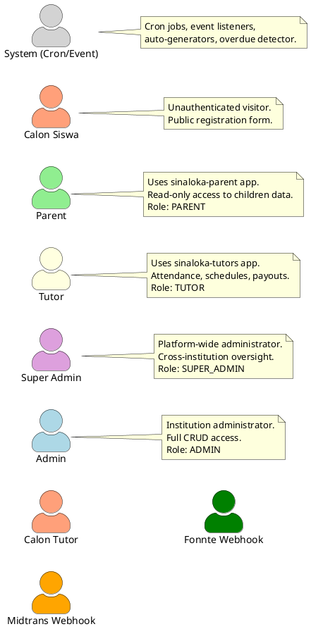
```plantuml
@startuml actors
left to right direction
skinparam actorStyle awesome

actor "Admin" as admin #lightblue
actor "Super Admin" as sa #plum
actor "Tutor" as tutor #lightyellow
actor "Parent" as parent #lightgreen
actor "Calon Siswa" as prospStudent #lightsalmon
actor "Calon Tutor" as prospTutor #lightsalmon
actor "System (Cron/Event)" as system #lightgray
actor "Midtrans Webhook" as midtrans #orange
actor "Fonnte Webhook" as fonnte #green

note right of admin
  Institution administrator.
  Full CRUD access.
  Role: ADMIN
end note

note right of sa
  Platform-wide administrator.
  Cross-institution oversight.
  Role: SUPER_ADMIN
end note

note right of tutor
  Uses sinaloka-tutors app.
  Attendance, schedules, payouts.
  Role: TUTOR
end note

note right of parent
  Uses sinaloka-parent app.
  Read-only access to children data.
  Role: PARENT
end note

note right of prospStudent
  Unauthenticated visitor.
  Public registration form.
end note

note right of system
  Cron jobs, event listeners,
  auto-generators, overdue detector.
end note

@enduml
```

| Actor | Deskripsi | Autentikasi |
|-------|-----------|-------------|
| **Admin** | Administrator institusi. Full CRUD access ke semua fitur institusi. | JWT `role: ADMIN` |
| **Super Admin** | Administrator platform. Cross-institution oversight, impersonation, plan management. | JWT `role: SUPER_ADMIN` |
| **Tutor** | Pengajar institusi. Akses schedule, attendance, payouts via sinaloka-tutors. | JWT `role: TUTOR` |
| **Parent** | Orang tua siswa. Read-only akses data anak via sinaloka-parent. | JWT `role: PARENT` |
| **Calon Siswa** | Visitor unauthenticated. Mengisi form registrasi publik. | Tidak ada |
| **Calon Tutor** | Visitor unauthenticated. Mengisi form registrasi publik. | Tidak ada |
| **System** | Cron jobs, event listeners, auto-generators. | Internal |
| **Midtrans Webhook** | Payment gateway callback. Public endpoint, signature verification. | SHA512 signature |
| **Fonnte Webhook** | WhatsApp delivery status callback. Public endpoint, device number verification. | Device number match |

---

## 1. Auth & Onboarding

### Use Case Diagram

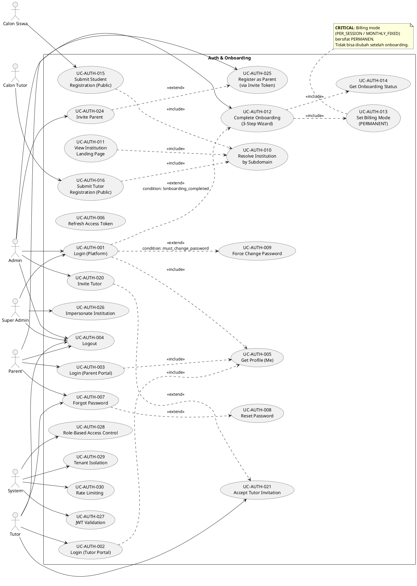
```plantuml
@startuml auth_onboarding
left to right direction
skinparam packageStyle rectangle

actor "Admin" as admin
actor "Super Admin" as sa
actor "Tutor" as tutor
actor "Parent" as parent
actor "Calon Siswa" as ps
actor "Calon Tutor" as pt
actor "System" as sys

rectangle "Auth & Onboarding" {
  usecase "UC-AUTH-001\nLogin (Platform)" as AUTH001
  usecase "UC-AUTH-002\nLogin (Tutor Portal)" as AUTH002
  usecase "UC-AUTH-003\nLogin (Parent Portal)" as AUTH003
  usecase "UC-AUTH-004\nLogout" as AUTH004
  usecase "UC-AUTH-005\nGet Profile (Me)" as AUTH005
  usecase "UC-AUTH-006\nRefresh Access Token" as AUTH006
  usecase "UC-AUTH-007\nForgot Password" as AUTH007
  usecase "UC-AUTH-008\nReset Password" as AUTH008
  usecase "UC-AUTH-009\nForce Change Password" as AUTH009
  usecase "UC-AUTH-010\nResolve Institution\nby Subdomain" as AUTH010
  usecase "UC-AUTH-011\nView Institution\nLanding Page" as AUTH011
  usecase "UC-AUTH-012\nComplete Onboarding\n(3-Step Wizard)" as AUTH012
  usecase "UC-AUTH-013\nSet Billing Mode\n(PERMANENT)" as AUTH013
  usecase "UC-AUTH-014\nGet Onboarding Status" as AUTH014
  usecase "UC-AUTH-015\nSubmit Student\nRegistration (Public)" as AUTH015
  usecase "UC-AUTH-016\nSubmit Tutor\nRegistration (Public)" as AUTH016
  usecase "UC-AUTH-020\nInvite Tutor" as AUTH020
  usecase "UC-AUTH-021\nAccept Tutor Invitation" as AUTH021
  usecase "UC-AUTH-024\nInvite Parent" as AUTH024
  usecase "UC-AUTH-025\nRegister as Parent\n(via Invite Token)" as AUTH025
  usecase "UC-AUTH-026\nImpersonate Institution" as AUTH026
  usecase "UC-AUTH-027\nJWT Validation" as AUTH027
  usecase "UC-AUTH-028\nRole-Based Access Control" as AUTH028
  usecase "UC-AUTH-029\nTenant Isolation" as AUTH029
  usecase "UC-AUTH-030\nRate Limiting" as AUTH030
}

admin --> AUTH001
admin --> AUTH004
admin --> AUTH012
admin --> AUTH020
admin --> AUTH024
sa --> AUTH001
sa --> AUTH004
sa --> AUTH026
tutor --> AUTH002
tutor --> AUTH004
tutor --> AUTH007
tutor --> AUTH021
parent --> AUTH003
parent --> AUTH004
parent --> AUTH007
parent --> AUTH025
ps --> AUTH015
pt --> AUTH016
sys --> AUTH027
sys --> AUTH028
sys --> AUTH029
sys --> AUTH030

AUTH001 ..> AUTH005 : <<include>>
AUTH001 ..> AUTH009 : <<extend>>\ncondition: must_change_password
AUTH001 ..> AUTH012 : <<extend>>\ncondition: !onboarding_completed
AUTH002 ..> AUTH005 : <<include>>
AUTH003 ..> AUTH005 : <<include>>
AUTH007 ..> AUTH008 : <<extend>>
AUTH012 ..> AUTH013 : <<include>>
AUTH012 ..> AUTH014 : <<include>>
AUTH015 ..> AUTH010 : <<include>>
AUTH016 ..> AUTH010 : <<include>>
AUTH011 ..> AUTH010 : <<include>>
AUTH020 ..> AUTH021 : <<extend>>
AUTH024 ..> AUTH025 : <<extend>>

note bottom of AUTH013
  **CRITICAL**: Billing mode
  (PER_SESSION / MONTHLY_FIXED)
  bersifat PERMANEN.
  Tidak bisa diubah setelah onboarding.
end note

@enduml
```

### Use Case List

| ID | Name | Actor(s) | Description | Business Rules |
|----|------|----------|-------------|----------------|
| UC-AUTH-001 | Login (Platform) | Admin, Super Admin | Autentikasi email + password di sinaloka-platform | Rate limit 5 req/15min. Slug validation untuk subdomain. SUPER_ADMIN tidak boleh login via subdomain. |
| UC-AUTH-002 | Login (Tutor Portal) | Tutor | Autentikasi di tutors.sinaloka.com | Tanpa slug. Banner sukses untuk `?invited=true`. |
| UC-AUTH-003 | Login (Parent Portal) | Parent | Autentikasi di parent.sinaloka.com | Tanpa slug. Forgot password available. |
| UC-AUTH-004 | Logout | All authenticated | Revoke refresh token, clear localStorage | Best-effort API call; client cleanup always runs. |
| UC-AUTH-005 | Get Profile (Me) | All authenticated | Fetch user profile + institution details | Returns `onboarding_completed`, `billing_mode` for routing. |
| UC-AUTH-006 | Refresh Access Token | All (via interceptor) | Auto-refresh saat 401 response | Token rotation. Queue pattern untuk concurrent requests. |
| UC-AUTH-007 | Forgot Password | Tutor, Parent | Request password reset link via email | Rate limit 3 req/15min. Non-enumerable response. 60s cooldown. |
| UC-AUTH-008 | Reset Password (Token) | Tutor, Parent | Set new password via reset link | 1-hour token expiry. Revokes ALL refresh tokens. |
| UC-AUTH-009 | Force Change Password | Admin, Tutor | Redirect ke /change-password jika `must_change_password=true` | Min 8 chars, uppercase, digit required. |
| UC-AUTH-010 | Resolve Institution by Subdomain | All visitors | Detect slug dari hostname, fetch institution data | Reserved subdomains excluded. Rate limit 30 req/min. |
| UC-AUTH-011 | View Institution Landing | Prospective visitors | Landing page dengan Login dan optional Register CTA | Register button hanya jika `registration_enabled=true`. |
| UC-AUTH-012 | Complete Onboarding | Admin | 3-step wizard: Profile, Academic, Billing | Steps 1-2 skippable. Step 3 mandatory. Full page reload after complete. |
| UC-AUTH-013 | Set Billing Mode | Admin | Pilih PER_SESSION atau MONTHLY_FIXED | **PERMANENT** - tidak bisa diubah. Affects entire finance module. |
| UC-AUTH-014 | Get Onboarding Status | Admin | Fetch completion status per step | Returns step flags. |
| UC-AUTH-015 | Submit Student Registration | Calon Siswa | Form registrasi publik | Rate limit 5/hour. Duplicate email check. |
| UC-AUTH-016 | Submit Tutor Registration | Calon Tutor | Form registrasi publik | Rate limit 5/hour. Min 1 subject. |
| UC-AUTH-020 | Invite Tutor | Admin | Send email invitation | Creates inactive User + Tutor. 48h token expiry. Plan limit enforced. |
| UC-AUTH-021 | Accept Tutor Invitation | Tutor (invited) | Set password + bank details, activate account | Emits `tutor.invite_accepted` event. |
| UC-AUTH-024 | Invite Parent | Admin | Send parent invite email linked to student(s) | 72h token. Validates student ownership. |
| UC-AUTH-025 | Register as Parent | Parent (invited) | Create account via invite token | Auto-links students by `parent_email` match. Emits `parent.registered`. |
| UC-AUTH-026 | Impersonate Institution | Super Admin | Enter institution context via sessionStorage | All API calls scoped via `?institution_id=`. Amber banner. |
| UC-AUTH-027 | JWT Validation | System | Validates JWT on every authenticated request | Checks user existence + is_active. `@Public()` to skip. |
| UC-AUTH-028 | Role-Based Access Control | System | `@Roles()` decorator enforcement | 403 if role mismatch. |
| UC-AUTH-029 | Tenant Isolation | System | `TenantInterceptor` injects `request.tenantId` | SUPER_ADMIN: optional from query. Others: forced from JWT. |
| UC-AUTH-030 | Rate Limiting | System | Per-IP request limits on sensitive endpoints | In-memory IP map, 10min cleanup. |

---

## 2. Students

### Use Case Diagram

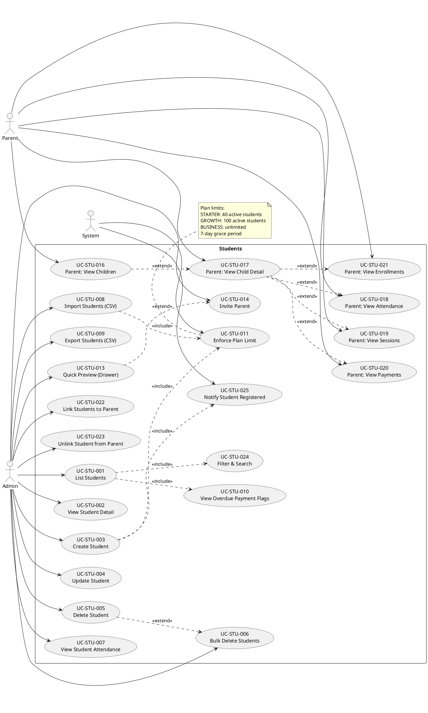
```plantuml
@startuml students
left to right direction
skinparam packageStyle rectangle

actor "Admin" as admin
actor "Parent" as parent
actor "System" as sys

rectangle "Students" {
  usecase "UC-STU-001\nList Students" as STU001
  usecase "UC-STU-002\nView Student Detail" as STU002
  usecase "UC-STU-003\nCreate Student" as STU003
  usecase "UC-STU-004\nUpdate Student" as STU004
  usecase "UC-STU-005\nDelete Student" as STU005
  usecase "UC-STU-006\nBulk Delete Students" as STU006
  usecase "UC-STU-007\nView Student Attendance" as STU007
  usecase "UC-STU-008\nImport Students (CSV)" as STU008
  usecase "UC-STU-009\nExport Students (CSV)" as STU009
  usecase "UC-STU-010\nView Overdue Payment Flags" as STU010
  usecase "UC-STU-011\nEnforce Plan Limit" as STU011
  usecase "UC-STU-013\nQuick Preview (Drawer)" as STU013
  usecase "UC-STU-014\nInvite Parent" as STU014
  usecase "UC-STU-016\nParent: View Children" as STU016
  usecase "UC-STU-017\nParent: View Child Detail" as STU017
  usecase "UC-STU-018\nParent: View Attendance" as STU018
  usecase "UC-STU-019\nParent: View Sessions" as STU019
  usecase "UC-STU-020\nParent: View Payments" as STU020
  usecase "UC-STU-021\nParent: View Enrollments" as STU021
  usecase "UC-STU-022\nLink Students to Parent" as STU022
  usecase "UC-STU-023\nUnlink Student from Parent" as STU023
  usecase "UC-STU-024\nFilter & Search" as STU024
  usecase "UC-STU-025\nNotify Student Registered" as STU025
}

admin --> STU001
admin --> STU002
admin --> STU003
admin --> STU004
admin --> STU005
admin --> STU006
admin --> STU007
admin --> STU008
admin --> STU009
admin --> STU013
admin --> STU014
admin --> STU022
admin --> STU023
parent --> STU016
parent --> STU017
parent --> STU018
parent --> STU019
parent --> STU020
parent --> STU021
sys --> STU011
sys --> STU025

STU001 ..> STU010 : <<include>>
STU001 ..> STU024 : <<include>>
STU003 ..> STU011 : <<include>>
STU003 ..> STU025 : <<include>>
STU005 ..> STU006 : <<extend>>
STU008 ..> STU011 : <<include>>
STU013 ..> STU014 : <<extend>>
STU016 ..> STU017 : <<extend>>
STU017 ..> STU018 : <<extend>>
STU017 ..> STU019 : <<extend>>
STU017 ..> STU020 : <<extend>>
STU017 ..> STU021 : <<extend>>

note bottom of STU011
  Plan limits:
  STARTER: 40 active students
  GROWTH: 100 active students
  BUSINESS: unlimited
  7-day grace period
end note

@enduml
```

### Use Case List

| ID | Name | Actor(s) | Description | Business Rules |
|----|------|----------|-------------|----------------|
| UC-STU-001 | List Students | Admin | Paginated, filterable, searchable table | Scoped by tenant. Extended meta: active_count, inactive_count. |
| UC-STU-002 | View Student Detail | Admin | Full profile + parent info | 404 if wrong institution. |
| UC-STU-003 | Create Student | Admin | Add student with parent contact | Plan limit enforced. Emits `student.registered`. |
| UC-STU-004 | Update Student | Admin | Partial update | Only supplied fields changed. |
| UC-STU-005 | Delete Student | Admin | Hard delete with cascade | Resets grace period if below limit. |
| UC-STU-006 | Bulk Delete Students | Admin | Delete multiple via Promise.all | Individual failures caught silently. |
| UC-STU-007 | View Student Attendance | Admin | Per-student attendance history + summary | Date range filter. Rate calculation. |
| UC-STU-008 | Import Students (CSV) | Admin | Bulk create from CSV file | Max rows, skipDuplicates. Plan limit enforced. |
| UC-STU-009 | Export Students (CSV) | Admin | Download filtered students as CSV | Respects current filters. |
| UC-STU-010 | View Overdue Payment Flags | Admin | Fetch `overdue-summary` for student flags | AlertTriangle icon on flagged students. |
| UC-STU-011 | Enforce Plan Limit | System | Check active count vs plan cap | 7-day grace period. 403 after expiry. |
| UC-STU-013 | Quick Preview (Drawer) | Admin | Side drawer on row click | No additional API call. |
| UC-STU-014 | Invite Parent | Admin | Send email invitation to parent | 72h token. Can invite for multiple students. |
| UC-STU-016 | View Children List | Parent | Dashboard with summary stats per child | Attendance rate, pending payments, next session. |
| UC-STU-017 | View Child Detail | Parent | Profile + enrollments | `ParentStudentGuard` enforced. |
| UC-STU-018 | View Child Attendance | Parent | Attendance records + summary | Date range + class filter. |
| UC-STU-019 | View Child Sessions | Parent | Upcoming/past sessions | Only from active enrollments. |
| UC-STU-020 | View Child Payments | Parent | Payment history + pending bills | gateway_configured flag included. |
| UC-STU-021 | View Child Enrollments | Parent | Current enrollments with schedule | Active/Trial only. |
| UC-STU-022 | Link Students to Parent | Admin | Many-to-many join | skipDuplicates. |
| UC-STU-023 | Unlink Student from Parent | Admin | Remove parent-student link | 404 if link doesn't exist. |
| UC-STU-024 | Filter & Search | Admin | Text search + grade/status filter | Debounced 300ms. Grade grouped SD/SMP/SMA. |
| UC-STU-025 | Notify Student Registered | System | Emit `student.registered` event | Non-blocking. |

---

## 3. Tutors

### Use Case Diagram

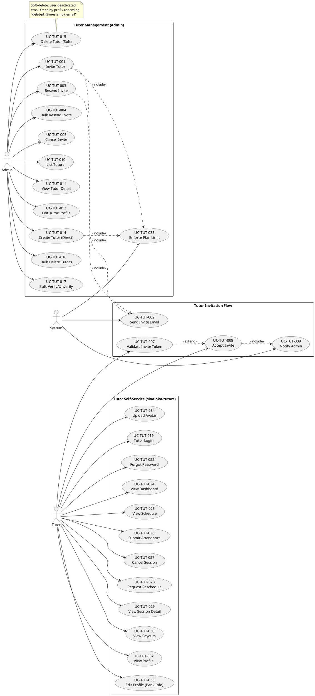
```plantuml
@startuml tutors
left to right direction
skinparam packageStyle rectangle

actor "Admin" as admin
actor "Tutor" as tutor
actor "System" as sys

rectangle "Tutor Management (Admin)" {
  usecase "UC-TUT-001\nInvite Tutor" as TUT001
  usecase "UC-TUT-003\nResend Invite" as TUT003
  usecase "UC-TUT-004\nBulk Resend Invite" as TUT004
  usecase "UC-TUT-005\nCancel Invite" as TUT005
  usecase "UC-TUT-010\nList Tutors" as TUT010
  usecase "UC-TUT-011\nView Tutor Detail" as TUT011
  usecase "UC-TUT-012\nEdit Tutor Profile" as TUT012
  usecase "UC-TUT-014\nCreate Tutor (Direct)" as TUT014
  usecase "UC-TUT-015\nDelete Tutor (Soft)" as TUT015
  usecase "UC-TUT-016\nBulk Delete Tutors" as TUT016
  usecase "UC-TUT-017\nBulk Verify/Unverify" as TUT017
  usecase "UC-TUT-035\nEnforce Plan Limit" as TUT035
}

rectangle "Tutor Invitation Flow" {
  usecase "UC-TUT-002\nSend Invite Email" as TUT002
  usecase "UC-TUT-007\nValidate Invite Token" as TUT007
  usecase "UC-TUT-008\nAccept Invite" as TUT008
  usecase "UC-TUT-009\nNotify Admin" as TUT009
}

rectangle "Tutor Self-Service (sinaloka-tutors)" {
  usecase "UC-TUT-019\nTutor Login" as TUT019
  usecase "UC-TUT-022\nForgot Password" as TUT022
  usecase "UC-TUT-024\nView Dashboard" as TUT024
  usecase "UC-TUT-025\nView Schedule" as TUT025
  usecase "UC-TUT-026\nSubmit Attendance" as TUT026
  usecase "UC-TUT-027\nCancel Session" as TUT027
  usecase "UC-TUT-028\nRequest Reschedule" as TUT028
  usecase "UC-TUT-029\nView Session Detail" as TUT029
  usecase "UC-TUT-030\nView Payouts" as TUT030
  usecase "UC-TUT-032\nView Profile" as TUT032
  usecase "UC-TUT-033\nEdit Profile (Bank Info)" as TUT033
  usecase "UC-TUT-034\nUpload Avatar" as TUT034
}

admin --> TUT001
admin --> TUT003
admin --> TUT004
admin --> TUT005
admin --> TUT010
admin --> TUT011
admin --> TUT012
admin --> TUT014
admin --> TUT015
admin --> TUT016
admin --> TUT017
tutor --> TUT007
tutor --> TUT008
tutor --> TUT019
tutor --> TUT022
tutor --> TUT024
tutor --> TUT025
tutor --> TUT026
tutor --> TUT027
tutor --> TUT028
tutor --> TUT029
tutor --> TUT030
tutor --> TUT032
tutor --> TUT033
tutor --> TUT034
sys --> TUT002
sys --> TUT009
sys --> TUT035

TUT001 ..> TUT002 : <<include>>
TUT001 ..> TUT035 : <<include>>
TUT003 ..> TUT002 : <<include>>
TUT007 ..> TUT008 : <<extend>>
TUT008 ..> TUT009 : <<include>>
TUT014 ..> TUT035 : <<include>>

note bottom of TUT015
  Soft-delete: user deactivated,
  email freed by prefix renaming
  "deleted_{timestamp}_email"
end note

@enduml
```

### Use Case List

| ID | Name | Actor(s) | Description | Business Rules |
|----|------|----------|-------------|----------------|
| UC-TUT-001 | Invite Tutor | Admin | Send email invitation | Creates inactive User+Tutor. 48h token. Plan limit. |
| UC-TUT-002 | Send Invite Email | System | Email via Resend API | Uses TUTOR_PORTAL_URL for link. |
| UC-TUT-003 | Resend Invite | Admin | New token + email | Cannot resend to active tutors. |
| UC-TUT-004 | Bulk Resend Invite | Admin | Resend to multiple pending tutors | Max 100. Failures skipped. |
| UC-TUT-005 | Cancel Invite | Admin | Hard delete tutor + cascade | Transaction: deletes all related data. |
| UC-TUT-007 | Validate Invite Token | Tutor | Check token validity | Auto-updates EXPIRED status. |
| UC-TUT-008 | Accept Invite | Tutor | Set password + bank info | Password min 8. All bank fields required. |
| UC-TUT-009 | Notify Admin | System | Emit `tutor.invite_accepted` | Event-driven notification. |
| UC-TUT-010 | List Tutors | Admin | Grid/table view with filters | Only active tutors. Search by name/email. |
| UC-TUT-011 | View Tutor Detail | Admin | Full profile + subjects + bank | Scoped by tenant + is_active. |
| UC-TUT-012 | Edit Tutor Profile | Admin | Update name, subjects, bank, verified | Subject associations replaced. |
| UC-TUT-014 | Create Tutor (Direct) | Admin | Create with full credentials | Immediately active. Alternative to invite. |
| UC-TUT-015 | Delete Tutor (Soft) | Admin | Deactivate user, free email | Email renamed. Refresh tokens deleted. |
| UC-TUT-016 | Bulk Delete Tutors | Admin | Soft delete multiple | Max 100. Transaction. |
| UC-TUT-017 | Bulk Verify/Unverify | Admin | Toggle verification status | Majority logic for button label. |
| UC-TUT-019 | Tutor Login | Tutor | Email + password auth | Shared auth endpoint. |
| UC-TUT-022 | Forgot Password | Tutor | Request reset link | 60s cooldown. |
| UC-TUT-024 | View Dashboard | Tutor | Greeting, pending payout, today's classes | Max 2 upcoming sessions. |
| UC-TUT-025 | View Schedule | Tutor | Upcoming/Completed/Cancelled tabs | Max 100 sessions. |
| UC-TUT-026 | Submit Attendance | Tutor | Mark P/A/L + topic + summary + finalize | Two-step: attendance then session complete. |
| UC-TUT-027 | Cancel Session | Tutor | Optimistic update | Rollback on API failure. |
| UC-TUT-028 | Request Reschedule | Tutor | Propose new date/time + reason | All fields required. Max 500 chars reason. |
| UC-TUT-029 | View Session Detail | Tutor | Completed/cancelled session info | Student attendance breakdown. |
| UC-TUT-030 | View Payouts | Tutor | Payout history + earnings summary | Total, pending, paid breakdown. |
| UC-TUT-032 | View Profile | Tutor | Avatar, name, subjects, rating | Read-only except bank info. |
| UC-TUT-033 | Edit Profile | Tutor | Bank name, account, holder | Only financial info editable by tutor. |
| UC-TUT-034 | Upload Avatar | Tutor | Crop + upload avatar | Client-side crop. Multipart upload. |
| UC-TUT-035 | Enforce Plan Limit | System | Check tutor count vs plan | STARTER: 5, GROWTH: 20, BUSINESS: unlimited. |

---

## 4. Classes

### Use Case Diagram

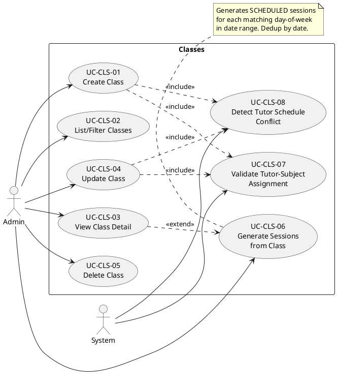
```plantuml
@startuml classes
left to right direction
skinparam packageStyle rectangle

actor "Admin" as admin
actor "System" as sys

rectangle "Classes" {
  usecase "UC-CLS-01\nCreate Class" as CLS01
  usecase "UC-CLS-02\nList/Filter Classes" as CLS02
  usecase "UC-CLS-03\nView Class Detail" as CLS03
  usecase "UC-CLS-04\nUpdate Class" as CLS04
  usecase "UC-CLS-05\nDelete Class" as CLS05
  usecase "UC-CLS-06\nGenerate Sessions\nfrom Class" as CLS06
  usecase "UC-CLS-07\nValidate Tutor-Subject\nAssignment" as CLS07
  usecase "UC-CLS-08\nDetect Tutor Schedule\nConflict" as CLS08
}

admin --> CLS01
admin --> CLS02
admin --> CLS03
admin --> CLS04
admin --> CLS05
admin --> CLS06
sys --> CLS07
sys --> CLS08

CLS01 ..> CLS07 : <<include>>
CLS01 ..> CLS08 : <<include>>
CLS04 ..> CLS07 : <<include>>
CLS04 ..> CLS08 : <<include>>
CLS03 ..> CLS06 : <<extend>>

note bottom of CLS06
  Generates SCHEDULED sessions
  for each matching day-of-week
  in date range. Dedup by date.
end note

@enduml
```

### Use Case List

| ID | Name | Actor(s) | Description | Business Rules |
|----|------|----------|-------------|----------------|
| UC-CLS-01 | Create Class | Admin | Assign tutor + jadwal + fee + room | Min 1 schedule. Start < end time. Tutor must teach subject. |
| UC-CLS-02 | List/Filter Classes | Admin | Table + timetable view | Server: semester, search. Client: subject, active-only. |
| UC-CLS-03 | View Class Detail | Admin | Drawer: enrolled students, capacity, fee | Enrollments filtered ACTIVE/TRIAL only. |
| UC-CLS-04 | Update Class | Admin | Edit any field | Schedule replacement is atomic (delete+create). |
| UC-CLS-05 | Delete Class | Admin | Permanent delete + type "delete" | Cascade deletes schedules. |
| UC-CLS-06 | Generate Sessions | Admin | Auto-generate from recurring schedule | skipDuplicates. Client preview estimates count. |
| UC-CLS-07 | Validate Tutor-Subject | System | Check tutor_subject junction | BadRequestException if mismatch. |
| UC-CLS-08 | Detect Tutor Schedule Conflict | System | Time overlap check on same day | Client-side. Blocks form submission. |

---

## 5. Academic Years

### Use Case Diagram

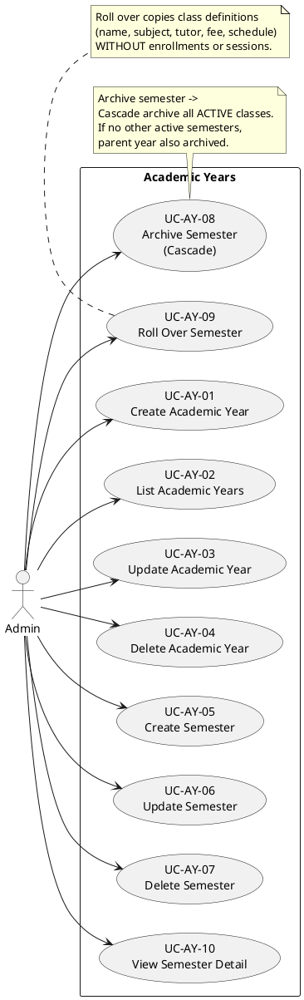
```plantuml
@startuml academic_years
left to right direction
skinparam packageStyle rectangle

actor "Admin" as admin

rectangle "Academic Years" {
  usecase "UC-AY-01\nCreate Academic Year" as AY01
  usecase "UC-AY-02\nList Academic Years" as AY02
  usecase "UC-AY-03\nUpdate Academic Year" as AY03
  usecase "UC-AY-04\nDelete Academic Year" as AY04
  usecase "UC-AY-05\nCreate Semester" as AY05
  usecase "UC-AY-06\nUpdate Semester" as AY06
  usecase "UC-AY-07\nDelete Semester" as AY07
  usecase "UC-AY-08\nArchive Semester\n(Cascade)" as AY08
  usecase "UC-AY-09\nRoll Over Semester" as AY09
  usecase "UC-AY-10\nView Semester Detail" as AY10
}

admin --> AY01
admin --> AY02
admin --> AY03
admin --> AY04
admin --> AY05
admin --> AY06
admin --> AY07
admin --> AY08
admin --> AY09
admin --> AY10

note bottom of AY08
  Archive semester ->
  Cascade archive all ACTIVE classes.
  If no other active semesters,
  parent year also archived.
end note

note bottom of AY09
  Roll over copies class definitions
  (name, subject, tutor, fee, schedule)
  WITHOUT enrollments or sessions.
end note

@enduml
```

### Use Case List

| ID | Name | Actor(s) | Description | Business Rules |
|----|------|----------|-------------|----------------|
| UC-AY-01 | Create Academic Year | Admin | New year with name + date range | Unique name per institution. |
| UC-AY-02 | List Academic Years | Admin | Expandable cards with semesters | Ordered by start_date desc. |
| UC-AY-03 | Update Academic Year | Admin | Edit name/dates | Uniqueness check only if name changed. |
| UC-AY-04 | Delete Academic Year | Admin | Permanent delete | Blocked if has semesters. |
| UC-AY-05 | Create Semester | Admin | Under specific academic year | Unique name per year. |
| UC-AY-06 | Update Semester | Admin | Edit name/dates | Same uniqueness logic. |
| UC-AY-07 | Delete Semester | Admin | Permanent delete | Blocked if has active classes. |
| UC-AY-08 | Archive Semester | Admin | Cascade archive classes + maybe year | Transactional cascade. |
| UC-AY-09 | Roll Over Semester | Admin | Copy class definitions to target | Dedup by name. Enrollments/sessions NOT copied. |
| UC-AY-10 | View Semester Detail | Admin | Classes with subjects, tutors, enrollment counts | Used by roll-over modal. |

---

## 6. Schedules / Sessions

### Use Case Diagram

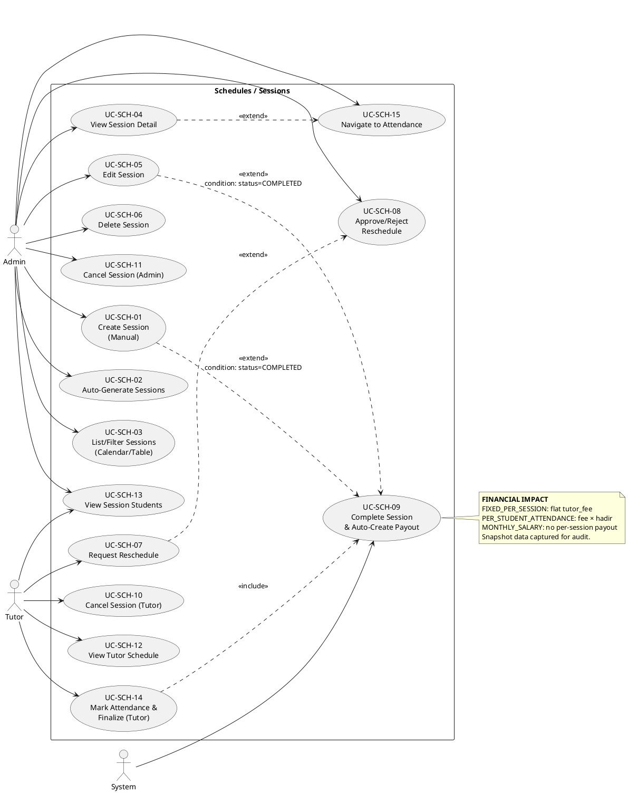
```plantuml
@startuml schedules
left to right direction
skinparam packageStyle rectangle

actor "Admin" as admin
actor "Tutor" as tutor
actor "System" as sys

rectangle "Schedules / Sessions" {
  usecase "UC-SCH-01\nCreate Session\n(Manual)" as SCH01
  usecase "UC-SCH-02\nAuto-Generate Sessions" as SCH02
  usecase "UC-SCH-03\nList/Filter Sessions\n(Calendar/Table)" as SCH03
  usecase "UC-SCH-04\nView Session Detail" as SCH04
  usecase "UC-SCH-05\nEdit Session" as SCH05
  usecase "UC-SCH-06\nDelete Session" as SCH06
  usecase "UC-SCH-07\nRequest Reschedule" as SCH07
  usecase "UC-SCH-08\nApprove/Reject\nReschedule" as SCH08
  usecase "UC-SCH-09\nComplete Session\n& Auto-Create Payout" as SCH09
  usecase "UC-SCH-10\nCancel Session (Tutor)" as SCH10
  usecase "UC-SCH-11\nCancel Session (Admin)" as SCH11
  usecase "UC-SCH-12\nView Tutor Schedule" as SCH12
  usecase "UC-SCH-13\nView Session Students" as SCH13
  usecase "UC-SCH-14\nMark Attendance &\nFinalize (Tutor)" as SCH14
  usecase "UC-SCH-15\nNavigate to Attendance" as SCH15
}

admin --> SCH01
admin --> SCH02
admin --> SCH03
admin --> SCH04
admin --> SCH05
admin --> SCH06
admin --> SCH08
admin --> SCH11
admin --> SCH13
admin --> SCH15
tutor --> SCH07
tutor --> SCH10
tutor --> SCH12
tutor --> SCH13
tutor --> SCH14
sys --> SCH09

SCH01 ..> SCH09 : <<extend>>\ncondition: status=COMPLETED
SCH05 ..> SCH09 : <<extend>>\ncondition: status=COMPLETED
SCH14 ..> SCH09 : <<include>>
SCH07 ..> SCH08 : <<extend>>
SCH04 ..> SCH15 : <<extend>>

note right of SCH09
  **FINANCIAL IMPACT**
  FIXED_PER_SESSION: flat tutor_fee
  PER_STUDENT_ATTENDANCE: fee × hadir
  MONTHLY_SALARY: no per-session payout
  Snapshot data captured for audit.
end note

@enduml
```

### Use Case List

| ID | Name | Actor(s) | Description | Business Rules |
|----|------|----------|-------------|----------------|
| UC-SCH-01 | Create Session (Manual) | Admin | Single ad-hoc session | Emits SESSION_CREATED notification. |
| UC-SCH-02 | Auto-Generate Sessions | Admin | Bulk from class schedule + date range | Dedup by date. Same as UC-CLS-06. |
| UC-SCH-03 | List/Filter Sessions | Admin | Calendar (month/week/day) + table | Color-coded by subject. CANCELLED: line-through. |
| UC-SCH-04 | View Session Detail | Admin | Drawer: attendance, content, reschedule info | Uses snapshot data for completed sessions. |
| UC-SCH-05 | Edit Session | Admin | Date, time, status | Cannot edit COMPLETED. Locked if past date. |
| UC-SCH-06 | Delete Session | Admin | Permanent delete | Cannot delete COMPLETED sessions. |
| UC-SCH-07 | Request Reschedule | Tutor | Propose new date/time + reason | Ownership check. All fields required. |
| UC-SCH-08 | Approve/Reject Reschedule | Admin | Apply or discard proposed changes | Both reset to SCHEDULED. Approve updates date/time. |
| UC-SCH-09 | Complete Session & Auto-Payout | System | Snapshot + create PENDING payout | **FINANCIAL**: 3 fee modes. Terminal state. |
| UC-SCH-10 | Cancel Session (Tutor) | Tutor | Cancel own session | Emits SESSION_CANCELLED. Terminal state. |
| UC-SCH-11 | Cancel Session (Admin) | Admin | Cancel via edit endpoint | Same terminal state. |
| UC-SCH-12 | View Tutor Schedule | Tutor | Upcoming/Completed/Cancelled tabs | Max 100 sessions. |
| UC-SCH-13 | View Session Students | Admin, Tutor | Enrolled students + attendance | ACTIVE enrollment + enrolled_at <= session date. |
| UC-SCH-14 | Mark Attendance & Finalize | Tutor | Two-step: attendance + complete | Topic required. "Mark All Present" shortcut. |
| UC-SCH-15 | Navigate to Attendance | Admin | Cross-page navigation with state | From Schedules drawer to /attendance. |

---

## 7. Enrollments

### Use Case Diagram

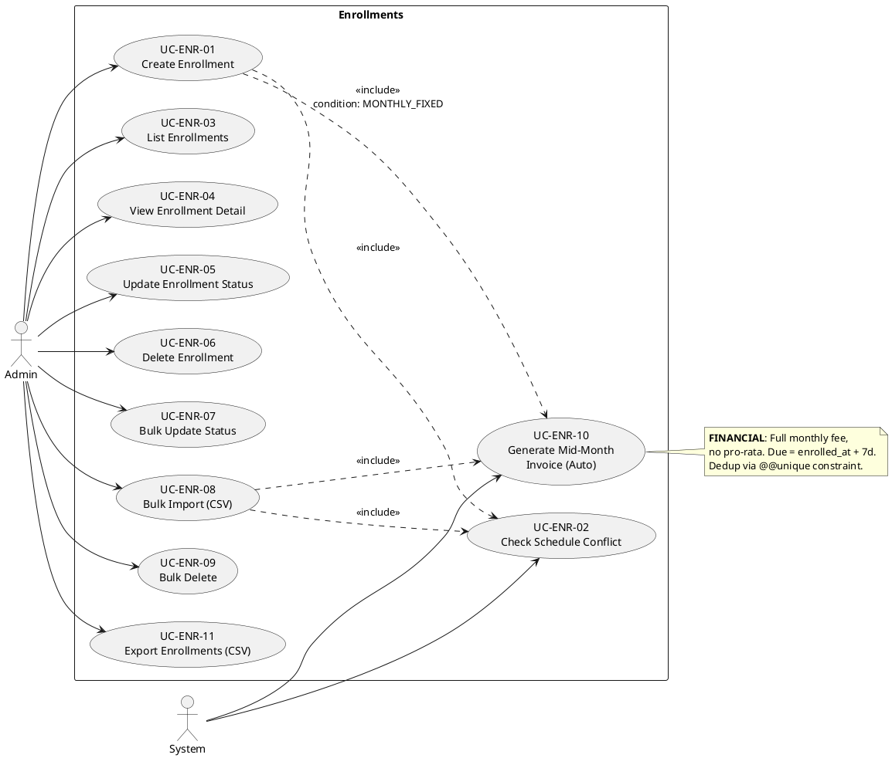
```plantuml
@startuml enrollments
left to right direction
skinparam packageStyle rectangle

actor "Admin" as admin
actor "System" as sys

rectangle "Enrollments" {
  usecase "UC-ENR-01\nCreate Enrollment" as ENR01
  usecase "UC-ENR-02\nCheck Schedule Conflict" as ENR02
  usecase "UC-ENR-03\nList Enrollments" as ENR03
  usecase "UC-ENR-04\nView Enrollment Detail" as ENR04
  usecase "UC-ENR-05\nUpdate Enrollment Status" as ENR05
  usecase "UC-ENR-06\nDelete Enrollment" as ENR06
  usecase "UC-ENR-07\nBulk Update Status" as ENR07
  usecase "UC-ENR-08\nBulk Import (CSV)" as ENR08
  usecase "UC-ENR-09\nBulk Delete" as ENR09
  usecase "UC-ENR-10\nGenerate Mid-Month\nInvoice (Auto)" as ENR10
  usecase "UC-ENR-11\nExport Enrollments (CSV)" as ENR11
}

admin --> ENR01
admin --> ENR03
admin --> ENR04
admin --> ENR05
admin --> ENR06
admin --> ENR07
admin --> ENR08
admin --> ENR09
admin --> ENR11
sys --> ENR02
sys --> ENR10

ENR01 ..> ENR02 : <<include>>
ENR01 ..> ENR10 : <<include>>\ncondition: MONTHLY_FIXED
ENR08 ..> ENR02 : <<include>>
ENR08 ..> ENR10 : <<include>>

note right of ENR10
  **FINANCIAL**: Full monthly fee,
  no pro-rata. Due = enrolled_at + 7d.
  Dedup via @@unique constraint.
end note

@enduml
```

### Use Case List

| ID | Name | Actor(s) | Description | Business Rules |
|----|------|----------|-------------|----------------|
| UC-ENR-01 | Create Enrollment | Admin | Enroll student(s) into class | Conflict check. Auto-invoice toggle. Mid-month payment for MONTHLY_FIXED. |
| UC-ENR-02 | Check Schedule Conflict | System | Time overlap detection | Same day + overlapping time range. ACTIVE/TRIAL only. |
| UC-ENR-03 | List Enrollments | Admin | Paginated + filterable | Overdue flags from Payments module. |
| UC-ENR-04 | View Enrollment Detail | Admin | Single enrollment with student/class | Scoped by tenant. |
| UC-ENR-05 | Update Enrollment Status | Admin | Change status/payment_status | student_id and class_id immutable. |
| UC-ENR-06 | Delete Enrollment | Admin | Permanent delete | Confirmation dialog. |
| UC-ENR-07 | Bulk Update Status | Admin | Update multiple at once | Max 100. updateMany. |
| UC-ENR-08 | Bulk Import (CSV) | Admin | Import from CSV | Max 500 rows. Per-row validation + conflict check. Partial success allowed. |
| UC-ENR-09 | Bulk Delete | Admin | Delete multiple + cascade payments | Transaction: delete payments first, then enrollments. |
| UC-ENR-10 | Generate Mid-Month Invoice | System | Auto-create payment for mid-month enrollment | MONTHLY_FIXED only. Full fee, no pro-rata. P2002 dedup. |
| UC-ENR-11 | Export Enrollments (CSV) | Admin | Download filtered as CSV | Respects active filters. |

---

## 8. Registrations

### Use Case Diagram

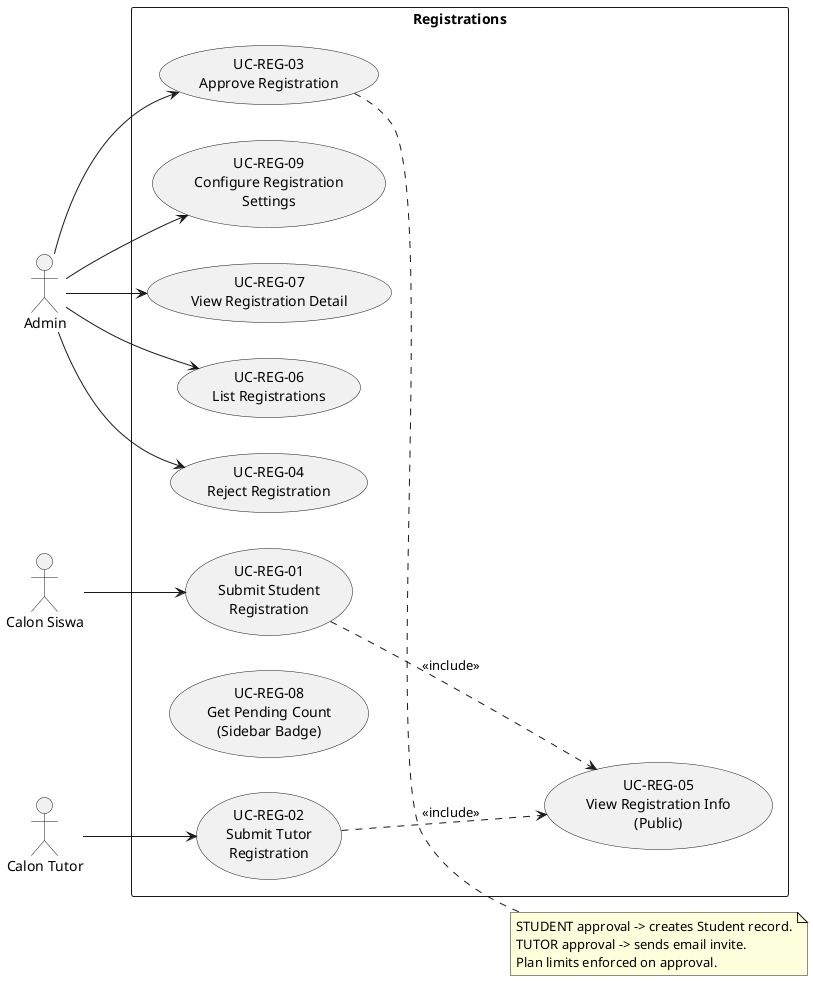
```plantuml
@startuml registrations
left to right direction
skinparam packageStyle rectangle

actor "Admin" as admin
actor "Calon Siswa" as ps
actor "Calon Tutor" as pt

rectangle "Registrations" {
  usecase "UC-REG-01\nSubmit Student\nRegistration" as REG01
  usecase "UC-REG-02\nSubmit Tutor\nRegistration" as REG02
  usecase "UC-REG-03\nApprove Registration" as REG03
  usecase "UC-REG-04\nReject Registration" as REG04
  usecase "UC-REG-05\nView Registration Info\n(Public)" as REG05
  usecase "UC-REG-06\nList Registrations" as REG06
  usecase "UC-REG-07\nView Registration Detail" as REG07
  usecase "UC-REG-08\nGet Pending Count\n(Sidebar Badge)" as REG08
  usecase "UC-REG-09\nConfigure Registration\nSettings" as REG09
}

ps --> REG01
pt --> REG02
admin --> REG03
admin --> REG04
admin --> REG06
admin --> REG07
admin --> REG09

REG01 ..> REG05 : <<include>>
REG02 ..> REG05 : <<include>>

note right of REG03
  STUDENT approval -> creates Student record.
  TUTOR approval -> sends email invite.
  Plan limits enforced on approval.
end note

@enduml
```

### Use Case List

| ID | Name | Actor(s) | Description | Business Rules |
|----|------|----------|-------------|----------------|
| UC-REG-01 | Submit Student Registration | Calon Siswa | Public form | Rate limit 5/hour. Duplicate email check. |
| UC-REG-02 | Submit Tutor Registration | Calon Tutor | Public form | Min 1 subject. Rate limit 5/hour. |
| UC-REG-03 | Approve Registration | Admin | Creates Student or sends Tutor invite | Plan limits enforced. STUDENT: immediate. TUTOR: invite email. |
| UC-REG-04 | Reject Registration | Admin | With optional reason | Best-effort rejection email. |
| UC-REG-05 | View Registration Info | Public | Fetch institution + reg settings | Determines form state: role-select, direct, closed. |
| UC-REG-06 | List Registrations | Admin | Paginated with type/status filter | Client-side name search. |
| UC-REG-07 | View Registration Detail | Admin | Single registration | Scoped by tenant. |
| UC-REG-08 | Get Pending Count | Admin | Badge count for sidebar | Cached 60s client-side. |
| UC-REG-09 | Configure Registration Settings | Admin | Toggle student/tutor enabled | Immediate effect on public form. |

---

## 9. Attendance

### Use Case Diagram

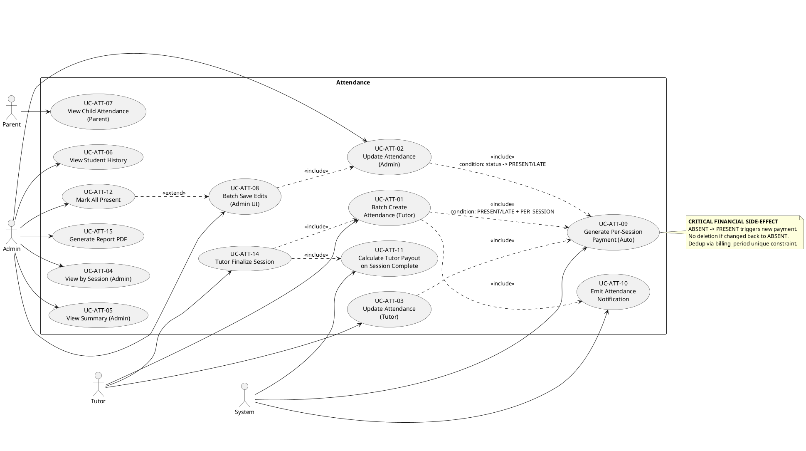
```plantuml
@startuml attendance
left to right direction
skinparam packageStyle rectangle

actor "Admin" as admin
actor "Tutor" as tutor
actor "Parent" as parent
actor "System" as sys

rectangle "Attendance" {
  usecase "UC-ATT-01\nBatch Create\nAttendance (Tutor)" as ATT01
  usecase "UC-ATT-02\nUpdate Attendance\n(Admin)" as ATT02
  usecase "UC-ATT-03\nUpdate Attendance\n(Tutor)" as ATT03
  usecase "UC-ATT-04\nView by Session (Admin)" as ATT04
  usecase "UC-ATT-05\nView Summary (Admin)" as ATT05
  usecase "UC-ATT-06\nView Student History" as ATT06
  usecase "UC-ATT-07\nView Child Attendance\n(Parent)" as ATT07
  usecase "UC-ATT-08\nBatch Save Edits\n(Admin UI)" as ATT08
  usecase "UC-ATT-09\nGenerate Per-Session\nPayment (Auto)" as ATT09
  usecase "UC-ATT-10\nEmit Attendance\nNotification" as ATT10
  usecase "UC-ATT-11\nCalculate Tutor Payout\non Session Complete" as ATT11
  usecase "UC-ATT-12\nMark All Present" as ATT12
  usecase "UC-ATT-14\nTutor Finalize Session" as ATT14
  usecase "UC-ATT-15\nGenerate Report PDF" as ATT15
}

admin --> ATT02
admin --> ATT04
admin --> ATT05
admin --> ATT06
admin --> ATT08
admin --> ATT12
admin --> ATT15
tutor --> ATT01
tutor --> ATT03
tutor --> ATT14
parent --> ATT07
sys --> ATT09
sys --> ATT10
sys --> ATT11

ATT01 ..> ATT09 : <<include>>\ncondition: PRESENT/LATE + PER_SESSION
ATT01 ..> ATT10 : <<include>>
ATT02 ..> ATT09 : <<include>>\ncondition: status -> PRESENT/LATE
ATT03 ..> ATT09 : <<include>>
ATT14 ..> ATT01 : <<include>>
ATT14 ..> ATT11 : <<include>>
ATT08 ..> ATT02 : <<include>>
ATT12 ..> ATT08 : <<extend>>

note right of ATT09
  **CRITICAL FINANCIAL SIDE-EFFECT**
  ABSENT -> PRESENT triggers new payment.
  No deletion if changed back to ABSENT.
  Dedup via billing_period unique constraint.
end note

@enduml
```

### Use Case List

| ID | Name | Actor(s) | Description | Business Rules |
|----|------|----------|-------------|----------------|
| UC-ATT-01 | Batch Create Attendance | Tutor | Submit for all students in session | Min 1 record. Duplicate = ConflictException. |
| UC-ATT-02 | Update Attendance (Admin) | Admin | Edit existing record | Session lock: blocked if COMPLETED or past. |
| UC-ATT-03 | Update Attendance (Tutor) | Tutor | Edit own record | No session-lock validation (code asymmetry). |
| UC-ATT-04 | View by Session | Admin | All attendance for session | Pending students shown as disabled. |
| UC-ATT-05 | View Summary | Admin | Class-level monthly summary | Rate: (PRESENT+LATE)/total × 100. |
| UC-ATT-06 | View Student History | Admin | Per-student over date range | Ordered by session date desc. |
| UC-ATT-07 | View Child Attendance | Parent | Read-only via ParentStudentGuard | Summary + individual records. |
| UC-ATT-08 | Batch Save Edits | Admin | Accumulated changes sent as parallel PATCHes | NOT atomic - partial success possible. |
| UC-ATT-09 | Generate Per-Session Payment | System | Auto-create PENDING payment | **PER_SESSION only**. Dedup via billing_period. |
| UC-ATT-10 | Emit Notification | System | `attendance.submitted` event | Only on batch create (tutor flow). |
| UC-ATT-11 | Calculate Tutor Payout | System | On session COMPLETED | FIXED/PER_STUDENT/MONTHLY_SALARY modes. |
| UC-ATT-12 | Mark All Present | Admin | Bulk local status change | Only for students with existing records. |
| UC-ATT-14 | Tutor Finalize Session | Tutor | Attendance + topic + complete | Two-step API: POST attendance, PATCH complete. |
| UC-ATT-15 | Generate Report PDF | Admin | PDF attendance report | i18n labels. Date range + class filter. |

---

## 10. Finance - Payments

### Use Case Diagram

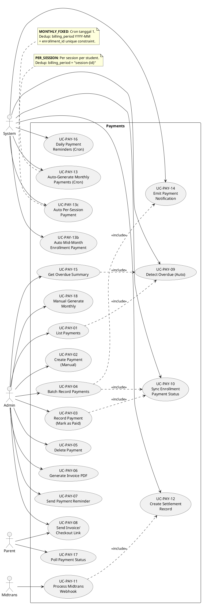
```plantuml
@startuml payments
left to right direction
skinparam packageStyle rectangle

actor "Admin" as admin
actor "Parent" as parent
actor "System" as sys
actor "Midtrans" as midtrans

rectangle "Payments" {
  usecase "UC-PAY-01\nList Payments" as PAY01
  usecase "UC-PAY-02\nCreate Payment\n(Manual)" as PAY02
  usecase "UC-PAY-03\nRecord Payment\n(Mark as Paid)" as PAY03
  usecase "UC-PAY-04\nBatch Record Payments" as PAY04
  usecase "UC-PAY-05\nDelete Payment" as PAY05
  usecase "UC-PAY-06\nGenerate Invoice PDF" as PAY06
  usecase "UC-PAY-07\nSend Payment Reminder" as PAY07
  usecase "UC-PAY-08\nSend Invoice/\nCheckout Link" as PAY08
  usecase "UC-PAY-09\nDetect Overdue (Auto)" as PAY09
  usecase "UC-PAY-10\nSync Enrollment\nPayment Status" as PAY10
  usecase "UC-PAY-11\nProcess Midtrans\nWebhook" as PAY11
  usecase "UC-PAY-12\nCreate Settlement\nRecord" as PAY12
  usecase "UC-PAY-13\nAuto-Generate Monthly\nPayments (Cron)" as PAY13
  usecase "UC-PAY-13b\nAuto Mid-Month\nEnrollment Payment" as PAY13b
  usecase "UC-PAY-13c\nAuto Per-Session\nPayment" as PAY13c
  usecase "UC-PAY-14\nEmit Payment\nNotification" as PAY14
  usecase "UC-PAY-15\nGet Overdue Summary" as PAY15
  usecase "UC-PAY-16\nDaily Payment\nReminders (Cron)" as PAY16
  usecase "UC-PAY-17\nPoll Payment Status" as PAY17
  usecase "UC-PAY-18\nManual Generate\nMonthly" as PAY18
}

admin --> PAY01
admin --> PAY02
admin --> PAY03
admin --> PAY04
admin --> PAY05
admin --> PAY06
admin --> PAY07
admin --> PAY08
admin --> PAY15
admin --> PAY18
parent --> PAY08
parent --> PAY17
midtrans --> PAY11
sys --> PAY09
sys --> PAY10
sys --> PAY12
sys --> PAY13
sys --> PAY13b
sys --> PAY13c
sys --> PAY14
sys --> PAY16

PAY01 ..> PAY09 : <<include>>
PAY03 ..> PAY10 : <<include>>
PAY04 ..> PAY10 : <<include>>
PAY04 ..> PAY14 : <<include>>
PAY11 ..> PAY12 : <<include>>
PAY15 ..> PAY09 : <<include>>

note bottom of PAY13
  **MONTHLY_FIXED**: Cron tanggal 1.
  Dedup: billing_period YYYY-MM
  + enrollment_id unique constraint.
end note

note bottom of PAY13c
  **PER_SESSION**: Per session per student.
  Dedup: billing_period = "session-{id}"
end note

@enduml
```

### Use Case List

| ID | Name | Actor(s) | Description | Business Rules |
|----|------|----------|-------------|----------------|
| UC-PAY-01 | List Payments | Admin | Paginated with status/student filters | Auto-refreshes overdue before listing. |
| UC-PAY-02 | Create Payment (Manual) | Admin | Record new payment | No auto-dedup for manual. |
| UC-PAY-03 | Record Payment | Admin | Mark PENDING/OVERDUE as PAID | Discount subtracted. Enrollment status synced. |
| UC-PAY-04 | Batch Record Payments | Admin | Mark multiple as PAID | Max 50. Emits notifications per payment. |
| UC-PAY-05 | Delete Payment | Admin | Hard delete | No restriction on PAID. |
| UC-PAY-06 | Generate Invoice PDF | Admin | PDF with sequential number | Counter in settings JSON. i18n labels. |
| UC-PAY-07 | Send Payment Reminder | Admin | Emit `payment.remind` event | WhatsApp delivery via Fonnte. |
| UC-PAY-08 | Send Invoice/Checkout Link | Admin, Parent | Midtrans Snap checkout URL | Unique orderId per attempt. ParentStudent verification. |
| UC-PAY-09 | Detect Overdue (Auto) | System | PENDING past due_date -> OVERDUE | Runs on every findAll. Compare start of today. |
| UC-PAY-10 | Sync Enrollment Status | System | Recalculate enrollment.payment_status | All PAID->PAID, any OVERDUE->OVERDUE, etc. |
| UC-PAY-11 | Process Midtrans Webhook | Midtrans | Verify signature + update status | Amount verification. Settlement record created. |
| UC-PAY-12 | Create Settlement Record | System | Track fees for Midtrans payments | QRIS 0.7%, bank_transfer Rp4000, credit_card 2.9%. |
| UC-PAY-13 | Auto Monthly Payments | System (Cron) | Generate on 1st of month | MONTHLY_FIXED only. P2002 dedup. |
| UC-PAY-13b | Auto Mid-Month Payment | System | On new enrollment | Full fee, no pro-rata. Due = enrolled+7d. |
| UC-PAY-13c | Auto Per-Session Payment | System | On session creation | PER_SESSION only. Dedup via session billing_period. |
| UC-PAY-14 | Emit Payment Notification | System | `payment.received` event | WebSocket push to institution. |
| UC-PAY-15 | Get Overdue Summary | Admin | Aggregated overdue data | Refreshes status first. Late payment threshold. |
| UC-PAY-16 | Daily Reminders (Cron) | System | Send notifications to parents | 09:00 WIB daily. 24h dedup. |
| UC-PAY-17 | Poll Payment Status | Parent | Check if checkout completed | Every 3s, max 10 attempts. |
| UC-PAY-18 | Manual Generate Monthly | Admin | Trigger monthly generation on demand | Same dedup logic as cron. |

---

## 11. Finance - Payouts

### Use Case Diagram

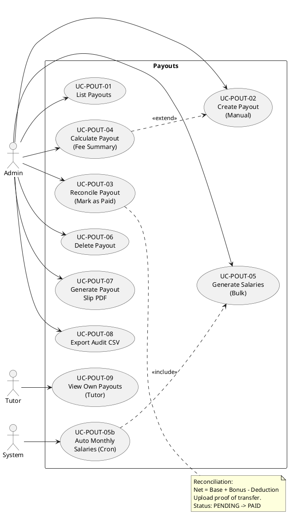
```plantuml
@startuml payouts
left to right direction
skinparam packageStyle rectangle

actor "Admin" as admin
actor "Tutor" as tutor
actor "System" as sys

rectangle "Payouts" {
  usecase "UC-POUT-01\nList Payouts" as POUT01
  usecase "UC-POUT-02\nCreate Payout\n(Manual)" as POUT02
  usecase "UC-POUT-03\nReconcile Payout\n(Mark as Paid)" as POUT03
  usecase "UC-POUT-04\nCalculate Payout\n(Fee Summary)" as POUT04
  usecase "UC-POUT-05\nGenerate Salaries\n(Bulk)" as POUT05
  usecase "UC-POUT-05b\nAuto Monthly\nSalaries (Cron)" as POUT05b
  usecase "UC-POUT-06\nDelete Payout" as POUT06
  usecase "UC-POUT-07\nGenerate Payout\nSlip PDF" as POUT07
  usecase "UC-POUT-08\nExport Audit CSV" as POUT08
  usecase "UC-POUT-09\nView Own Payouts\n(Tutor)" as POUT09
}

admin --> POUT01
admin --> POUT02
admin --> POUT03
admin --> POUT04
admin --> POUT05
admin --> POUT06
admin --> POUT07
admin --> POUT08
tutor --> POUT09
sys --> POUT05b

POUT04 ..> POUT02 : <<extend>>
POUT05b ..> POUT05 : <<include>>

note right of POUT03
  Reconciliation:
  Net = Base + Bonus - Deduction
  Upload proof of transfer.
  Status: PENDING -> PAID
end note

@enduml
```

### Use Case List

| ID | Name | Actor(s) | Description | Business Rules |
|----|------|----------|-------------|----------------|
| UC-POUT-01 | List Payouts | Admin | Paginated with status/tutor filter | Tutor bank info flattened. |
| UC-POUT-02 | Create Payout (Manual) | Admin | For specific tutor | Amount manual or calculated. |
| UC-POUT-03 | Reconcile Payout | Admin | Proof + bonuses/deductions + confirm | Final = base + bonus - deduction. |
| UC-POUT-04 | Calculate Payout | Admin | Sum tutor_fee from COMPLETED sessions | Overlap warning for duplicate periods. |
| UC-POUT-05 | Generate Salaries (Bulk) | Admin | Payouts for all tutors with monthly_salary | Dedup by description "Salary: YYYY-MM". |
| UC-POUT-05b | Auto Monthly Salaries | System (Cron) | 1st of month for all institutions | Same dedup logic. |
| UC-POUT-06 | Delete Payout | Admin | Hard delete | No status restriction. |
| UC-POUT-07 | Generate Payout Slip PDF | Admin | PDF with sequential number | Counter in settings. Session breakdown included. |
| UC-POUT-08 | Export Audit CSV | Admin | CSV with metadata + session breakdown | Downloaded as `payout-audit-{id}.csv`. |
| UC-POUT-09 | View Own Payouts | Tutor | Read-only payout history | Tutor can only see their own. |

---

## 12. Finance - Expenses

### Use Case List

| ID | Name | Actor(s) | Description | Business Rules |
|----|------|----------|-------------|----------------|
| UC-EXP-01 | List Expenses | Admin | Paginated + category/date/search filter | Includes total_amount aggregate. |
| UC-EXP-02 | Create Expense | Admin | With optional recurring config | Weekly/monthly recurrence. Receipt upload. |
| UC-EXP-03 | Update Expense | Admin | Edit any field | Partial update. |
| UC-EXP-04 | Delete Expense | Admin | Hard delete | No restrictions. |
| UC-EXP-05 | Export Expenses CSV | Admin | Download filtered expenses | Respects current filter state. |
| UC-EXP-06 | Process Recurring (Manual) | Admin | Trigger occurrence generation | Dedup by category+amount+date. |
| UC-EXP-07 | Auto Recurring (Cron) | System | Daily at midnight WIB | Weekly +7d, Monthly +1mo. |

---

## 13. Finance - Overview & Reports

### Use Case List

| ID | Name | Actor(s) | Description | Business Rules |
|----|------|----------|-------------|----------------|
| UC-FIN-01 | View Financial Summary | Admin | Revenue, payouts, expenses, net profit | `Net = Revenue - Payouts - Expenses`. Period filters. |
| UC-FIN-02 | Get Revenue Breakdown | Admin | By class, method, status | PAID payments only for revenue. |
| UC-FIN-03 | Get Expense Breakdown | Admin | By category + monthly trend | 6 months trend. |
| UC-FIN-04 | Export CSV | Admin | Payments/payouts/expenses export | Period-filtered. |
| UC-FIN-05 | Generate Finance Report PDF | Admin | Total income/payouts/expenses/net | i18n. Preview in modal iframe. |
| UC-FIN-06 | View Settlement Summary | Super Admin | Cross-institution settlement data | Pending/transferred per institution. |
| UC-FIN-07 | Mark Settlement Transferred | Super Admin | PENDING -> TRANSFERRED | Cannot transfer already-transferred. |
| UC-FIN-08 | Batch Transfer Settlements | Super Admin | Mark multiple as TRANSFERRED | Strict: all must be PENDING. |
| UC-FIN-09 | Get Settlement Report | Super Admin | Per-institution monthly breakdown | Fee decomposition per transaction. |

---

## 14. Settings

### Use Case Diagram

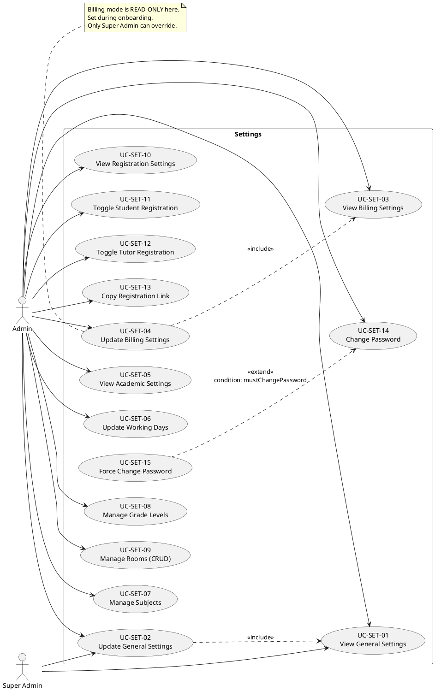
```plantuml
@startuml settings
left to right direction
skinparam packageStyle rectangle

actor "Admin" as admin
actor "Super Admin" as sa

rectangle "Settings" {
  usecase "UC-SET-01\nView General Settings" as SET01
  usecase "UC-SET-02\nUpdate General Settings" as SET02
  usecase "UC-SET-03\nView Billing Settings" as SET03
  usecase "UC-SET-04\nUpdate Billing Settings" as SET04
  usecase "UC-SET-05\nView Academic Settings" as SET05
  usecase "UC-SET-06\nUpdate Working Days" as SET06
  usecase "UC-SET-07\nManage Subjects" as SET07
  usecase "UC-SET-08\nManage Grade Levels" as SET08
  usecase "UC-SET-09\nManage Rooms (CRUD)" as SET09
  usecase "UC-SET-10\nView Registration Settings" as SET10
  usecase "UC-SET-11\nToggle Student Registration" as SET11
  usecase "UC-SET-12\nToggle Tutor Registration" as SET12
  usecase "UC-SET-13\nCopy Registration Link" as SET13
  usecase "UC-SET-14\nChange Password" as SET14
  usecase "UC-SET-15\nForce Change Password" as SET15
}

admin --> SET01
admin --> SET02
admin --> SET03
admin --> SET04
admin --> SET05
admin --> SET06
admin --> SET07
admin --> SET08
admin --> SET09
admin --> SET10
admin --> SET11
admin --> SET12
admin --> SET13
admin --> SET14
sa --> SET01
sa --> SET02

SET02 ..> SET01 : <<include>>
SET04 ..> SET03 : <<include>>
SET15 ..> SET14 : <<extend>>\ncondition: mustChangePassword

note bottom of SET04
  Billing mode is READ-ONLY here.
  Set during onboarding.
  Only Super Admin can override.
end note

@enduml
```

---

## 15. Plans & Subscriptions

### Use Case Diagram

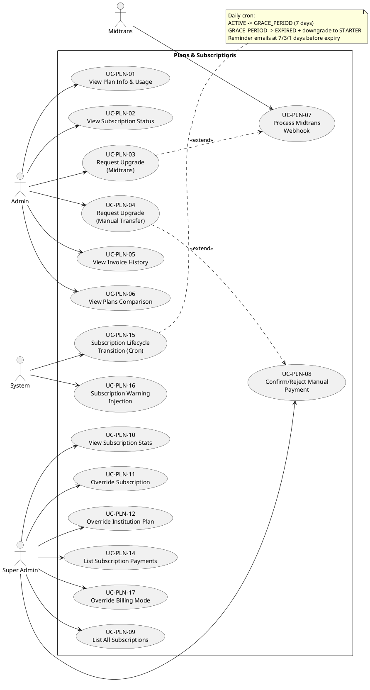
```plantuml
@startuml plans
left to right direction
skinparam packageStyle rectangle

actor "Admin" as admin
actor "Super Admin" as sa
actor "System" as sys
actor "Midtrans" as midtrans

rectangle "Plans & Subscriptions" {
  usecase "UC-PLN-01\nView Plan Info & Usage" as PLN01
  usecase "UC-PLN-02\nView Subscription Status" as PLN02
  usecase "UC-PLN-03\nRequest Upgrade\n(Midtrans)" as PLN03
  usecase "UC-PLN-04\nRequest Upgrade\n(Manual Transfer)" as PLN04
  usecase "UC-PLN-05\nView Invoice History" as PLN05
  usecase "UC-PLN-06\nView Plans Comparison" as PLN06
  usecase "UC-PLN-07\nProcess Midtrans\nWebhook" as PLN07
  usecase "UC-PLN-08\nConfirm/Reject Manual\nPayment" as PLN08
  usecase "UC-PLN-09\nList All Subscriptions" as PLN09
  usecase "UC-PLN-10\nView Subscription Stats" as PLN10
  usecase "UC-PLN-11\nOverride Subscription" as PLN11
  usecase "UC-PLN-12\nOverride Institution Plan" as PLN12
  usecase "UC-PLN-14\nList Subscription Payments" as PLN14
  usecase "UC-PLN-15\nSubscription Lifecycle\nTransition (Cron)" as PLN15
  usecase "UC-PLN-16\nSubscription Warning\nInjection" as PLN16
  usecase "UC-PLN-17\nOverride Billing Mode" as PLN17
}

admin --> PLN01
admin --> PLN02
admin --> PLN03
admin --> PLN04
admin --> PLN05
admin --> PLN06
sa --> PLN08
sa --> PLN09
sa --> PLN10
sa --> PLN11
sa --> PLN12
sa --> PLN14
sa --> PLN17
midtrans --> PLN07
sys --> PLN15
sys --> PLN16

PLN03 ..> PLN07 : <<extend>>
PLN04 ..> PLN08 : <<extend>>

note right of PLN15
  Daily cron:
  ACTIVE -> GRACE_PERIOD (7 days)
  GRACE_PERIOD -> EXPIRED + downgrade to STARTER
  Reminder emails at 7/3/1 days before expiry
end note

@enduml
```

---

## 16. Dashboard

### Use Case Diagram

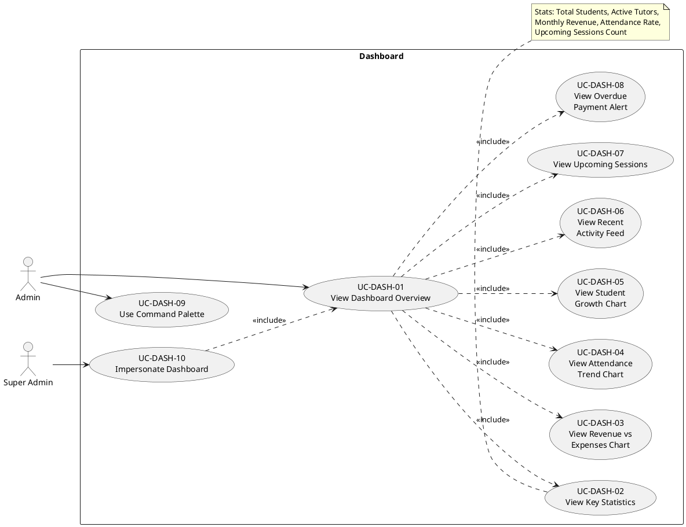
```plantuml
@startuml dashboard
left to right direction
skinparam packageStyle rectangle

actor "Admin" as admin
actor "Super Admin" as sa

rectangle "Dashboard" {
  usecase "UC-DASH-01\nView Dashboard Overview" as DASH01
  usecase "UC-DASH-02\nView Key Statistics" as DASH02
  usecase "UC-DASH-03\nView Revenue vs\nExpenses Chart" as DASH03
  usecase "UC-DASH-04\nView Attendance\nTrend Chart" as DASH04
  usecase "UC-DASH-05\nView Student\nGrowth Chart" as DASH05
  usecase "UC-DASH-06\nView Recent\nActivity Feed" as DASH06
  usecase "UC-DASH-07\nView Upcoming Sessions" as DASH07
  usecase "UC-DASH-08\nView Overdue\nPayment Alert" as DASH08
  usecase "UC-DASH-09\nUse Command Palette" as DASH09
  usecase "UC-DASH-10\nImpersonate Dashboard" as DASH10
}

admin --> DASH01
admin --> DASH09
sa --> DASH10

DASH01 ..> DASH02 : <<include>>
DASH01 ..> DASH03 : <<include>>
DASH01 ..> DASH04 : <<include>>
DASH01 ..> DASH05 : <<include>>
DASH01 ..> DASH06 : <<include>>
DASH01 ..> DASH07 : <<include>>
DASH01 ..> DASH08 : <<include>>
DASH10 ..> DASH01 : <<include>>

note bottom of DASH02
  Stats: Total Students, Active Tutors,
  Monthly Revenue, Attendance Rate,
  Upcoming Sessions Count
end note

@enduml
```

---

## 17. Notifications

### Use Case Diagram

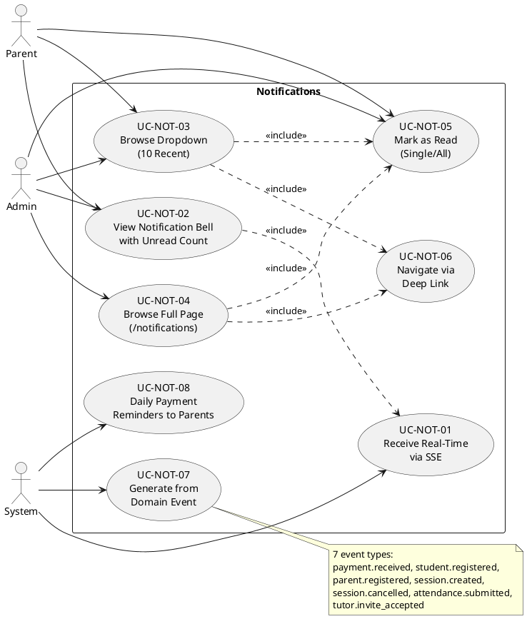
```plantuml
@startuml notifications
left to right direction
skinparam packageStyle rectangle

actor "Admin" as admin
actor "Parent" as parent
actor "System" as sys

rectangle "Notifications" {
  usecase "UC-NOT-01\nReceive Real-Time\nvia SSE" as NOT01
  usecase "UC-NOT-02\nView Notification Bell\nwith Unread Count" as NOT02
  usecase "UC-NOT-03\nBrowse Dropdown\n(10 Recent)" as NOT03
  usecase "UC-NOT-04\nBrowse Full Page\n(/notifications)" as NOT04
  usecase "UC-NOT-05\nMark as Read\n(Single/All)" as NOT05
  usecase "UC-NOT-06\nNavigate via\nDeep Link" as NOT06
  usecase "UC-NOT-07\nGenerate from\nDomain Event" as NOT07
  usecase "UC-NOT-08\nDaily Payment\nReminders to Parents" as NOT08
}

admin --> NOT02
admin --> NOT03
admin --> NOT04
admin --> NOT05
parent --> NOT02
parent --> NOT03
parent --> NOT05
sys --> NOT01
sys --> NOT07
sys --> NOT08

NOT02 ..> NOT01 : <<include>>
NOT03 ..> NOT05 : <<include>>
NOT03 ..> NOT06 : <<include>>
NOT04 ..> NOT05 : <<include>>
NOT04 ..> NOT06 : <<include>>

note right of NOT07
  7 event types:
  payment.received, student.registered,
  parent.registered, session.created,
  session.cancelled, attendance.submitted,
  tutor.invite_accepted
end note

@enduml
```

---

## 18. WhatsApp

### Use Case Diagram

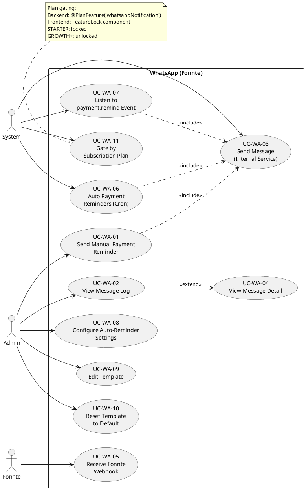
```plantuml
@startuml whatsapp
left to right direction
skinparam packageStyle rectangle

actor "Admin" as admin
actor "System" as sys
actor "Fonnte" as fonnte

rectangle "WhatsApp (Fonnte)" {
  usecase "UC-WA-01\nSend Manual Payment\nReminder" as WA01
  usecase "UC-WA-02\nView Message Log" as WA02
  usecase "UC-WA-03\nSend Message\n(Internal Service)" as WA03
  usecase "UC-WA-04\nView Message Detail" as WA04
  usecase "UC-WA-05\nReceive Fonnte\nWebhook" as WA05
  usecase "UC-WA-06\nAuto Payment\nReminders (Cron)" as WA06
  usecase "UC-WA-07\nListen to\npayment.remind Event" as WA07
  usecase "UC-WA-08\nConfigure Auto-Reminder\nSettings" as WA08
  usecase "UC-WA-09\nEdit Template" as WA09
  usecase "UC-WA-10\nReset Template\nto Default" as WA10
  usecase "UC-WA-11\nGate by\nSubscription Plan" as WA11
}

admin --> WA01
admin --> WA02
admin --> WA08
admin --> WA09
admin --> WA10
fonnte --> WA05
sys --> WA03
sys --> WA06
sys --> WA07
sys --> WA11

WA01 ..> WA03 : <<include>>
WA02 ..> WA04 : <<extend>>
WA06 ..> WA03 : <<include>>
WA07 ..> WA03 : <<include>>

note bottom of WA11
  Plan gating:
  Backend: @PlanFeature('whatsappNotification')
  Frontend: FeatureLock component
  STARTER: locked
  GROWTH+: unlocked
end note

@enduml
```

---

## 19. Audit Log

### Use Case Diagram

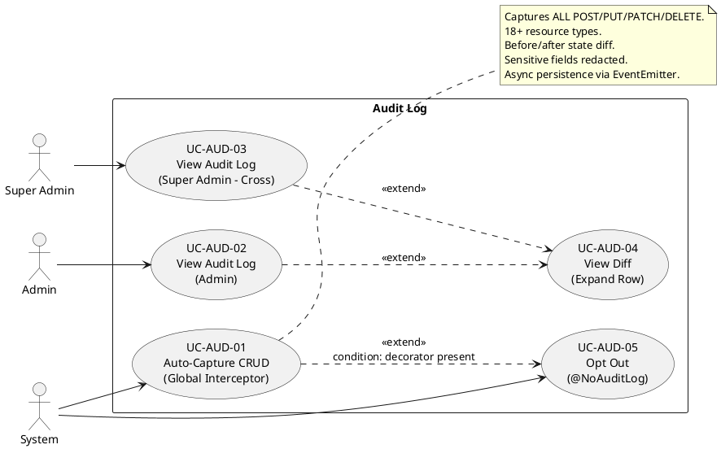
```plantuml
@startuml auditlog
left to right direction
skinparam packageStyle rectangle

actor "Admin" as admin
actor "Super Admin" as sa
actor "System" as sys

rectangle "Audit Log" {
  usecase "UC-AUD-01\nAuto-Capture CRUD\n(Global Interceptor)" as AUD01
  usecase "UC-AUD-02\nView Audit Log\n(Admin)" as AUD02
  usecase "UC-AUD-03\nView Audit Log\n(Super Admin - Cross)" as AUD03
  usecase "UC-AUD-04\nView Diff\n(Expand Row)" as AUD04
  usecase "UC-AUD-05\nOpt Out\n(@NoAuditLog)" as AUD05
}

admin --> AUD02
sa --> AUD03
sys --> AUD01
sys --> AUD05

AUD02 ..> AUD04 : <<extend>>
AUD03 ..> AUD04 : <<extend>>
AUD01 ..> AUD05 : <<extend>>\ncondition: decorator present

note right of AUD01
  Captures ALL POST/PUT/PATCH/DELETE.
  18+ resource types.
  Before/after state diff.
  Sensitive fields redacted.
  Async persistence via EventEmitter.
end note

@enduml
```

---

## 20. Navigation & Layout

### Use Case List

| ID | Name | Actor(s) | Description | Business Rules |
|----|------|----------|-------------|----------------|
| UC-NAV-01 | Navigate via Sidebar | Admin, Tutor | 5 sections, 15 items | Glass effect. Active glow. |
| UC-NAV-02 | Toggle Sidebar Collapse | Admin, Tutor | Expanded (w-64) / Minimized (w-20) | Icons only when minimized. |
| UC-NAV-03 | Command Palette | Admin, Tutor | Ctrl+K, search all 15 pages | Arrow key navigation. |
| UC-NAV-04 | User Menu | Admin, Tutor | Avatar dropdown: settings, logout | Role-colored badge. |
| UC-NAV-05 | Impersonate Institution | Super Admin | Amber banner with Exit button | sessionStorage-based. |
| UC-NAV-06 | Plan Widget in Sidebar | Admin, Tutor | Usage bar with color coding | Hidden when minimized. Upgrade button. |
| UC-NAV-07 | Plan Warning Banner | System | Subscription/limit warnings | Priority: grace > expiring > 100% > 80%. |
| UC-NAV-08 | Toggle Dark Mode | All | Sun/Moon icon in header | Not persisted. |
| UC-NAV-09 | Toggle Language | All | ID/EN button in header | Persisted to localStorage. |
| UC-NAV-10 | Protected Route | System | Priority redirect chain | Loading > Auth > SuperAdmin > Password > Onboarding. |
| UC-NAV-11 | Super Admin Route | System | Role gate for /super/* | Only SUPER_ADMIN. |
| UC-NAV-12 | Super Admin Sidebar | Super Admin | 6 items, simplified layout | No sections, no widgets. |
| UC-NAV-13 | Resolve Institution Subdomain | System | Extract slug from hostname | Reserved subdomains excluded. |

---

## Use Case Index

### Summary Statistics

| Domain | Prefix | Count |
|--------|--------|-------|
| Auth & Onboarding | UC-AUTH | 31 |
| Students | UC-STU | 25 |
| Tutors | UC-TUT | 36 |
| Classes | UC-CLS | 8 |
| Academic Years | UC-AY | 10 |
| Schedules / Sessions | UC-SCH | 15 |
| Enrollments | UC-ENR | 11 |
| Registrations | UC-REG | 9 |
| Attendance | UC-ATT | 17 |
| Payments | UC-PAY | 18 |
| Payouts | UC-POUT | 10 |
| Expenses | UC-EXP | 7 |
| Finance Overview | UC-FIN | 9 |
| Settings | UC-SET | 17 |
| Plans & Subscriptions | UC-PLN | 17 |
| Dashboard | UC-DASH | 10 |
| Notifications | UC-NOT | 8 |
| WhatsApp | UC-WA | 11 |
| Audit Log | UC-AUD | 5 |
| Navigation & Layout | UC-NAV | 13 |
| **Total** | | **~287** |

### Actor-Use Case Matrix

| Actor | Domains | Approx. UCs |
|-------|---------|-------------|
| **Admin** | All except Parent-only | ~180 |
| **Super Admin** | Auth, Settings, Plans, Dashboard, Audit, Finance Overview, Settlements, Navigation | ~45 |
| **Tutor** | Auth, Tutor Self-Service, Schedule, Attendance, Payouts, Navigation | ~35 |
| **Parent** | Auth, Students (child views), Payments (checkout/poll), Notifications | ~15 |
| **Calon Siswa** | Auth, Registration | ~3 |
| **Calon Tutor** | Auth, Registration | ~3 |
| **System** | All (cron, events, guards, interceptors) | ~40 |
| **Midtrans Webhook** | Payments, Plans | ~2 |
| **Fonnte Webhook** | WhatsApp | ~1 |

### Critical Financial Use Cases (High-Risk)

These use cases involve money flow and require extra testing:

| UC | Domain | Risk |
|----|--------|------|
| UC-AUTH-013 | Set Billing Mode | **PERMANENT** - affects entire finance module |
| UC-PAY-03/04 | Record Payment | Revenue recognition |
| UC-PAY-08 | Checkout Link | Midtrans integration |
| UC-PAY-09 | Overdue Detection | Auto status change |
| UC-PAY-11 | Midtrans Webhook | External payment confirmation |
| UC-PAY-13/13b/13c | Auto-Generate Payments | Billing calculation |
| UC-POUT-03 | Reconcile Payout | Tutor payout with adjustments |
| UC-POUT-05 | Generate Salaries | Bulk financial creation |
| UC-SCH-09 | Complete Session & Payout | Auto payout on session complete |
| UC-ATT-09 | Per-Session Payment | Attendance triggers payment |
| UC-ENR-10 | Mid-Month Invoice | Enrollment triggers payment |
| UC-PLN-07 | Subscription Webhook | Subscription payment |
| UC-PLN-15 | Subscription Lifecycle | Auto downgrade on expiry |
| UC-FIN-07/08 | Settlement Transfer | Fund transfer tracking |

---

## Dependency Overview

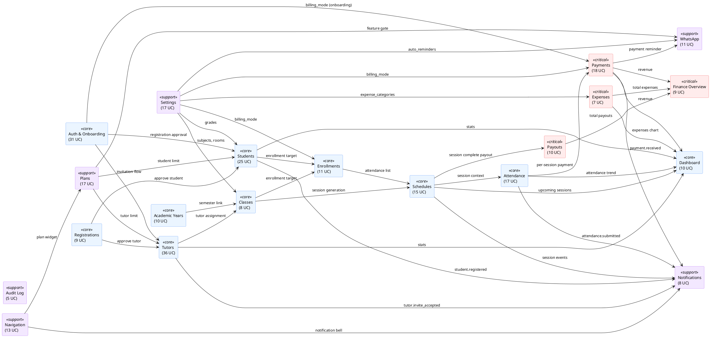
```plantuml
@startuml dependency_overview
left to right direction
skinparam packageStyle rectangle
skinparam rectangle {
  BackgroundColor<<critical>> #FFECEC
  BorderColor<<critical>> #EF4444
  BackgroundColor<<core>> #EBF5FF
  BorderColor<<core>> #3B82F6
  BackgroundColor<<support>> #F3E8FF
  BorderColor<<support>> #A855F7
}

rectangle "Settings\n(17 UC)" <<support>> as SET
rectangle "Auth & Onboarding\n(31 UC)" <<core>> as AUTH
rectangle "Students\n(25 UC)" <<core>> as STU
rectangle "Tutors\n(36 UC)" <<core>> as TUT
rectangle "Classes\n(8 UC)" <<core>> as CLS
rectangle "Academic Years\n(10 UC)" <<core>> as AY
rectangle "Enrollments\n(11 UC)" <<core>> as ENR
rectangle "Registrations\n(9 UC)" <<core>> as REG
rectangle "Schedules\n(15 UC)" <<core>> as SCH
rectangle "Attendance\n(17 UC)" <<core>> as ATT
rectangle "Payments\n(18 UC)" <<critical>> as PAY
rectangle "Payouts\n(10 UC)" <<critical>> as POUT
rectangle "Expenses\n(7 UC)" <<critical>> as EXP
rectangle "Finance Overview\n(9 UC)" <<critical>> as FIN
rectangle "Plans\n(17 UC)" <<support>> as PLN
rectangle "Dashboard\n(10 UC)" <<core>> as DASH
rectangle "Notifications\n(8 UC)" <<support>> as NOT
rectangle "WhatsApp\n(11 UC)" <<support>> as WA
rectangle "Audit Log\n(5 UC)" <<support>> as AUD
rectangle "Navigation\n(13 UC)" <<support>> as NAV

SET --> CLS : subjects, rooms
SET --> STU : grades
SET --> ENR : billing_mode
SET --> PAY : billing_mode
SET --> EXP : expense_categories
SET --> WA : auto_reminders
AUTH --> STU : registration approval
AUTH --> TUT : invitation flow
AUTH --> PAY : billing_mode (onboarding)
REG --> STU : approve student
REG --> TUT : approve tutor
STU --> ENR : enrollment target
CLS --> ENR : enrollment target
CLS --> SCH : session generation
TUT --> CLS : tutor assignment
AY --> CLS : semester link
ENR --> SCH : attendance list
SCH --> ATT : session context
ATT --> PAY : per-session payment
SCH --> POUT : session complete payout
PAY --> FIN : revenue
POUT --> FIN : total payouts
EXP --> FIN : total expenses
PAY --> WA : payment reminder
PAY --> NOT : payment.received
STU --> NOT : student.registered
TUT --> NOT : tutor.invite_accepted
SCH --> NOT : session events
ATT --> NOT : attendance.submitted
STU --> DASH : stats
TUT --> DASH : stats
PAY --> DASH : revenue
EXP --> DASH : expenses chart
ATT --> DASH : attendance trend
SCH --> DASH : upcoming sessions
PLN --> STU : student limit
PLN --> TUT : tutor limit
PLN --> WA : feature gate
NAV --> NOT : notification bell
NAV --> PLN : plan widget

@enduml
```
